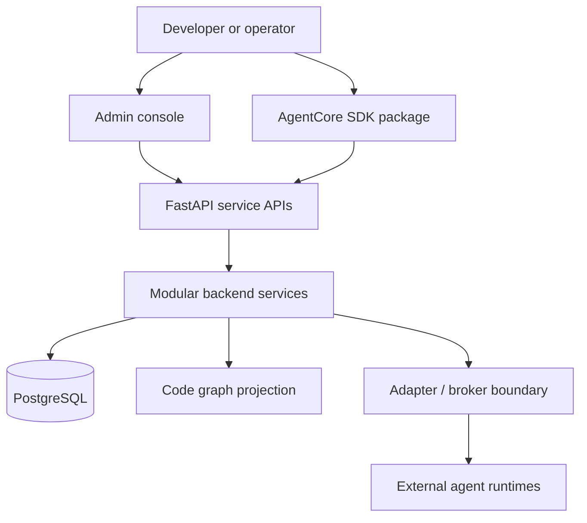

# AgentCore

[](LICENSE)
[](https://www.python.org/)
[](https://fastapi.tiangolo.com/)
[](https://www.postgresql.org/)
[](docs/08-software-engineering-architecture/35-usage-profile-and-cursor-mcp-onboarding.md)
[](pyproject.toml)
[](docs/00-master-plan/02-roadmap-and-phase-gates.md)
[](CONTRIBUTING.md)
[](https://github.com/Mohammad-Mirasadollahi/AgentCore/stargazers)
[](https://github.com/Mohammad-Mirasadollahi/AgentCore/commits)

AgentCore connects to a codebase and improves the outputs of connected AI coding tools. It indexes code knowledge, injects task-scoped context into IDE assistants and agent runtimes, and measures the gain. On that wedge it is a vendor-neutral **control plane** for registering, coordinating, governing, and observing external agent runtimes. It is not an LLM, an agent framework, or a replacement for LangGraph—connected workers perform execution; AgentCore owns code graph, memory, docs sync, tickets, routing, policy, approval, and audit.

## Repository layout

| Path | Role |
|------|------|
| `backend/services/` | Modular FastAPI vertical slices (Phases 1–7 + platform services) |
| `backend/packages/` | Shared packages (`shared-kernel`, `sdk`, `contracts`, catalogs, …) |
| `backend/configs/` | Port profiles, governance catalogs, domain/feature packs, examples |
| `docs/` | Phase-based product and engineering documentation (Phases 0–11+) |
| `tests/backend/` | Nested suites: `services/`, `gates/`, `packages/`, `tools/`, `platform/`, `legacy/` |
| `tests/support/` | Feature-gate harness packages (`technical_logic`, `port_profile_gate`, …) |
| `frontend/` | Admin / UI surfaces (platform) |
| `archives/hackathon/` | Archived Change Society hackathon demo (not the active product path) |

## Implementation status

Roadmap Phases **1–11** have executable vertical slices and/or verification gates. Platform services that were previously scaffolds now ship with API + in-memory tests (and Postgres store adapters where applicable).

| Phase | Focus | Code / gate home |
|------:|-------|------------------|
| 1 | Core data model | `backend/services/core-data-service/` · `tests/backend/services/core-data-service/` |
| 2 | Memory and context | `backend/services/memory-service/` · `tests/backend/services/memory-service/` |
| 3 | Docs-as-code sync | `backend/services/docs-sync-service/` · `tests/backend/services/docs-sync-service/` |
| 4 | Rule engine | `backend/services/rule-engine-service/` · `tests/backend/services/rule-engine-service/` |
| 5 | Interoperability / adapters | `backend/services/adapter-service/` · `tests/backend/services/adapter-service/` |
| 6 | Technical logic verification | `tests/support/technical_logic/` · `tests/backend/gates/technical-logic-verification/` |
| 7 | Code-knowledge graph | `backend/services/code-graph-service/` · `tests/backend/services/code-graph-service/` |
| 8 | Software engineering / ports / packages | `backend/configs/port-profiles/` · `backend/packages/` · `tests/backend/gates/port-profile-verification/` |
| 9 | Governance catalogs | `backend/configs/governance/` · `tests/backend/gates/governance-catalog-verification/` |
| 10 | Gap analysis catalog | `backend/configs/governance/gap-register.json` · `tests/backend/gates/gap-register-verification/` |
| 11 | Logical examples catalog | `backend/configs/logical-examples/` · `tests/backend/gates/logical-examples-verification/` |

**Additional platform services:** `audit-service`, `identity-access-service`, `orchestration-service`, `reporting-service`, `project-profile-service`, `common-context-service`, `mcp-gateway-service` (memory or PostgreSQL stores via `AGENTCORE_DATABASE_URL`).

**Outbox relay:** `backend/packages/outbox_relay` + `python -m agentcore_worker` publishes unpublished service outbox rows to memory, audit, and the adapter broker. Compose profile `all` can run the worker beside Postgres.

**Usage Profiles:** named compositions for org/person configuration (domain pack + feature profile + MCP tools). Catalog: `backend/configs/usage-profiles/` (includes `programming-cursor-mcp`). Activate via `project-profile-service`; Cursor connects through `mcp-gateway-service`. Design: [docs/08-software-engineering-architecture/35-usage-profile-and-cursor-mcp-onboarding.md](docs/08-software-engineering-architecture/35-usage-profile-and-cursor-mcp-onboarding.md).

Design target notes (not required for current gates): Neo4j runtime and Tree-sitter multi-language ingestion remain longer-term for Phase 7 (slice today uses PostgreSQL projection + Python `ast` + in-memory Store).

## Quick architecture



## Development setup

```bash
bash scripts/ensure-venv.sh
```

This creates `.venv`, installs dependencies, installs the editable `agentcore` package, and puts the `agentcore` command on your PATH (`~/.local/bin`).

```bash
agentcore doctor
agentcore profile list
agentcore --help
```

CLI reference: [docs/08-software-engineering-architecture/36-agentcore-cli.md](docs/08-software-engineering-architecture/36-agentcore-cli.md).

Optional PostgreSQL for full-platform stores:

```bash
cp backend/deployments/compose/postgres.example.env /tmp/agentcore-postgres.env
docker compose --env-file /tmp/agentcore-postgres.env \
  -f backend/deployments/compose/compose.yaml --profile core up -d postgres
```

Development ports are non-default and project-scoped. See `backend/configs/port-profiles/agentcore-dev.json`.

## Named test commands

Use the project virtualenv. `PYTHONPATH` must include the service `src` (or `tests/support` + `backend/packages` for gates).

```bash
# Phase vertical slices
PYTHONPATH=backend/services/core-data-service/src .venv/bin/python -m pytest tests/backend/services/core-data-service -q
PYTHONPATH=backend/services/memory-service/src .venv/bin/python -m pytest tests/backend/services/memory-service -q
PYTHONPATH=backend/services/docs-sync-service/src .venv/bin/python -m pytest tests/backend/services/docs-sync-service -q
PYTHONPATH=backend/services/rule-engine-service/src .venv/bin/python -m pytest tests/backend/services/rule-engine-service -q
PYTHONPATH=backend/services/adapter-service/src .venv/bin/python -m pytest tests/backend/services/adapter-service -q
PYTHONPATH=backend/services/code-graph-service/src .venv/bin/python -m pytest tests/backend/services/code-graph-service -q

# Phase gates
PYTHONPATH=tests/support .venv/bin/python -m pytest tests/backend/gates/technical-logic-verification -q
PYTHONPATH=tests/support:backend/packages .venv/bin/python -m pytest tests/backend/gates/port-profile-verification -q
PYTHONPATH=tests/support:backend/packages .venv/bin/python -m pytest tests/backend/gates/governance-catalog-verification -q
PYTHONPATH=tests/support:backend/packages .venv/bin/python -m pytest tests/backend/gates/gap-register-verification -q
PYTHONPATH=tests/support:backend/packages .venv/bin/python -m pytest tests/backend/gates/logical-examples-verification -q

# Shared packages
PYTHONPATH=backend/packages .venv/bin/python -m pytest tests/backend/packages -q

# Platform services (examples)
PYTHONPATH=backend/services/audit-service/src .venv/bin/python -m pytest tests/backend/services/audit-service -q
PYTHONPATH=backend/services/common-context-service/src .venv/bin/python -m pytest tests/backend/services/common-context-service -q

# Usage Profile + Cursor MCP gateway
PYTHONPATH=backend/packages .venv/bin/python -m pytest tests/backend/tools/usage-profile -q
PYTHONPATH=backend/services/project-profile-service/src:backend/packages .venv/bin/python -m pytest tests/backend/services/project-profile-service -q
PYTHONPATH=backend/services/mcp-gateway-service/src:backend/packages .venv/bin/python -m pytest tests/backend/services/mcp-gateway-service -q
```

Full test layout: [tests/README.md](tests/README.md). Technical test strategy: [docs/06-technical-logic/07-technical-test-strategy.md](docs/06-technical-logic/07-technical-test-strategy.md).

## Documentation

| Area | Index |
|------|--------|
| Master docs map | [docs/README.md](docs/README.md) |
| Roadmap and phase gates | [docs/00-master-plan/02-roadmap-and-phase-gates.md](docs/00-master-plan/02-roadmap-and-phase-gates.md) |
| Engineering architecture | [docs/08-software-engineering-architecture/00-index.md](docs/08-software-engineering-architecture/00-index.md) |
| Backend structure standard | [backend/docs/STRUCTURE_STANDARD.md](backend/docs/STRUCTURE_STANDARD.md) |
| Technology baseline | [docs/13-technology-stack-and-platform-decisions/00-index.md](docs/13-technology-stack-and-platform-decisions/00-index.md) |
| API naming standards | [docs/14-api-design-and-naming-standards/00-index.md](docs/14-api-design-and-naming-standards/00-index.md) |
| Archived hackathon demo | [archives/hackathon/README.md](archives/hackathon/README.md) |

## Technology baseline

- **Backend:** Python 3.12+, FastAPI  
- **Data:** PostgreSQL (pgvector planned); Neo4j is the design target for production code graph  
- **Frontend:** Next.js, TypeScript (admin surfaces)  
- **Local Python:** `.venv` at repository root  

## Contributing

How to help, open pull requests, and keep slices consistent:

- **Guide:** [CONTRIBUTING.md](CONTRIBUTING.md)
- **Bug report:** use the GitHub **Bug report** issue template (`.github/ISSUE_TEMPLATE/bug_report.yml`)
- **Feature request:** use the GitHub **Feature request** issue template (`.github/ISSUE_TEMPLATE/feature_request.yml`)
- **Pull requests:** follow `.github/PULL_REQUEST_TEMPLATE.md`

Please search existing issues first. Do not put secrets, tokens, or private customer data in issues or PRs.

## Private sync

Local private-repo sync uses `scripts/git-sync.sh` (gitignored tool + local PAT). After the first push, AI-written change notes live under `scripts/.git-sync-changes/`.

## Security & license

- [SECURITY.md](SECURITY.md) — vulnerability reporting (not public issues)  
- [LICENSE](LICENSE) (Apache 2.0)

**Data sovereignty:** do not upload repository contents to public cloud services without explicit per-action approval. See project law in workspace rules / `AGENTS.md`.
