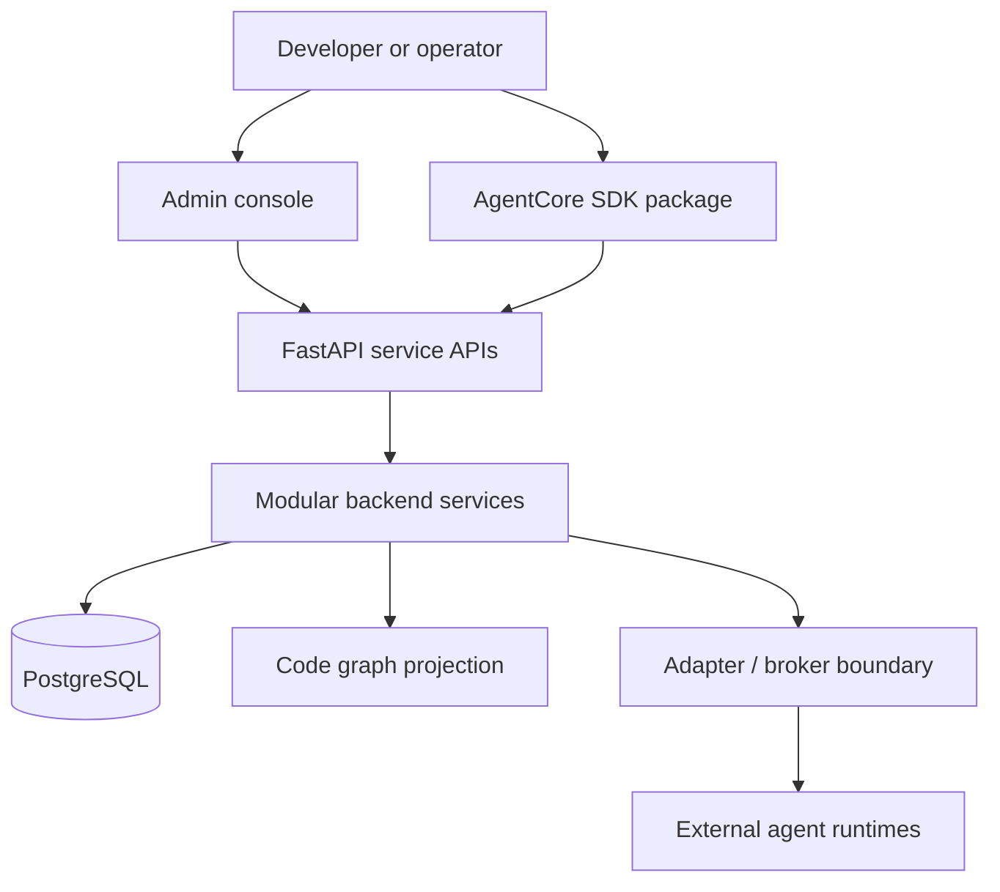

# AgentCore

[](LICENSE)
[](https://www.python.org/)
[](https://fastapi.tiangolo.com/)
[](https://www.postgresql.org/)
[](docs/08-software-engineering-architecture/35-usage-profile-and-cursor-mcp-onboarding.md)
[](pyproject.toml)
[](docs/00-master-plan/02-roadmap-and-phase-gates.md)
[](CONTRIBUTING.md)
[](https://github.com/Mohammad-Mirasadollahi/AgentCore/stargazers)
[](https://github.com/Mohammad-Mirasadollahi/AgentCore/commits)

## What it is

AgentCore is a vendor-neutral **control and knowledge plane** for AI-assisted work. It is **not** an LLM, a coding IDE, or an agent framework (workers still execute; AgentCore owns registry, memory, docs sync, tickets, routing, policy, approval, and audit).

It is useful **beyond coding**: the same platform governs shared memory, documentation truth, durable tickets, multi-agent routing, human approval, and audit across domains. Coding is the first wedge that proves the loop; the destination is a cross-domain operating layer for agentic teams.

**Primary profile in active development:** programming / Cursor MCP (`programming-cursor-mcp`) — connect a repository, build a code-knowledge graph, and improve IDE/agent outputs. Other Usage Profiles compose the same core for different audiences; see [Usage Profile + MCP](docs/08-software-engineering-architecture/35-usage-profile-and-cursor-mcp-onboarding.md).

## Scope (read this first)

| | |
| --- | --- |
| **Nature** | Knowledge + control plane (context, governance, evidence) — not the executor |
| **Delivery focus (v1 wedge)** | Code connection: **explore · hybrid retrieval · change-risk · architecture** (MCP + CLI) |
| **Freshness** | Explicit ingest + session pending-sync — **not** continuous save-watch indexing; **not** Repository Code Wiki in v1 |
| **Trust** | Closed Beta / **single-tenant lab** — multi-tenant SaaS not claimed yet |
| **Platform destination** | Tickets, adapters, memory, rules, approval, audit, cross-domain ops — built on the wedge, not instead of it |

Full catalog and non-goals → [product scope](docs/00-master-plan/01-product-scope-and-feature-catalog.md).

## Contents

| Go here | For |
| --- | --- |
| [What it is](#what-it-is) / [Scope](#scope-read-this-first) | Nature and boundaries at a glance |
| [Quick start](#quick-start) | **Server + client** install and MCP connect (SSH or HTTP) |
| [Quick architecture](#quick-architecture) | How the pieces connect |
| [Install](#install) | Local-dev bootstrap details and flags |
| [Verify](#verify) | Confirm CLI + profiles |
| [Documentation map](#documentation-map) | Where every topic lives (click through) |
| [Contributing & license](#contributing--license) | PRs, security, Apache 2.0 |

---

## Quick start

Two machines are typical: an **AgentCore server** (platform + stores) and a **dev host** (your app repo + coding agent). Replace example hostnames with yours.

Full examples (SSH vs HTTP, security, troubleshooting) → [One-command connect guide](docs/08-software-engineering-architecture/41-one-command-cross-platform-agent-onboarding.md).

### 1) AgentCore server

Requires Python 3.12+, Docker (Compose), and a clone of this repo.

```bash
cd /opt/AgentCore
bash install.sh
# new shell so agentcore is on PATH
agentcore doctor
```

**Optional — HTTP MCP** (long-running; skip if you use SSH-only connect):

```bash
export AGENTCORE_MCP_TOKEN_SECRET='replace-with-a-long-random-secret'
export AGENTCORE_MCP_HTTP_PUBLIC_URL='http://agentcore.example.internal:32500'
agentcore mcp serve-http --host 0.0.0.0 --port 32500
```

### 2) Dev host (client)

Install the CLI only (no Docker required on the client):

```bash
# clone AgentCore somewhere, then:
bash install.sh --skip-infra
agentcore path install   # if needed; open a new shell
agentcore connect --init
```

Edit `~/.agentcore/connect.yaml`.

**SSH mode** (recommended on a private LAN; use an SSH **key**, not a password):

```yaml
server:
  ssh: ops@agentcore.example.internal
  remote_root: /opt/AgentCore
auth:
  ssh_key: ~/.ssh/id_ed25519_agentcore
scope:
  tenant: acme
  workspace: eng
connect:
  prefer_http: false
  register: true
```

**HTTP mode** (requires `serve-http` on the server):

```yaml
server:
  url: http://agentcore.example.internal:32194
  mcp_http_url: http://agentcore.example.internal:32500
scope:
  tenant: acme
  workspace: eng
connect:
  prefer_http: true
  register: true
```

From your **application** repository:

```bash
cd /opt/MyApp
agentcore connect
```

Reload MCP / the IDE window. You should see tools such as `agentcore_ping`.

Same host for both roles? Run step 1, then `agentcore connect` after `agentcore connect --init` with `prefer_http: false` and `ssh` pointing at localhost, or use [local Cursor export](docs/08-software-engineering-architecture/36-agentcore-cli.md).

---

## Quick architecture



---

## Install

Local-dev bootstrap of this checkout (same as **Quick start → AgentCore server**). Requires Python 3.12+, Docker (for Postgres/Neo4j), and a clone of this repo.

```bash
bash install.sh
```

Open a **new** shell, then:

```bash
agentcore doctor
```

- Full steps, flags, and troubleshooting → [Local install runbook](docs/08-software-engineering-architecture/39-local-install-runbook.md)
- Venv only (no Compose infra) → `bash install.sh --skip-infra` (typical **dev host / client**)
- CLI reference → [AgentCore CLI](docs/08-software-engineering-architecture/36-agentcore-cli.md)
- Server + client MCP connect → [One-command connect](docs/08-software-engineering-architecture/41-one-command-cross-platform-agent-onboarding.md)
- Usage Profile catalog → [Usage Profile + MCP](docs/08-software-engineering-architecture/35-usage-profile-and-cursor-mcp-onboarding.md)
- Operator connect loop (ingest → explore) → [Wedge connect runbook](docs/07-code-knowledge-graph/35-wedge-operator-connect-runbook.md)

---

## Verify

```bash
agentcore profile list
agentcore --help
```

Tests and suite layout → [tests/README.md](tests/README.md).

---

## Documentation map

Start at the docs hub, then open the chapter you need:

| Chapter | Link |
| --- | --- |
| **Docs hub** | [docs/README.md](docs/README.md) |
| Product scope & features | [01-product-scope-and-feature-catalog](docs/00-master-plan/01-product-scope-and-feature-catalog.md) |
| Master plan index | [00-master-plan](docs/00-master-plan/00-index.md) |
| Roadmap & phase gates | [02-roadmap-and-phase-gates](docs/00-master-plan/02-roadmap-and-phase-gates.md) |
| Code-knowledge graph | [07-code-knowledge-graph](docs/07-code-knowledge-graph/00-index.md) |
| Engineering / install / CLI | [08-software-engineering-architecture](docs/08-software-engineering-architecture/00-index.md) |
| Governance & ops | [09-platform-governance-operations](docs/09-platform-governance-operations/00-index.md) |
| Gap register | [10-gap-analysis](docs/10-gap-analysis/00-index.md) |
| Technology stack | [13-technology-stack](docs/13-technology-stack-and-platform-decisions/00-index.md) |
| API naming | [14-api-design](docs/14-api-design-and-naming-standards/00-index.md) |
| Backend layout | [backend/docs/STRUCTURE_STANDARD.md](backend/docs/STRUCTURE_STANDARD.md) |
| Agent workspace rules | [AGENTS.md](AGENTS.md) |

Reading order for new engineers → [docs/README.md § Reading Order](docs/README.md#reading-order).

---

## Contributing & license

- [CONTRIBUTING.md](CONTRIBUTING.md) · [SECURITY.md](SECURITY.md) · [LICENSE](LICENSE) (Apache 2.0)
- Do not upload private repo contents to public cloud without explicit per-action approval ([data sovereignty](ai-toolstack/docs/data-sovereignty-no-cloud-exfiltration.md)).
