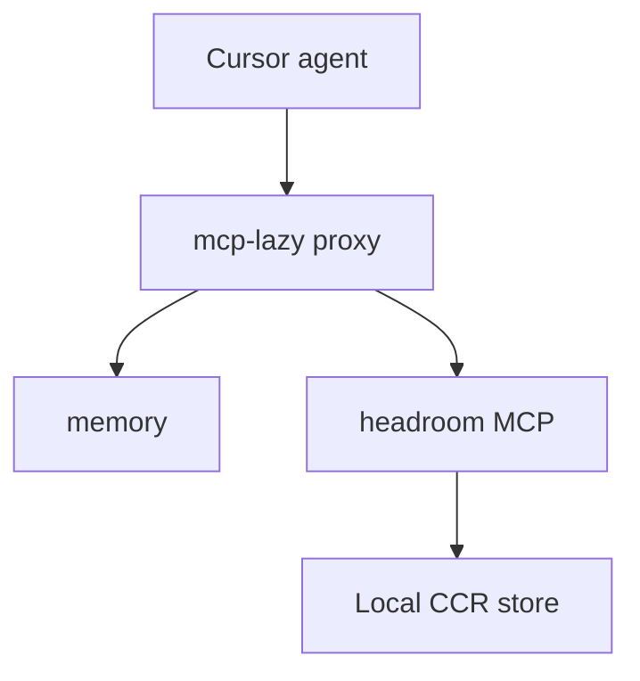

# Headroom + MCP Lazy integration (ThinkingSOC)

Headroom compresses **tool outputs, logs, files, RAG chunks, and large structured context** before they reach the LLM.

**Upstream:** [headroomlabs-ai/headroom](https://github.com/headroomlabs-ai/headroom) · Apache 2.0 · local-first.

---

## Toggle in Cursor (single MCP entry)

`install.sh` registers **one** MCP server in `~/.cursor/mcp.json`:

| Entry | Enable when | Tools |
|-------|-------------|-------|
| **mcp-lazy** | Memory + Headroom (and any custom backends in `mcp-lazy-servers.json`) | `mcp_search_tools` → `mcp_execute_tool` |

Headroom (`headroom_compress`, `headroom_retrieve`, `headroom_stats`, …) is a **backend behind mcp-lazy**, not a separate Cursor toggle. Use `mcp_execute_tool` with `server_name: "headroom"`.

**Examples:**

| Goal | mcp-lazy |
|------|----------|
| Full agent workflow (memory + compress) | ON |
| Memory only | ON (agent simply skips headroom tools) |

---

## RTK + Headroom (complementary — not interchangeable)

| Question | Answer |
|----------|--------|
| Does Headroom auto-compress Shell? | **No** — only when agent calls `headroom_compress` (or optional `headroom wrap cursor` proxy) |
| What if RTK hook is off? | Shell output is **raw** — run `./ai-toolstack/install.sh` (auto-installs **RTK** when `AI_TOOLSTACK_AUTO_INSTALL_RTK=1` in `config/auto-install.env.sh`) |
| RTK role | **Lane A:** automatic Shell compression (`preToolUse` hook when `rtk` is on PATH) |
| Headroom role | **Lane B:** on-demand compression for Read, MCP JSON, grep dumps, log files |

**Agent rule:** do **not** `headroom_compress` RTK-filtered Shell output. **Do** compress large non-shell blobs.

| Source | Lane | Notes |
|--------|------|-------|
| Shell git/pytest/docker/lint | **RTK** | Hook automatic |
| `cat` / Read huge log | **Headroom** | RTK passthrough on `cat` |
| Grep/Read/MCP JSON | **Headroom** | + `retrieve` when compressed loses detail |
| RTK Shell output | **Skip** | no double-compress |

Disable RTK hook: `AI_TOOLSTACK_RTK_HOOK=0 ./ai-toolstack/install.sh`

**Cursor Shell sandbox:** `rtk-cursor-hook.sh` sets `XDG_DATA_HOME` to `ai-toolstack/data/rtk-xdg` (gitignored) so RTK can write `history.db` without printing `[rtk: No such file or directory]` on every invocation (~15 tokens saved per Shell tool call).

### Production guardrails (hard-coded)

| Guard | Implementation |
|-------|----------------|
| RTK watermark | `hooks/rtk-cursor-hook.sh` appends `<!-- thinkingSOC:rtk-lane -->` to every Shell command |
| Headroom bypass | `lib/headroom_mcp_guard.py` skips `headroom_compress` when marker present |
| Disk-first logs | `HEADROOM_MCP_READ=on` → use **`headroom_read`** instead of `cat` for large files |

Verify: `node ai-toolstack/scripts/compression-lanes-real-test.mjs`

**Stress / challenge suite** (bottleneck map, adversarial scenarios):

```bash
node ai-toolstack/scripts/compression-lanes-stress-test.mjs          # full (~90s; includes lint)
node ai-toolstack/scripts/compression-lanes-stress-test.mjs --quick  # fast (~45s; skips lint)
```

Report: `ai-toolstack/data/headroom/compression-lanes-stress-report.json`

---

## Architecture



| Layer | Tool | Scope |
|-------|------|-------|
| MCP schemas | **mcp-lazy** | Lazy-load tool schemas |
| Discovery | **Read + rg** | Committed docs in repo |
| Chat facts | **Memory** | Cross-session decisions |
| **Context compression** | **Headroom MCP** | JSON, logs, files via `headroom_compress` |

---

## MCP tools (via mcp-lazy)

```
mcp_search_tools({ "query": "headroom compress" })
mcp_execute_tool({
  "server_name": "headroom",
  "tool_name": "headroom_compress",
  "arguments": { "content": "..." }
})
```

| Tool | Use when |
|------|----------|
| `headroom_compress` | Large text/JSON/logs/shell output before reasoning (returns hash + savings) |
| `headroom_read` | **Large files on disk** — read + cache without `cat` in terminal (`HEADROOM_MCP_READ=on`) |
| `headroom_retrieve` | Need original content by hash (CCR, 1h local TTL) |
| `headroom_stats` | Session compression stats |

**Agent workflow:** After shell commands or large Read/MCP results, call `headroom_compress` when output exceeds ~500 tokens of low-signal data (search hits, JSON arrays, build logs).

---

## Install

```bash
pipx install "headroom-ai[mcp]"   # once per host (install.sh does this)
./ai-toolstack/install.sh
npx mcp-lazy init
# Cursor → Reload Window
```

Runtime data: `ai-toolstack/data/headroom/` (`HEADROOM_WORKSPACE_DIR`).

Config: `ai-toolstack/config/headroom-env.sh` · Serve wrapper: `ai-toolstack/bin/headroom-mcp-serve.sh` (spawned by mcp-lazy, not registered in `mcp.json`).

---

## Optional: proxy mode (automatic LLM-level compression)

For zero-code compression of **all** LLM traffic (including tool results in the API path), run Headroom proxy and point Cursor at it:

```bash
headroom wrap cursor    # starts proxy on :8787 + prints Cursor settings
```

Then in Cursor: **Settings → Models → OpenAI API Key → Advanced → Override Base URL** → `http://127.0.0.1:8787/v1`.

Do **not** register memory or headroom directly in `mcp.json`. Only **mcp-lazy** belongs in Cursor; backends live in `mcp-lazy-servers.json`.

See [Headroom proxy docs](https://headroom-docs.vercel.app/docs/proxy).

---

## Verify

```bash
./ai-toolstack/scripts/verify-install.sh
./ai-toolstack/scripts/verify-mcp-tools.mjs --quick
./ai-toolstack/scripts/ai-toolstack.sh stats gain --since 24h
```

---

## Agent workflow

1. **Read** service design / standards docs  
2. **Narrow rg** on surfaced paths  
3. **Edit** minimally (ponytail)  
4. **RTK** → Shell output compressed automatically (`preToolUse` hook)  
5. **Headroom** → `headroom_compress` on large Read / MCP / JSON / logs (not Shell)

---

## Related

- [`token-optimization-overview.md`](token-optimization-overview.md) — decision router
- [Headroom MCP docs](https://headroom-docs.vercel.app/docs/mcp)
