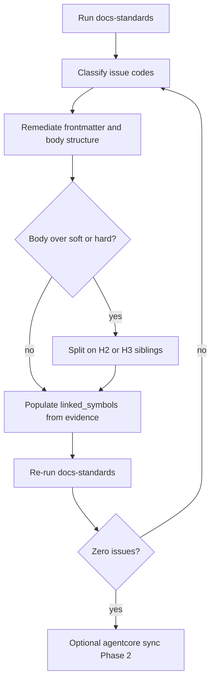

# 10 - Documentation Standardization Procedure

## Purpose

This document is the **normative operating procedure** for standardizing AgentCore product documentation under `docs/`. It turns the authoring rules in `06-…`, `08-…`, and `09-…` into a **repeatable, machine-verified method** that humans and agents **must** follow whenever documentation is brought to Full-tier compliance (bulk remediation, new normative docs, or fixing a nonconforming file).

Structure and ingest tiers live in `08-documentation-structure-and-machine-ingest-standard.md`. Lanes live in `09-documentation-classification-and-lanes.md`. Content quality lives in `06-professional-documentation-standard.md`. **This file owns the how**: audit → fix → split → link → accept.

## Design Goals

| Goal | Requirement |
| --- | --- |
| One exit criterion | A doc is standardized only when `agentcore docs-standards` reports **zero issues** for that file (warnings may remain only if this procedure explicitly allows them; soft budget **must** be cleared for new remediations) |
| Machine-first gate | Authors do not invent a parallel checklist; they use the same issue codes as `check_markdown_doc` |
| Evidence-based code links | `linked_symbols` never invents symbols; tokens must resolve or be path-evidenced |
| Modular growth | Soft ≤ ~400 body lines; hard ≤ ~800; split on H2 (or H3 inside a mega-section) instead of growing mega-files |
| Idempotent tooling | Remediator and split scripts may be re-run; they must not destroy readable body prose |

## Non-Goals

- Replacing `06` / `08` / `09` content rules with a second taxonomy.
- Auto-inventing `DOCUMENTED_BY` edges for architecture docs that do not explain code.
- Lowering the machine gate to “mostly conforming.”
- Writing Persian (or any non-English) into committed documentation bodies.

## Document flow



| Step | Actor | Action | Outcome |
| --- | --- | --- | --- |
| 1 | Operator / agent | Run machine audit | Issue list + percents |
| 2 | Operator / agent | Remediate metadata/structure | Frontmatter + Purpose + Mermaid where required |
| 3 | Operator / agent | Split oversized bodies | Sibling `-continued` / part files under soft budget |
| 4 | Operator / agent | Add evidence `linked_symbols` | Graph-ready tokens only |
| 5 | Operator / agent | Re-audit until clean | `nonconforming_count = 0` |
| 6 | Operator | Optional `agentcore sync` | Docs indexed + `DOCUMENTED_BY` for resolved tokens |

---

## 1. Definition Of Standardized

A Markdown file under `docs/**/*.md` is **standardized** when **all** of the following hold:

1. **Machine gate green** — `check_markdown_doc` returns `ok: true` (no `issues`; soft-budget **warnings must be resolved** for remediations performed under this procedure).
2. **Full-tier frontmatter** — required fields + all five lane fields populated with **allowed enums only** (§3, §4).
3. **Body shape** — exactly one H1 matching `title`; a Purpose (or allowed equivalent) H2; English-only committed body.
4. **Design types** — if `doc_type` ∈ `{hld, lld, feature_spec, service_design}`, body contains at least one Mermaid fence **and** a matching agent-readable flow table (Step / Actor / Action / Outcome).
5. **Size** — body lines ≤ soft budget (~400) after splits; never exceed hard budget (800) without an explicit split plan already applied.
6. **Code links honesty** — `linked_symbols` is either empty (doc does not explain code) or contains only evidence-based tokens (§6).

Tree scope for the CLI gate: repository `docs/` (see `build_docs_standards_report`). Other trees (`backend/docs/`, service READMEs) follow the same rules when authors opt them into Full-tier; they are not all scanned by default.

---

## 2. Machine Gate (`agentcore docs-standards`)

### 2.1 Commands

```text
agentcore docs-standards
agentcore docs-standards detail
agentcore docs-standards save /tmp/docs-standards.txt
agentcore docs-standards detail save /tmp/docs-standards.txt
```

Programmatic equivalent: `build_docs_standards_report()` / `check_markdown_doc()` in `backend/packages/agentcore_cli/commands/docs_standards/`.

Regression lock: `tests/backend/tools/agentcore-cli/test_docs_standards.py` **must** keep the repo `docs/` tree at `nonconforming_count == 0`.

### 2.2 Issue codes (blocking)

| Issue code | Meaning | Required fix |
| --- | --- | --- |
| `missing_or_invalid_frontmatter` | No/invalid YAML `---` block | Add Full-tier frontmatter |
| `missing_required:<field>` | Required field empty | Fill field (§3) |
| `missing_lane:<field>` | Lane field empty | Fill lane (§4) |
| `invalid_doc_id_format` | Not `ac.doc.<domain>.<slug>` | Rewrite `doc_id` (immutable once published) |
| `invalid_status` | Status not in allowed set | Map aliases (§5) |
| `invalid_doc_type` | Type not in allowed set | Map aliases (§5) |
| `tags_must_be_list` | `tags` not a YAML list | Use list |
| `canonical_path_mismatch` | Path ≠ repo-relative path | Set `canonical_path` to actual path |
| `missing_h1` / `multiple_h1` | Zero or >1 H1 outside fences | One H1; demote extras to H2 |
| `title_h1_mismatch` | `title` ≠ H1 | Align both |
| `missing_purpose_h2` | No Purpose/overview H2 | Add `## Purpose` (or allowed synonym) |
| `design_missing_mermaid` | Design `doc_type` without Mermaid | Add Mermaid under Purpose / Document flow |
| `body_over_hard_budget:<n>` | Body > 800 lines | **Must** split before accept |

### 2.3 Warning codes (must clear under this procedure)

| Warning | Meaning | Required fix under this procedure |
| --- | --- | --- |
| `body_over_soft_budget:<n>` | Body > 400 lines | Split into sibling files (§7) until warning clears |

Soft budget is a **signal to split**, not permission to leave mega-docs after a standardization pass.

---

## 3. Required Frontmatter Fields

Every Full-tier doc **must** include:

| Field | Allowed values / rules |
| --- | --- |
| `doc_id` | `^ac\.doc\.[a-z0-9][a-z0-9_.-]*$` (AgentCore product docs). Do not use `tsoc.doc.*` under `docs/`. |
| `title` | Non-empty; matches single H1 |
| `doc_type` | Exactly one of: `index`, `standard`, `hld`, `lld`, `feature_spec`, `service_design`, `runbook`, `adr`, `contract`, `example`, `gap`, `glossary`, `readme` |
| `status` | Exactly one of: `draft`, `active`, `deprecated`, `archived` |
| `schema_version` | Frontmatter schema semver string (typically `"1.0"`) |
| `owner` | Team/role slug |
| `summary` | 1–3 accurate sentences (embedding preamble); not marketing fluff; prefer a complete first sentence |
| `tags` | Non-empty YAML list (kebab-case) |
| `phase` | Phase folder name or stable phase label |
| `canonical_path` | Exact repo-relative path of this file |

Lane fields (required):

| Field | Source of truth |
| --- | --- |
| `lifecycle_lane` | `09-…` §2 |
| `concern_lane` | `09-…` §3 — **only** values listed there |
| `audience_lane` | Non-empty list from `09-…` §4 |
| `authority` | `09-…` §5 |
| `visibility` | `09-…` §6 |

Recommended: `linked_symbols`, `related_docs`, `doc_version`, `chunk_hints`, `language: en`, `security_classification`.

---

## 4. Concern Lane Closed Set

`concern_lane` **must** be one of:

`standard` · `design` · `decision` · `problem` · `gap` · `contract` · `ops` · `example` · `cross_team` · `onboarding` · `security` · `product`

### 4.1 Forbidden aliases (normalize before accept)

| Do not use | Normalize to |
| --- | --- |
| `architecture` | `design` |
| `implementation` | `design` |
| `runbook` (as concern) | `ops` |
| `risk` / `risks` | `problem` |
| `feature` / `feature-specification` | `product` |
| `integration` | `cross_team` |
| `specification` / `guide` | `standard` |
| `contracts` | `contract` |
| `roadmap` | `gap` |

### 4.2 Status aliases

| Do not use | Normalize to |
| --- | --- |
| `proposed` / `experimental` | `draft` |
| `accepted` / `stable` | `active` |
| `rejected` / `superseded` / `withdrawn` | `archived` |

### 4.3 `doc_type` aliases

| Do not use | Normalize to |
| --- | --- |
| `design` | `hld` (or infer `lld` / `feature_spec` from filename) |
| `feature` / `feature-specification` | `feature_spec` |
| `high-level-design` | `hld` |
| `low-level-design` | `lld` |
| `specification` / `guide` / `policy` | `standard` |
| `onboarding` | `runbook` |
| `roadmap` / `risks` / `risks-acceptance` | `gap` |
| `contracts` | `contract` |

---

## 5. Body Structure Rules

1. YAML frontmatter first; then exactly one `#` H1; then `## Purpose` (synonyms allowed by machine: headings matching Purpose / “Overview of…” / “What this document…”).
2. Prefer chunkable H2s (about ≤12). Put algorithms, contracts, and acceptance in dedicated H2s.
3. Design types **must** include Mermaid and a matching agent-readable flow table (Step / Actor / Action / Outcome) in the same section. The remediator inserts both when missing.
4. Keep a single `## Related Documents` block (no duplicates).
5. English only in committed bodies.

---

## 6. `linked_symbols` Rules (Code Graph Phase 2)

Human-doc sync (`sync_human_docs`) creates `DOCUMENTED_BY` only for tokens that **resolve** to existing code symbols after Phase 1 ingest.

### 6.1 Accepted token forms

- `path/to/file.py::SymbolName` (preferred; file must exist)
- Exact `qualified_name` already present in the code graph
- Bare graph symbol id (advanced)

### 6.2 How to populate during standardization

1. Prefer tokens already written as `` `backend/.../file.py::Name` `` in the body.
2. If the body cites `` `backend/.../file.py` `` (or the same path without backticks) and the file exists, authors **must** during an enrichment pass link the file’s first public top-level `def`/`class` as `path::Name` (evidence = path citation).
3. Curated maps for known ownership docs (CLI, ingest, docs-standards, docs-sync) **must** seed tokens that exist on disk when those docs are remediated.
4. **Never** invent symbols that are not in the cited file / graph.
5. Architecture-only docs with **no** code-path citations **may** keep `linked_symbols: []`.

### 6.3 Optional enrichment helpers

**Preferred (hybrid write path):** evidence-only CLI suggestions (no invented edges):

```text
agentcore docs-suggest-links
agentcore docs-suggest-links --path docs/foo.md
agentcore docs-suggest-links --docs-root backend/docs --include-all
agentcore docs-suggest-links --apply   # frontmatter only; then agentcore sync
```

Normative detail: `docs/07-code-knowledge-graph/41-hybrid-documentation-coverage.md`.

After the mandatory gate is green, operators may also run:

```text
python scripts/optional_docs_enrichment.py
```

This expands evidence `linked_symbols` from cited paths and inserts missing design flow tables. Re-run `docs-standards` afterward.

Unresolved tokens are reported; they must not create edges.

---

## 7. Size Budgets And Split Procedure

| Budget | Threshold | Gate |
| --- | --- | --- |
| Soft | ~400 body lines | Warning; **must clear** under this procedure |
| Hard | 800 body lines | Blocking issue |

### 7.1 Split method (normative)

1. Prefer a new numbered sibling or `*-continued.md` / `*-part-N.md` in the **same folder**.
2. Split on **H2** boundaries first so each file keeps coherent sections.
3. If one H2 section alone exceeds soft budget (for example a huge command catalog), split that section on **H3** boundaries into a part file.
4. Head file keeps Purpose + early sections; continued file states it is a continuation and links back.
5. Both files get Full-tier frontmatter and unique `doc_id` / `canonical_path`.
6. Update folder `00-index.md` (and parent Related Documents) when adding siblings.
7. Re-run the machine gate until soft and hard are clear.

Tooling helpers (non-exclusive):

- `scripts/remediate_docs_standards.py` / `remediate_docs_standards.py --force`
- `scripts/split_soft_budget_docs.py`
- `scripts/optional_docs_enrichment.py`
- Library: `agentcore_cli.commands.docs_standards.remediate`

---

## 8. Operator / Agent Procedure (Mandatory Sequence)

**[DOC-STD-PROC-001]** Standardization passes **must** follow this order:

1. **Baseline audit** — `agentcore quality-audit detail` (categorized docs+code) and/or `agentcore docs-standards detail`. Record category counts and top findings.
2. **Remediate structure/metadata** — apply Full-tier frontmatter, lanes, Purpose, Mermaid+flow table for design types, alias normalization (§4–§5). Prefer shared remediator over one-off edits.
3. **Clear size warnings** — split per §7 until soft warnings are gone; never accept hard overruns.
4. **Link honestly** — populate `linked_symbols` per §6 (path citations + curated ownership maps).
5. **Optional enrichment** — `python scripts/optional_docs_enrichment.py` for remaining path citations and design flow tables; then re-audit.
6. **Final audit** — `nonconforming_count == 0` and no soft warnings for files touched by the pass.
7. **Tests** — run `tests/backend/tools/agentcore-cli/test_docs_standards.py` when changing gate/remediator behavior or after bulk tree remediations.
8. **Optional sync** — `agentcore sync` Phase 2 to project human docs + resolved `DOCUMENTED_BY` edges.

Do **not** mark a bulk remediation “done” while soft-budget warnings remain on files the pass touched.

---

## 9. Implementation Map

| Concern | Path |
| --- | --- |
| Issue codes / budgets | `backend/packages/agentcore_cli/commands/docs_standards/check.py` |
| Tree report | `…/docs_standards/collect.py` |
| CLI entry (standards gate) | `…/docs_standards/cmd.py` |
| CLI entry (categorized audit) | `…/quality_audit/cmd.py` (`agentcore quality-audit`) |
| Remediator | `…/docs_standards/remediate.py` |
| Optional enrichment | `scripts/optional_docs_enrichment.py` |
| Soft-budget split | `scripts/split_soft_budget_docs.py` |
| Frontmatter parse | `backend/packages/agentcore_cli/markdown_frontmatter.py` |
| Human doc graph projection | `…/application/ingest/human_docs.py` |
| Token resolve | `…/domain/symbol_resolve.py` |
| Phase 2 orchestration | `backend/packages/agentcore_cli/docs_link_sync.py` |
| Unit / tree lock | `tests/backend/tools/agentcore-cli/test_docs_standards.py` |

---

## 10. Acceptance Checklist

- [ ] `agentcore docs-standards` → `nonconforming_count = 0` for the scope of work.
- [ ] No `body_over_soft_budget` warnings on files remediated in this pass.
- [ ] No hard budget issues anywhere in scope.
- [ ] Every touched file has Full-tier required + lane fields with closed-set enums.
- [ ] `doc_id` matches `ac.doc.*`; `canonical_path` matches real path; `title` matches single H1.
- [ ] Design types have Mermaid **and** a Step/Actor/Action/Outcome flow table.
- [ ] `linked_symbols` empty only when no code-path citations exist; otherwise evidence-based / curated.
- [ ] Optional enrichment script run when performing a full-tree polish pass.
- [ ] Folder index updated for new siblings.
- [ ] `test_docs_standards.py` green when tooling or whole-tree compliance changed.
- [ ] Body remains readable if frontmatter were stripped (fallback).

---

## Related Documents

- `08-documentation-structure-and-machine-ingest-standard.md` (+ continued) — structure, frontmatter schema, RAG shape.
- `09-documentation-classification-and-lanes.md` — lane enumerations and filter rules.
- `06-professional-documentation-standard.md` — content quality and designed-vs-shipped honesty.
- `../agents/documentation-authoring.md` — portable agent law (must follow this procedure when standardizing).
- `../agents/team-documentation-playbook-for-agentcore.md` — team entry: which docs to follow and why AgentCore needs them.
- MCP coding agents: tool `agentcore_docs_authoring_standards` + skill `agentcore-documentation-authoring` (SSOT module `common_context_service.documentation_authoring_law`).
- `../08-software-engineering-architecture/42-agentcore-cli-command-reference.md` — `docs-standards` CLI UX.
- `../03-docs-as-code-sync/00-index.md` — docs-sync / drift context for Phase 2 linking.
- `../15-agent-workspace-guidance/06-mcp-first-agent-skills-and-rules.md` — MCP-first seed skills including documentation authoring.
