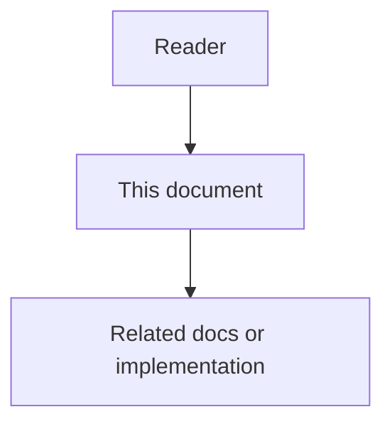

# Core Data Model - Feature Specification

## Purpose

The Core Data Model turns agent activity, decisions, discovered problems, and executable work into durable structured records. It is the foundation for memory, documentation synchronization, policy evaluation, orchestration, auditing, and interoperability.

## Document flow

| Step | Actor | Action | Outcome |
| --- | --- | --- | --- |
| 1 | Reader | Opens this design document | Understands scope and constraints |
| 2 | Reader | Follows the Mermaid flow | Sees primary component interactions |
| 3 | Reader | Uses Related Documents / linked symbols | Reaches deeper design or implementation |

## Mission

The Core Data Model turns agent activity, decisions, discovered problems, and executable work into durable structured records. It is the foundation for memory, documentation synchronization, policy evaluation, orchestration, auditing, and interoperability.

## Feature 1 - Activity and Work Log

An Activity is an atomic record of something an agent or human did. A WorkLog is the session-level summary of what was attempted, what changed, what passed, what failed, and what remains.

The platform must capture structured work instead of relying on chat history. Activities should link to files, commands, tests, artifacts, tasks, and evidence. WorkLogs should summarize outcomes and blockers in a form that future agents and humans can understand.

## Feature 2 - Decision Tracking

A Decision captures why a technical, architectural, security, product, or operational choice was made. This prevents future agents from undoing valid tradeoffs just because they look inefficient in isolation.

A complete Decision includes context, options considered, chosen option, rejected alternatives, consequences, generated rules, owner, linked entities, and supersession policy.

## Feature 3 - Issue and Task Separation

An Issue describes a problem, risk, inconsistency, or need. A Task describes executable work required to address an Issue. This separation allows one Issue to create multiple Tasks across backend, frontend, data, QA, docs, security, or human approval workflows.

## Feature 4 - Agent Collaboration Work Surface

AgentCore owns a specialized collaboration surface for agents: Issue, Task, AgentTicket, ChangeSet (pull-request analog), ReviewThread/ReviewComment, DiscussionComment, and WorkLabel. Agents create and review these records inside AgentCore. GitHub and similar systems are optional projections, not the system of record. See `07-agent-collaboration-work-surface.md` and `08-changeset-review-and-discussion-contracts.md`.

## User Value

- Teams can reconstruct what happened without reading raw chat logs.
- Agents can inherit decisions and avoid repeated mistakes.
- Risks are separated from execution work.
- Audit, memory, docs, and orchestration layers receive stable structured input.

## Functional Requirements

- Create Activity records from raw tool traces and agent events.
- Create WorkLogs from completed sessions.
- Promote important rationale into Decision records.
- Create Issues for risks or discovered problems.
- Decompose Issues into role-specific Tasks.
- Create ChangeSets, review threads, discussion comments, and work labels as native AgentCore records when agents propose and review changes.
- Preserve correlation IDs and evidence references across all records.

## Non-Functional Requirements

- Records must be queryable, auditable, version-aware, and tenant-scoped.
- Sensitive data must be redacted before prompt or dashboard use.
- Duplicate retries must not create duplicate logical records.
- State transitions must be explicit and testable.
