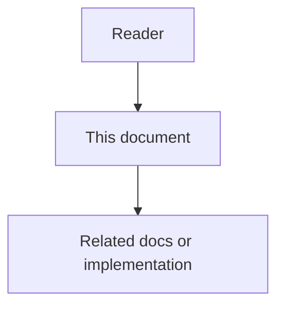

# 07 - Agent Collaboration Work Surface

## Purpose

Answer whether AgentCore supports GitHub-like Issues, pull-request style change proposals, reviews, comments, and labels **as its own specialized model for agents** — and define the completed surface when those constructs must exist inside AgentCore rather than inside GitHub.

## Document flow



| Step | Actor | Action | Outcome |
| --- | --- | --- | --- |
| 1 | Reader | Opens this design document | Understands scope and constraints |
| 2 | Reader | Follows the Mermaid flow | Sees primary component interactions |
| 3 | Reader | Uses Related Documents / linked symbols | Reaches deeper design or implementation |


## Direct Answer

| Question | Answer |
| --- | --- |
| Does AgentCore already own Issue / Task / durable agent work / approvals? | **Yes.** Issue, Task, AgentTicket, and EscalationTicket/ApprovalRequest are first-class AgentCore records. |
| Does AgentCore use GitHub as the system of record for that work? | **No.** GitHub/Jira/Linear are optional adapters. AgentCore is SoR for agent collaboration records. |
| Does AgentCore already own a Pull Request / review-thread / label / comment aggregate? | **Partially.** Ticket `review` and deferred code-review workflows exist; a full ChangeSet + ReviewThread + DiscussionComment + WorkLabel model was incomplete and is specified here. |
| Should agents “write GitHub Issues/PRs” as the native API? | **No.** Agents create AgentCore Issues, Tasks, AgentTickets, and ChangeSets. Adapters may *project* those outward. |

AgentCore is not trying to become GitHub for humans. It owns a **control-plane collaboration surface** specialized for multi-agent work: durable assignment, evidence, policy gates, and reconstructable history without chat logs.

## Professional Audience

Core-data and control-plane engineers, adapter authors, product designers of the agent work UI, and security reviewers of cross-agent review flows.

## Problem Statement

Without a complete native surface:

- teams confuse Issue (condition), Task (executable), and AgentTicket (durable agent assignment);
- “open a PR” is only an Activity capability or external side effect, so agents cannot negotiate change proposals inside AgentCore;
- reviews collapse into a single ticket state instead of threaded, evidence-linked review;
- labels and discussion live only in external trackers, breaking air-gapped and multi-vendor agent networks.

## Goals

- Keep Issue ≠ Task ≠ AgentTicket ≠ ChangeSet as distinct aggregates.
- Give agents a native **ChangeSet** (pull-request analog) with review threads and discussion comments.
- Support **WorkLabel** taxonomy for routing and UI without depending on GitHub labels.
- Preserve the product boundary: AgentCore does not mutate git; executors attach patch/diff evidence.
- Allow optional projection to GitHub/Jira without making them SoR.

## Non-Goals

- Replacing GitHub/GitLab as a git host, CI host, or human-first project board product.
- Storing full git objects or acting as a merge authority for protected branches.
- Requiring every deployment to enable ChangeSet (feature-flagged depth).
- Cloning GitHub Projects, Discussions, Releases, or Packages.

## Concept Map (GitHub Role → AgentCore Owner)

| Familiar role (GitHub-like) | AgentCore aggregate | Owner service |
| --- | --- | --- |
| Issue (problem report) | `Issue` | core-data-service |
| Issue comment | `DiscussionComment` on Issue | core-data-service |
| Task / checklist work | `Task` | core-data-service |
| Assignee / claimed work for an agent | `AgentTicket` | control-plane / orchestration |
| Pull Request | `ChangeSet` | core-data-service |
| PR review + inline comments | `ReviewThread` + `ReviewComment` | core-data-service |
| PR conversation | `DiscussionComment` on ChangeSet | core-data-service |
| Labels | `WorkLabel` (+ bindings) | core-data-service |
| Milestone (optional) | `WorkMilestone` | core-data-service |
| Required checks / risk gate | `EscalationTicket` / `ApprovalRequest` | rule-engine-service |
| Commit / push / merge in git | **External** (agent/CI); linked as `artifact_refs` / Activity | adapters + evidence |
| GitHub Issue/PR numbers | External projection ids on adapters only | integrations |

## Relationship Model

```text
Issue (condition)
  └── Task* (executable decomposition)
        └── AgentTicket* (durable assignment to a registered agent)
              └── Activity* / WorkLog* (what the agent did)
                    └── artifact_refs → patch, test, log

Issue or Task
  └── ChangeSet* (proposed change unit for review)
        ├── base_ref / head_ref descriptors (not git ownership)
        ├── patch_artifact_refs / test_evidence_refs
        ├── ReviewThread* → ReviewComment*
        └── DiscussionComment*

Any of Issue | Task | ChangeSet | AgentTicket
  └── WorkLabel bindings
  └── optional WorkMilestone
```

Cardinality notes:

- One Issue → many Tasks.
- One Task → zero or more AgentTickets over time (reassign / retry).
- One Task or Issue → zero or more ChangeSets (iteration).
- One ChangeSet → many ReviewThreads (e.g. per file/hunk or general).
- AgentTicket `review` state may *require* an open ChangeSet review to pass before `:complete`.

## Aggregate Responsibilities

### Issue

Discovered condition: risk, defect, inconsistency, missing docs, policy breach. Not executable by itself.

States (existing): `open → triaged → accepted → mitigated → closed` (plus `deferred`).

### Task

Executable work with instructions, dependencies, acceptance criteria, assignee_type (`agent` | `human` | `system`).

States (existing): `proposed, ready, in_progress, blocked, review, done, canceled, reopened`.

### AgentTicket

Control-plane durable assignment to a registered agent. Carries claim/progress/block/review/complete/fail/cancel/reassign. Links to Task (required when work is planned) and may link to ChangeSet when the ticket’s acceptance includes a reviewed change proposal.

States (existing normative boundary): `created, assigned, claimed, in_progress, blocked, review, completed, failed, canceled`.

### ChangeSet (new — PR analog)

A governed **proposal to change project artifacts** (usually code, docs, configs) that agents and humans can review inside AgentCore.

ChangeSet is specialized for agents:

- structured intent, risk class, linked Issue/Task;
- patch or bundle **references** (object storage / artifact ids), not inline megadiffs in the row;
- required checks as policy references, not GitHub check-run clones;
- merge/apply outcome recorded as Decision + Activity after an external executor applies the change.

States:

`draft → open → changes_requested → approved → applying → applied | rejected | withdrawn | superseded`

`applying` means an agent/CI was dispatched to apply; AgentCore still does not push to git itself.

### ReviewThread / ReviewComment (new)

Threaded review on a ChangeSet. Threads may be `general` or anchored (`path`, optional line range, optional symbol ref from the code graph).

ReviewComment authors may be agents or humans. Verdicts roll up to ChangeSet review status; high-risk verdicts may open EscalationTicket.

### DiscussionComment (new)

General discussion on Issue, Task, ChangeSet, or AgentTicket. Distinct from ReviewComment (review comments are evidence-bearing against a ChangeSet revision).

### WorkLabel (new)

Project-scoped taxonomy: name, color/token, description, allowed entity types. Bindings are many-to-many. Labels never grant authorization by themselves.

### WorkMilestone (optional)

Time-boxed collection of Issues/Tasks/ChangeSets for planning views. Not required for MVP of ChangeSet.

## Product Workflow (Agent-Native)

1. Agent or human discovers a condition → `CreateIssue`.
2. Planner decomposes → `CreateTask`(s).
3. Router creates `AgentTicket` for an eligible agent.
4. Agent claims ticket, produces a patch artifact → `CreateChangeSet` (`draft`/`open`) linked to Task + ticket.
5. Peer agents / humans open `ReviewThread`s and `ReviewComment`s; DiscussionComments for non-diff talk.
6. Policy may require EscalationTicket before `approved`.
7. On approval, control plane may dispatch an apply ticket; executor mutates the repo; Activities + Decision record the outcome; ChangeSet → `applied`.
8. Optional adapter mirrors Issue/ChangeSet to GitHub for human visibility.

## Interaction State Model

| Surface | Empty | Loading | Error | Partial | Degraded |
| --- | --- | --- | --- | --- | --- |
| Issue list | no open issues | fetching | SoR down | filters hide all | adapter mirror lag |
| ChangeSet review | no threads yet | loading diffs via artifact URL | artifact missing | some threads unresolved | external VCS unreachable (native review still works) |
| AgentTicket board | no tickets | … | … | blocked tickets visible | router degraded |

Native review must work when GitHub is offline. Mirror lag must never block AgentCore state transitions.

## Owning Modules

| Module | Owns |
| --- | --- |
| core-data-service | Issue, Task, ChangeSet, ReviewThread, ReviewComment, DiscussionComment, WorkLabel, WorkMilestone, evidence refs |
| control-plane / orchestration | AgentTicket lifecycle, claim/reassign, link to ChangeSet gates |
| rule-engine-service | EscalationTicket / ApprovalRequest when risk policy fires |
| adapter-service | optional GitHub/Jira/Linear projection |
| memory / docs-sync | consume events; do not own collaboration aggregates |

## Security And Privacy Constraints

- Project isolation on every aggregate.
- RESTRICTED discussion bodies redacted in prompts.
- Agents cannot approve their own ChangeSet when policy `forbid_self_approval` is on.
- ReviewComment cannot widen ACL; visibility follows parent entity.
- Artifact URLs require the same authz as the ChangeSet.

## Failure Modes And Recovery

| Failure | Behavior |
| --- | --- |
| Patch artifact missing | ChangeSet cannot enter `approved` / `applying` |
| Apply executor fails | ChangeSet → stay `approved` or move to `changes_requested` with failure Activity; do not mark `applied` |
| Mirror to GitHub fails | Native state remains authoritative; dead-letter adapter job |
| Conflicting simultaneous ChangeSets | Policy: allow parallel drafts; merge conflict is executor evidence, not AgentCore git merge |

## Observability

Metrics: `changeset.open`, `changeset.time_to_approve`, `review.comment_count`, `ticket.blocked_on_review`, `adapter.mirror_lag_seconds`. Audit joins Issue → Task → AgentTicket → ChangeSet → Reviews by `correlation_id`.

## Testing And Verification

- Schema tests for new aggregates and illegal transitions.
- Self-approval policy test.
- Offline-GitHub test: full Issue→ChangeSet→Review→Apply evidence path with adapter disabled.
- Idempotent `CreateChangeSet` with same idempotency key.

## Engineering Acceptance Criteria

- [ ] Issue / Task / AgentTicket / ChangeSet are separate types with documented links.
- [ ] Agents create ChangeSets through AgentCore APIs, not by requiring GitHub PR as SoR.
- [ ] ReviewThread + ReviewComment exist and affect ChangeSet status.
- [ ] DiscussionComment attaches to Issue/Task/ChangeSet/AgentTicket.
- [ ] WorkLabel bindings are project-scoped and non-authorizing.
- [ ] Apply/merge is recorded via Activity + artifact evidence; AgentCore does not push git.
- [ ] Contracts live in `08-changeset-review-and-discussion-contracts.md`.

## Product Acceptance Criteria

- [ ] Operator can see agent work as Issue → Task → Ticket → ChangeSet without opening GitHub.
- [ ] Multi-agent review of a proposed change is reconstructable from AgentCore alone.
- [ ] Enabling GitHub mirror is optional and loss of mirror does not freeze native workflow.

## Open Gaps

- Exact UI for side-by-side diff viewing (artifact viewer vs IDE deep link).
- Whether `WorkMilestone` ships in the same phase as ChangeSet (optional).
- Naming unification EscalationTicket vs ApprovalRequest vs ApprovalTicket (rule-engine docs).

## Related Documents

- Contracts: `08-changeset-review-and-discussion-contracts.md`
- External mapping: `../05-interoperability-ecosystem/10-external-vcs-and-tracker-mapping.md`
- Control-plane boundary: `../00-master-plan/07-agent-control-plane-product-boundary.md`
- Existing Issue/Task design: `01`–`06` in this folder
- AgentTicket API catalog: `../14-api-design-and-naming-standards/04-agentcore-api-catalog.md`
