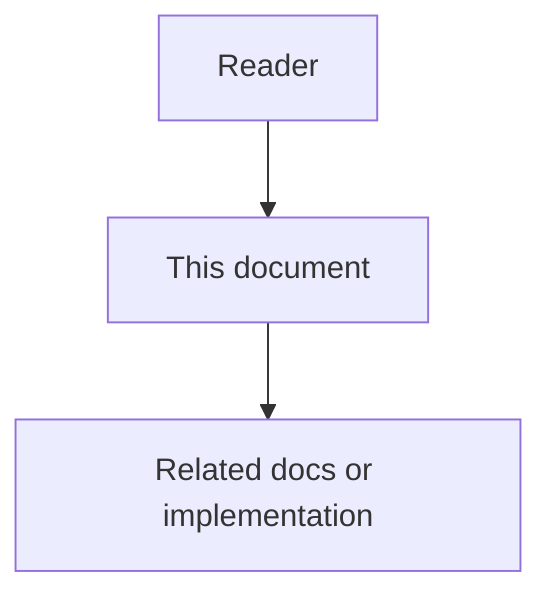

# Memory and Context - Feature Specification

## Purpose

The Memory and Context phase gives agents the right context at the right time while keeping prompts current, low-noise, secure, and cost-efficient.

## Document flow

| Step | Actor | Action | Outcome |
| --- | --- | --- | --- |
| 1 | Reader | Opens this design document | Understands scope and constraints |
| 2 | Reader | Follows the Mermaid flow | Sees primary component interactions |
| 3 | Reader | Uses Related Documents / linked symbols | Reaches deeper design or implementation |

## Mission

The Memory and Context phase gives agents the right context at the right time while keeping prompts current, low-noise, secure, and cost-efficient.

## Feature 1 - Three-Tier Memory

Memory is separated into working memory, episodic memory, and semantic memory. Working memory is temporary task state. Episodic memory stores historical activity. Semantic memory stores durable current truth, rules, active decisions, and architectural facts.

## Feature 2 - Memory Consolidation

Raw activities and WorkLogs are consolidated into durable knowledge. Consolidation reduces noise while preserving evidence references.

## Feature 3 - State over Event Context

Agents receive current state by default. Historical events are retrieved only when the task requires audit, root-cause analysis, or migration history.

## Feature 4 - Decay and Garbage Collection

Stale memory is deprecated or archived when linked code, decisions, policies, or domains disappear. Decay is multi-signal and must not be based only on age.

## Feature 5 - Prompt Caching

Stable architecture, organization rules, and high-level decisions are placed in versioned static prompt sections to improve cache hit rate and reduce repeated cost.

## Feature 6 - Dynamic Context Injection and RAG

The retriever builds ContextBundles from graph links, semantic search, access control, and task intent.

## Feature 7 - Configurable Memory Weighting

Retrieval, decay, retention, and forgotten-memory handling use versioned WeightProfiles. No final weight or threshold should be hard-coded in application logic.

## Feature 8 - Chat Q&A RAG Incremental Documentation

Successful chat questions and answers grow project RAG: persist normalized questions and derived documentation, do not delete those artifacts when the turn ends, refresh linked docs when code hashes change (otherwise reuse existing docs), treat code as behavioral source of truth, and on code-vs-doc contradiction disclose the conflict, answer code-first, and show documentation only on explicit user request. Turns use an immutable session tree, durable write-back receipts, skill-eligible tools, and loop guards. Quality levers from license-verified OSS prior art are cataloged in `10`–`13`.

Normative detail: `09-chat-qa-rag-incremental-documentation.md`.

## Functional Requirements

- Classify memory as working, episodic, semantic, restricted, or deprecated.
- Consolidate raw records into SemanticFacts.
- Resolve current state from active facts and decisions.
- Build ContextBundles with source references and token budgets.
- Apply WeightProfiles to retrieval and decay.
- Preserve restricted memory boundaries.
- After successful chat Q&A, index the question and retain derived documentation in project RAG.
- On code-vs-doc contradiction, disclose conflict, explain from code first, and gate full doc explanation behind user opt-in.
