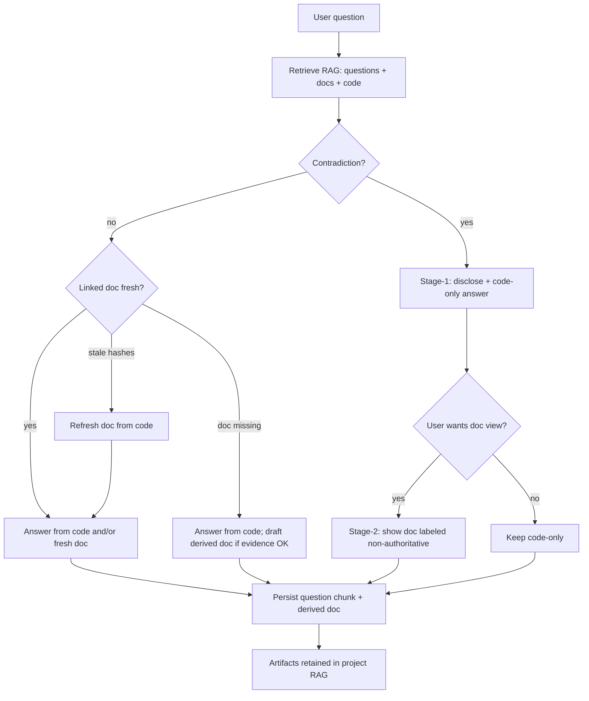
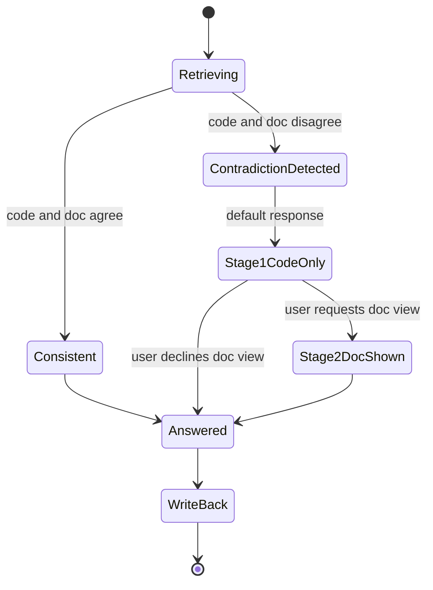

# 09 - Chat Q&A RAG Incremental Documentation

## Purpose

This document specifies how AgentCore **must** turn successful chat questions and answers into durable, project-scoped RAG knowledge, keep derived documentation across sessions, refresh it when linked code changes, and disclose **code-versus-documentation contradictions** with a code-first default and optional documentation view.

It owns product behavior, authority rules, contradiction UX, persistence invariants, and acceptance criteria. Autonomous repeated-question scoring and FAQ promotion remain in `07-autonomous-question-discovery-and-faq-memory.md`. Per-symbol living documentation on ingest remains in `../07-code-knowledge-graph/03-ingestion-and-living-documentation-workflow.md`.

## Implementation Status

| Area | Status |
| --- | --- |
| Symbol living docs persist across sync; unchanged symbols reuse existing AI docs | Partial / as-built in code-graph ingest |
| Hash-gated regenerate when symbol body changes | Partial / as-built in code-graph ingest |
| Closed loop: chat answer → embed question + derived doc into project RAG | Not started (design) |
| MCP / product chat surface that auto-observes Q&A into RAG | Not started (design) |
| Code-vs-doc contradiction detection + staged disclosure UX | Not started (design) |
| QuestionMemory observe / promote-faq HTTP API | Partial; not wired into chat RAG retrieval |

Until the closed loop ships, agents and operators **must not** treat this document as evidence that chat Q&A already grows project RAG automatically.

## Professional Audience

Readers are expected to implement or review memory-service, code-graph retrieval, docs-sync drafts, MCP gateway tools, and chat answer orchestration without tutorials on embeddings or basic RAG.

## Problem Statement

Chat answers today are easy to lose: the question stays in an IDE transcript, optional FAQ APIs are not embedded into searchable RAG, and derived documentation is not systematically promoted after a successful answer. Teams then re-pay token cost, rediscover the same intent, and cannot tell whether a retrieved doc still matches code.

Without explicit contradiction handling, a mixed retrieval pack (code symbols + docs) can produce a single blended answer that hides drift. Users need a clear signal when sources disagree, a trustworthy first answer grounded in code, and an optional path to read the documentation narrative.

## Goals

- After a successful chat Q&A in project scope, persist the **normalized question** (and answer linkage) into project RAG so later retrieval can resolve similar intent.
- Persist the **derived documentation artifact** produced or selected for that answer; **must not** delete it merely because the chat turn ended.
- Grow project documentation **incrementally** from valuable questions rather than only from bulk ingest.
- When the user asks again and linked code hashes changed, **update** the linked derived doc (or living symbol doc) before answering from it.
- When the doc was not refreshed yet but still exists, **serve the existing doc** rather than failing closed or inventing a replacement without evidence.
- Treat **code as behavioral source of truth**; treat documentation as acceleration and intent context.
- On detected contradiction between code evidence and documentation evidence: **disclose contradiction**, answer **code-first**, and offer **optional documentation explanation** only when the user requests it.
- Keep chat turns on an **immutable session tree** (fork for Stage-2 / simulation); prove write-back with **`ChatTurnReceipt`**, not in-memory text alone.
- Enforce **skill eligibility**, **loop guards**, and **scoped memory keys** before/during agentic chat.

## Non-Goals

- Replacing per-symbol living documentation generated on `agentcore sync`.
- Promoting every one-off chat question into long-term FAQ without scoring / policy (see doc `07`).
- Fabricating documentation when code evidence is insufficient.
- Silently blending contradictory code and doc claims into one undifferentiated answer.
- Sharing project Q&A RAG across tenants or unrelated projects.
- Claiming a dedicated end-user Chat UI already exists; the target surface may be MCP-mediated IDE chat, an AgentCore chat API, or both when implemented.

## Authority Model

| Evidence class | Authority for runtime behavior | Role in first answer |
| --- | --- | --- |
| Current code (symbol body, signature, tests, graph edges with fresh hashes) | **Source of truth** | Default explanation body |
| Living / human / Q&A-derived documentation matching code hashes | Trusted acceleration | May answer alone when fresh and consistent |
| Documentation with stale or conflicting hashes | Non-authoritative for behavior | Disclose; show only on request after code answer |
| FAQ / QuestionMemory without linked code evidence | Assistive intent only | Must not override code on conflict |

When code and documentation disagree about behavior, the product **must** prefer code for the primary explanation and **must not** present the documentation claim as current truth.

## Product Workflow

### Successful Q&A write-back

1. User asks a project-scoped question through the chat surface (IDE agent via MCP or future AgentCore chat API).
2. System retrieves candidates from RAG (prior questions, derived docs, living docs, code symbols) under project ACL.
3. System answers using the authority model above.
4. On successful answer (policy: confidence / evidence thresholds met), system **must**:
   - record a `ChatQuestionObservation` (raw + normalized question, scope, session, evidence refs);
   - upsert a searchable `RagQuestionChunk` for the normalized question (and optional paraphrases);
   - upsert or link a `QaDerivedDocument` (or promote into docs-sync draft / living doc) with evidence refs and content hashes of linked symbols;
   - **retain** those artifacts — chat completion **must not** delete them as ephemeral turn garbage.
5. Subsequent similar questions retrieve the stored question and doc to interpret intent faster.

### Freshness on repeat ask

1. User asks a question that hits an existing derived or living doc.
2. System compares linked symbol (or file) content hashes to hashes stored on the doc.
3. If hashes differ: mark doc stale / run update path; answer from refreshed evidence; persist updated doc.
4. If hashes match: reuse existing doc content for acceleration.
5. If update job has not completed yet but a prior doc exists: answer using **code-first** rules if behavior is in doubt; still **expose** the existing doc as available context with a freshness flag rather than dropping it.

### Contradiction disclosure (staged)

1. Retrieval yields both code evidence and documentation evidence for the same subject.
2. Contradiction detector compares claims (or hash/freshness + semantic conflict signal) and emits `CodeDocContradiction` when they disagree on behavior.
3. **Stage 1 (default):** tell the user a contradiction exists; give a short conflict summary (what code says vs what doc says) without dumping the full doc; explain **only from code**.
4. **Stage 2 (optional):** if the user opts in, show the documentation explanation clearly labeled as non-authoritative / possibly stale.
5. Optionally offer “update documentation from current code” as a follow-up action when policy allows write.

## Primary Flows

### Write-back and reuse



| Step | Actor | Action | Result |
| --- | --- | --- | --- |
| 1 | User | Asks project-scoped question | Observation created |
| 2 | Retriever | Searches questions, docs, symbols under ACL | Candidate pack |
| 3 | Contradiction detector | Compares code vs doc evidence | Contradiction flag or clear |
| 4a | Answerer | If contradiction: disclose + code-only body | Stage-1 response |
| 4b | Answerer | If user opts in: attach doc explanation with stigma label | Stage-2 response |
| 4c | Answerer | If no contradiction: use fresh doc and/or code per authority | Normal response |
| 5 | Writer | Upserts question RAG chunk + derived doc; never delete on turn end | Durable project knowledge |
| 6 | Freshness | On repeat ask with changed hashes: update doc then answer | Incremental refresh |

### Contradiction stage machine



| State | User-visible behavior | System obligation |
| --- | --- | --- |
| Consistent | Normal answer; may cite doc when fresh | No contradiction banner |
| ContradictionDetected | Internal; prepare Stage-1 payload | Must not emit blended silent merge |
| Stage1CodeOnly | Banner + short conflict gist + code explanation | Doc body withheld |
| Stage2DocShown | Prior Stage-1 plus full/partial doc text | Doc labeled non-authoritative |
| WriteBack | None required | Persist question + answer linkage; retain docs |

## Core Objects

### ChatQuestionObservation

One ask instance: raw text, normalized form, actor, project scope, session, retrieval summary, answer ref, contradiction flag, timestamps.

### RagQuestionChunk

Embedded, searchable representation of the normalized question (and optional paraphrases) used to recognize future intent. Project-scoped; ACL filtered before ANN.

### QaDerivedDocument

Durable documentation artifact created or updated from a successful Q&A (may link to living symbol docs or docs-sync drafts). Fields **must** include evidence refs, linked symbol ids, content hashes used for freshness, and status (`active` \| `stale` \| `superseded`).

### CodeDocContradiction

Record that code evidence and documentation evidence disagree for a subject. Fields: subject refs, code claim summary, doc claim summary, detection method, confidence, resolution (`unresolved` \| `user_saw_doc` \| `doc_updated` \| `dismissed`).

### ChatSessionBranch

Immutable tree node for a chat analysis path (parent message / turn ref). Used so Stage-1 code answers, Stage-2 doc views, rewrites, and “what-if” simulations do **not** overwrite each other. Fields: `branch_id`, `parent_branch_id`, `session_id`, `project_id`, `kind` (`main` \| `contradiction_doc_view` \| `simulation` \| `reask`), `created_from_turn_id`.

### ChatTurnReceipt

Proof that a successful turn’s durable side effects completed. Chat quality **must not** treat “answer text exists in memory/stream” as write-back success.

```text
ChatTurnSucceeded =
    user-visible answer emitted
    AND (if write-back required) RagQuestionChunk upserted
    AND (if write-back required) QaDerivedDocument upserted or linked
    AND ChatTurnReceipt persisted with idempotency_key
```

Fields: `turn_id`, `idempotency_key` (tenant + project + session + normalized_question_key + schema_version), `question_chunk_id`, `derived_doc_id`, `persisted_at`, optional outbox ids for async index jobs.

### ChatStreamEvent

Shared envelope for UI, audit, and replay (inspired by LibreChat-style session/audit patterns; clean-room contract):

```text
event_id, event_type, turn_id, session_id, project_id,
sequence, attempt, timestamp, schema_version, payload
```

Event types **should** include at least: `turn.started`, `retrieval.completed`, `contradiction.detected`, `answer.delta`, `answer.completed`, `citation.attached`, `writeback.completed`, `writeback.failed`, `human.approval_needed`, `turn.aborted`.

## Pipeline Separation (normative)

Chat orchestration **must** keep three work classes apart (Haystack-style component separation; clean-room):

| Class | Examples | Owner |
| --- | --- | --- |
| Deterministic | ACL filter, hash freshness, pin inject, idempotent upsert, outbox insert | Shared services / activities |
| Probabilistic | Rewrite, retrieve ranking, answer generation, contradiction gist prose | LiteLLM-backed nodes with typed I/O |
| Policy | Tool eligibility, model route, approval requirement, data residency, budget | Chat profile / Usage Profile / gateway |

Probabilistic nodes **must not** directly mutate tickets, bypass ACL, or mark write-back success without a `ChatTurnReceipt`.

## Session Tree And Simulation

1. Default answers append to the **main** branch.
2. Stage-2 doc view **should** fork a child branch from the Stage-1 turn (immutable parent ref) so code-first content remains.
3. Analyst/agent **simulation** (alternate model/prompt on same evidence) **must** stay non-authoritative until an explicit promote action writes a new derived doc / FAQ under policy.
4. Resume continues the same `turn_id` / checkpoint; a fresh reask creates a new turn (and usually a new branch), never silently reuses another turn’s write-back keys.

## Memory And Scope Isolation

Chat memory and RAG write-back keys **must** include at least:

```text
tenant_id, workspace_id (if any), project_id, actor_ref,
session_id, turn_id, memory_purpose
```

There **must not** be a global cross-tenant chat memory. Purpose values **should** distinguish `conversation`, `faq_candidate`, `derived_doc`, and `refusal` (refusals excluded from future LLM history per quality catalog G-30).

## Subagent Permission Boundaries

When chat escalates to tools/subagents (MCP explore, docs draft, web):

| Subagent | Allowed | Forbidden by default |
| --- | --- | --- |
| Retrieval | Graph/docs/FAQ read tools under ACL | Ticket mutation, unrestricted shell |
| Doc update | Draft/upsert derived doc after evidence | Silent publish without policy |
| External web | Only when profile allows; SSRF-safe fetch | Arbitrary URL SSRF, credential exfil |

Tool sets sent to the model **must** pass skill eligibility (classify → permission → cost/risk → small set) before prompt assembly — see [13](./13-chat-quality-query-rewrite-memory-feedback.md).

## Persistence Invariants

1. Successful Q&A write-back **must** retain `RagQuestionChunk` and `QaDerivedDocument` (or equivalent living/human doc links) after the chat turn ends.
2. Chat completion **must not** treat derived docs as ephemeral scratch that is deleted by default.
3. Code-change sync may **update or supersede** a derived doc; it **must not** orphan answers without a freshness signal when a prior doc still exists.
4. Purge / TTL / policy deletion remains allowed under explicit retention and ACL rules; that is not the same as post-answer cleanup.
5. Project isolation **must** apply before embedding search and before write-back.
6. Write-back success **must** be evidenced by `ChatTurnReceipt`, not by in-memory answer text alone.
7. Write-back upserts **must** be idempotent on `ChatTurnReceipt.idempotency_key`.

## Interaction Requirements (Contradiction)

| Requirement | Detail |
| --- | --- |
| Disclose | Stage-1 **must** state that a contradiction exists |
| Code-first | Stage-1 explanation body **must** be grounded in code evidence |
| Short gist | Stage-1 **should** include one short sentence on how code and doc differ, without pasting the full doc |
| Opt-in doc | Full documentation explanation **must** appear only after explicit user request (or an equivalent UI control) |
| Labeling | Stage-2 doc content **must** be labeled non-authoritative / possibly stale |
| No silent blend | The system **must not** present contradictory claims as a single confident narrative without disclosure |

## Actors And Permissions

| Actor | Capability |
| --- | --- |
| Developer / agent in project | Ask; receive Stage-1/2; opt into doc view |
| Project write principal | Trigger doc update from code after contradiction |
| Memory / RAG writer | Persist observations and chunks under project ACL |
| Operator | Configure retention, promotion thresholds, contradiction sensitivity |

## Failure Modes

| Failure | Expected behavior |
| --- | --- |
| Retrieval empty | In grounded mode: refusal / empty_response; else code explore/search; no fake FAQ hit |
| Write-back fails after answer | Emit `writeback.failed`; keep user-visible answer; retry idempotent write; do **not** claim ChatTurnSucceeded |
| Contradiction detector uncertain | Prefer disclose-as-possible-drift + code-first over silent doc trust |
| Doc update fails while hashes stale | Serve code-first; keep existing doc available with `stale` flag |
| Cross-project leakage attempt | Deny; no write-back outside scope |
| Tool loop no progress | Hit loop guard (max iterations / tokens / duration); abort with partial answer + sources |
| Human approval required | Persist waiting state; release workers/locks; resume on signal (non-blocking HITL) |

## Observability

Emit auditable `ChatStreamEvent`s (names illustrative): `chat.qa.answered`, `chat.qa.question_indexed`, `chat.qa.doc_upserted`, `chat.qa.contradiction_detected`, `chat.qa.doc_view_requested`, `chat.qa.doc_refreshed`, `chat.qa.writeback_failed`. Each event **must** carry project scope, correlation / turn id, and evidence refs.

Observability exporters **must** redact secrets, raw credentials, and high-sensitivity payloads; prefer hashes/tokenization for identifiers when policy requires. Capture of full prompts/responses **must** be configurable and tenant-ACL’d.

## Test And Acceptance Criteria

- Unit: contradiction classifier marks agree / disagree / uncertain on fixtures; Stage-1 payload omits full doc body.
- Unit: write-back upsert is idempotent for the same `idempotency_key`.
- Unit: in-memory answer without `ChatTurnReceipt` is **not** treated as write-back success.
- Integration: after successful Q&A, question chunk and derived doc are retrievable by a paraphrased follow-up query in the same project.
- Integration: changing linked symbol hash marks doc stale and refresh updates stored hashes.
- Integration / contract: completing a chat turn does **not** delete the derived doc.
- Integration: Stage-2 fork retains Stage-1 parent branch content.
- Contract: skill eligibility reduces tool set before model call (permission + risk filters applied).
- Live (when release-gated): IDE/MCP ask → answer → second session retrieves prior question intent; on forced code edit, contradiction or refresh path appears as specified.
- Acceptance: Stage-1 always discloses contradiction before any optional doc dump; code explanation is present; Stage-2 only after opt-in.

## Related Documents

| Document | Relationship |
| --- | --- |
| [07 - Autonomous Question Discovery And FAQ Memory](./07-autonomous-question-discovery-and-faq-memory.md) | Repeated-question scoring, FAQ promotion, evidence search order |
| [01 - Feature Specification](./01-feature-specification.md) | Parent memory feature list |
| [Ingestion And Living Documentation Workflow](../07-code-knowledge-graph/03-ingestion-and-living-documentation-workflow.md) | Hash-gated living docs on sync |
| [Metadata-First Code Understanding](../07-code-knowledge-graph/07-metadata-first-code-understanding.md) | When source must be read |
| [Docs-as-Code Feature Specification](../03-docs-as-code-sync/01-feature-specification.md) | Human docs, drafts, drift |
| [Documentation Structure And Machine Ingest](../00-master-plan/08-documentation-structure-and-machine-ingest-standard.md) | Authoring / RAG chunk shape for published docs |
| [10 - Chat Quality Prior Art License And Method](./10-chat-quality-prior-art-license-and-method.md) | OSS study method + license gates for quality ideas |
| [11 / 12 / 13 - Chat quality catalogs](./10-chat-quality-prior-art-license-and-method.md) | Retrieval, grounding, rewrite/feedback levers |
