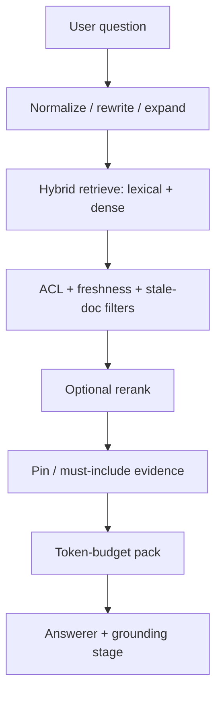

# 11 - Chat Quality Retrieval Ranking And Context Packing

## Purpose

Catalog **retrieval and ranking** mechanisms observed in open-source chat/RAG backends that measurably improve answer precision and reduce wrong-context generation. Ideas only; clean-room re-implementation required per [10 - License And Method](./10-chat-quality-prior-art-license-and-method.md).

## Primary Flow (target AgentCore shape)



| Step | Action | Quality effect |
| --- | --- | --- |
| 1 | Normalize / rewrite / expand query | Higher recall for paraphrases |
| 2 | Hybrid lexical + dense | Catches exact tokens and semantic neighbors |
| 3 | ACL + freshness filters | Stops cross-project and deleted-doc bleed |
| 4 | Rerank | Raises precision of top-k |
| 5 | Pins | Guarantees critical evidence in context |
| 6 | Budget pack | Prevents truncation of the wrong half of evidence |
| 7 | Answer + grounding | Covered in doc 12 |

## Idea Catalog

### A. Hybrid and multi-signal retrieval

| ID | Idea | Source (paths) | Tag | AgentCore use |
| --- | --- | --- | --- | --- |
| R-01 | **Weighted fusion of full-text + dense** in one search | RAGFlow `rag/nlp/search.py` `Dealer.search`: `matchText` + `MatchDenseExpr` + `FusionExpr("weighted_sum", …)` (observed weights lean dense, e.g. `0.05,0.95`) | Adopt | Extend chat doc RAG beyond vector-only; keep weights in versioned WeightProfile |
| R-02 | **OpenSearch hybrid pipeline** with separate BM25 and KNN legs + normalization | RAGFlow `rag/utils/opensearch_conn.py` `_init_hybrid_search`, `hybrid` query + `search_pipeline` | Adapt | Optional when OpenSearch/ES is present; pgvector path can approximate with RRF (already used in code-graph hybrid) |
| R-03 | **Fallback when zero hits**: lower `min_match` / similarity and retry | RAGFlow `Dealer.search` empty-total retry branch | Adopt | Avoid silent “no context” when thresholds were too strict |
| R-04 | **Highlight keywords** for operator/debug and citation UI | RAGFlow `get_highlight` on token fields | Adapt | Useful for Stage-2 doc view and evidence panels |
| R-05 | **Rank features / pagerank field** boosts in retrieval | RAGFlow `rank_feature`, `PAGERANK_FLD`; feedback writes pagerank (see doc 13) | Adapt | Project-tunable boost for trusted docs/symbols |
| R-06 | **Prune stale chunks** whose parent document was deleted | RAGFlow `Dealer._prune_deleted_chunks` | Adopt | Hard quality bug if deleted docs still answer |

### B. Reranking

| ID | Idea | Source | Tag | AgentCore use |
| --- | --- | --- | --- | --- |
| R-07 | **Dedicated rerank model stage** after retrieve | RAGFlow `rag/llm/rerank_model.py`, dialog `rerank_id` / `tenant_rerank_id` | Adapt | LiteLLM or local TEI rerank profile; never call vendor SDKs from product code |
| R-08 | **Pluggable rerankers** (Cohere, Voyage, TEI fast) | kotaemon `libs/kotaemon/kotaemon/rerankings/` | Adapt | Same port abstraction |
| R-09 | **LLM-as-reranker / Trulens-style relevance scores** on candidates | kotaemon `indices/rankings/llm_trulens.py`, index option `use_llm_reranking` | Adapt | Costly; gate by risk/profile; feed low-score warning (doc 12) |
| R-10 | **Normalize rerank scores** across providers | RAGFlow unit tests `test_rerank_normalization.py` | Adopt | Comparable thresholds in WeightProfile |

### C. Hierarchical / multi-granularity indexes

| ID | Idea | Source | Tag | AgentCore use |
| --- | --- | --- | --- | --- |
| R-11 | **RAPTOR-like tree summaries** over clusters of chunks | RAGFlow `rag/utils/raptor_utils.py`, RAPTOR services under `rag/svr/task_executor_refactor/` | Adapt | For large human docs / wiki modules; skip for tiny symbol docs; auto-disable on structured tables when appropriate |
| R-12 | **Question keywords stored on chunks** (`question_kwd` / `important_kwd`) to improve recall | RAGFlow search field list + infinity keyword columns | Adapt | At ingest, generate question-facing keywords for living docs and Q&A-derived docs |
| R-13 | **Multi-retriever fan-in** then merge | kotaemon `FullQAPipeline.retrieve` loops `self.retrievers` | Adapt | Code graph + docs-sync + FAQ question chunks as separate retrievers with RRF |

### D. Graph-structured retrieval modes (GraphRAG)

| ID | Idea | Source | Tag | AgentCore use |
| --- | --- | --- | --- | --- |
| R-14 | **Local search**: entity neighborhood + community reports + text units with **token budget ratios** | GraphRAG `query/structured_search/local_search/mixed_context.py` (`community_prop`, `text_unit_prop`) | Adapt | Map entities→symbols, communities→module clusters, text units→chunks/living docs |
| R-15 | **Global search**: map over community reports then reduce | GraphRAG `global_search/search.py` map/reduce prompts | Adapt | Architecture / cross-cutting questions; not for exact behavior (code-first still wins) |
| R-16 | **DRIFT search**: primer + follow-up local actions | GraphRAG `drift_search/` | Adapt | Later phase; expensive; good for exploratory chat |
| R-17 | **Basic vector search** as baseline mode | GraphRAG `basic_search/` | Adopt | Always keep a cheap baseline for comparison/evals |
| R-18 | **`allow_general_knowledge` flag** on global reduce | GraphRAG `GlobalSearch.allow_general_knowledge` | Adapt | Default **false** for AgentCore project chat (refuse invented world knowledge) |

### E. Gates, pins, and packing

| ID | Idea | Source | Tag | AgentCore use |
| --- | --- | --- | --- | --- |
| R-19 | **Workspace similarity threshold** drops weak vector hits | AnythingLLM vector providers (`similarityThreshold` default ~0.25) | Adopt | Per-project threshold in chat profile |
| R-20 | **topN cap** on retrieved chunks | AnythingLLM `topN` | Adopt | Bound tokens before pack |
| R-21 | **Pinned documents always in context**; exclude duplicates from vector hits | AnythingLLM `DocumentManager.pinnedDocs`, `filterIdentifiers` | Adapt | “Must-include” evidence refs (symbol, ADR, policy doc) |
| R-22 | **Prefetch history + pins + parsed files** once per turn | AnythingLLM `stream.js` `prefetchedContext` | Adapt | Cut latency and inconsistency across stream phases |
| R-23 | **Token-budgeted context assembly** with named proportions | GraphRAG local mixed context; RAGFlow `message_fit_in` | Adopt | ContextPack builder already exists conceptually — enforce budgets for chat |
| R-24 | **Separate chat vs query modes** for retrieval strictness | AnythingLLM `chatMode` (`chat` \| `query`) | Adopt | `query` = grounded-only path for high-stakes answers |
| R-25 | **Third mode `automatic`**: escalate to tools/agent when needed | AnythingLLM `VALID_CHAT_MODE` / workspace `chatMode` | Adapt | Route hard questions to MCP explore; keep simple asks on RAG |
| R-26 | **Layout-aware PDF parsing** (region types, reading order, drop headers/footers) | RAGFlow `deepdoc/vision/`, `deepdoc/parser/pdf_parser.py` | Adapt | Only if AgentCore ingests PDFs for chat KB; improves chunk quality upstream of RAG |
| R-27 | **Parent/child or TOC-enhanced retrieval** (`mom_id`, TOC paths) | RAGFlow `Dealer` fields `mom_id`; TOC enhance helpers in search | Adapt | Pull sibling/parent chunks when a leaf hit is partial |
| R-28 | **Agentic RAG sufficiency loop** (retrieve → check enough → retrieve more) | RAGFlow `rag/advanced_rag/` harness `sufficiency` + prompts `sufficiency_check.md` | Adapt | Cap iterations; log each hop; stop on sufficiency or budget |
| R-29 | **Claims / covariates on graph entities** for local context | GraphRAG claim extraction + `covariate` data model | Adapt | Attach structured claims to symbols/docs; cite as evidence class |
| R-30 | **Dynamic community selection / relevancy rating** before global map | GraphRAG `dynamic_community_selection.py`, `rate_relevancy.py` | Adapt | Cut irrelevant communities before expensive map/reduce |
| R-31 | **Separate “sources for UI” vs full context texts** (citation window vs prompt window) | AnythingLLM stream path: truncated source previews vs full `contextTexts` | Adopt | Users see short citations; model gets budgeted full text |
| R-32 | **Embedding-side rerankers** in addition to cross-encoder | AnythingLLM `server/utils/EmbeddingRerankers/` | Adapt | Optional second stage under LiteLLM/local TEI |
| R-33 | **Source-window backfill** from prior-turn citations when new search is thin | AnythingLLM `fillSourceWindow` in chat helpers | Adopt | Multi-turn “tell me more” keeps good chunks without full rerank |
| R-34 | **Two-stage / windowed rerank** (large recall window → blend → page slice) | RAGFlow `Dealer.retrieval` / `_rerank_window` / `rerank_by_model` | Adopt | Stable ranking under cost bounds |
| R-35 | **Weighted fulltext fields + synonyms** (title/important/question boosts) | RAGFlow `FulltextQueryer.question`, `synonym.Dealer` | Adapt | Map to living-doc / FAQ field boosts in WeightProfile |
| R-36 | **Ingest-time auto-questions** embedded as `question_kwd` (retrieval-side HyDE analog) | RAGFlow `question_proposal` → `question_kwd` | Adopt | Align index vectors with question phrasing for Q&A-derived docs |
| R-37 | **SQL / structured path** when KB has a field map | RAGFlow `dialog_service.use_sql` | Adapt | Exact aggregates beside fuzzy RAG when schema exists |
| R-38 | **Full-doc vs top-k RAG switch** by size | LibreChat `RAG_USE_FULL_CONTEXT` / context handlers | Adapt | Small ADRs: full text; large manuals: retrieve |
| R-39 | **MMR / diversity** in file retrieval | kotaemon `DocumentRetrievalPipeline` MMR option | Adapt | Reduce near-duplicate chunks in pack |
| R-40 | **Opinionated token budgets** (e.g. system/history/user shares) + middle-out “cannonball” trim | AnythingLLM compressor / `cannonball` | Adopt | Under pressure keep instructions+latest ask; drop middle first |
| R-41 | **When compressing system, favor evidence over custom instructions** | AnythingLLM compressor split on context vs prompt | Adopt | Evidence wins over long system prose |

## Mapping To AgentCore

| Already strong | Gap this catalog closes |
| --- | --- |
| Code-graph hybrid search / explore | Chat-facing doc/FAQ hybrid + rerank profile |
| Hash-gated living docs | Question keywords + optional RAPTOR for large docs |
| Neo4j graph | Local/global-style packing over symbols/modules |
| WeightProfiles | Store hybrid weights, thresholds, topN, props |

## Component Contract For Chat Retrieval

Each retrieval/ranking component **should** declare (Haystack-inspired; clean-room):

```text
Input Schema, Output Schema, Side Effects,
Retry Policy, Timeout, Idempotency Requirement,
Observability Fields, Version
```

Separate **deterministic** steps (ACL, hash freshness, pin inject) from **probabilistic** ranking/generation. LLM nodes **must not** own SQL writes or success marking — see [09 Pipeline Separation](./09-chat-qa-rag-incremental-documentation.md#pipeline-separation-normative).

## Non-Goals

- Vendoring RAGFlow/GraphRAG runtimes into AgentCore.
- Replacing code-as-authority with community-report prose.
- Unlimited top-k retrieval “to be safe”.

## Related Documents

- [10 - License And Method](./10-chat-quality-prior-art-license-and-method.md)
- [12 - Grounding Citations Refusal](./12-chat-quality-grounding-citations-refusal.md)
- [09 - Chat Q&A Incremental Docs](./09-chat-qa-rag-incremental-documentation.md)
- Turbovec / hybrid examples under `docs/13-…` and `docs/11-…`
