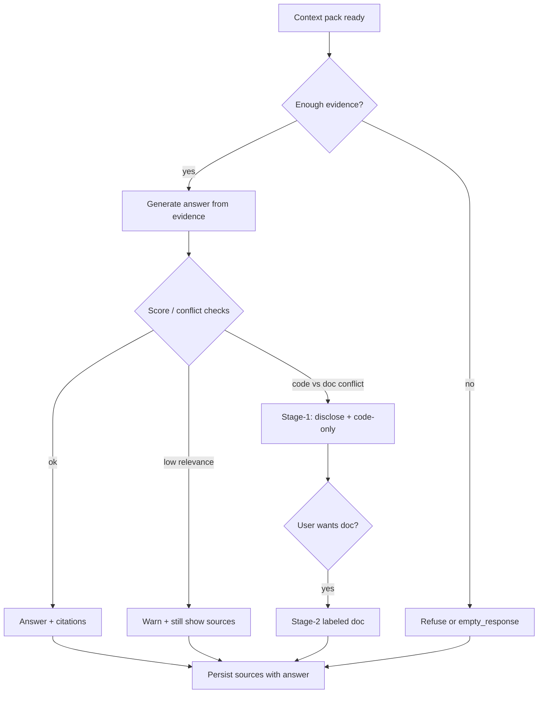

# 12 - Chat Quality Grounding Citations Refusal

## Purpose

Catalog mechanisms that make chat answers **auditable and safe when evidence is weak**, drawn from OSS backends. Aligns with AgentCore contradiction policy in [09](./09-chat-qa-rag-incremental-documentation.md): disclose conflicts, code-first, optional doc view.

## Primary Flow

| Step | Obligation |
| --- | --- |
| Evidence gate | Grounded modes must not invent KB facts when pack is empty |
| Generate | Prompt must instruct “don’t know” over fabrication |
| Conflict / score | Run contradiction + relevance checks before final UX |
| Citations | Attach source ids/snippets users can open |
| Persist | Store source refs with the turn for audit and FAQ write-back |

## Idea Catalog

### A. Refusal and empty knowledge

| ID | Idea | Source | Tag | AgentCore use |
| --- | --- | --- | --- | --- |
| G-01 | **Query mode refuses when workspace has no embeddings** | AnythingLLM `server/utils/chats/stream.js` early exit + `queryRefusalResponse` | Adopt | Project chat `grounded` mode: no vectors / no graph hits → configured refusal string |
| G-02 | **Query mode refuses when retrieval returns zero context texts** | Same file after vector search | Adopt | Distinct from “chat mode” which may use general LLM |
| G-03 | **Configurable `empty_response` when knowledge list empty** | RAGFlow `dialog_service.async_chat` `prompt_config.empty_response` | Adopt | Per-dialog / per-project string; stream final with empty reference |
| G-04 | **Prompt text: do not make up an answer** | kotaemon `DEFAULT_QA_*_PROMPT` in `citation_qa.py` | Adopt | System prompt packs for grounded chat |
| G-05 | **Disable general knowledge in graph global reduce by default** | GraphRAG `allow_general_knowledge` | Adopt | Same as R-18; prevents silent world-knowledge blend |

### B. Citations and evidence presentation

| ID | Idea | Source | Tag | AgentCore use |
| --- | --- | --- | --- | --- |
| G-06 | **Post-hoc `insert_citations`** linking answer spans to chunk tokens/vectors | RAGFlow `retriever.insert_citations` (tkweight/vtweight blend) + vector hydrate helper | Adapt | Prefer structured citation markers AgentCore owns; do not copy marker formats blindly |
| G-07 | **Citation prompt path** for model-assisted citation | RAGFlow `citation_prompt` in prompts generator | Adapt | Optional second pass; cost/latency tradeoff |
| G-08 | **Inline vs panel citations** | kotaemon `AnswerWithInlineCitation` + `prepare_citations` / evidence render | Adapt | UI: inline for humans; structured refs for agents/MCP |
| G-09 | **Evidence modes** (text / table / figure) with different QA templates | kotaemon `PrepareEvidencePipeline`, `EVIDENCE_MODE_*` | Adapt | Code vs Markdown vs diagram evidence channels |
| G-10 | **Show “No evidence found”** when citation prep yields nothing | kotaemon `show_citations_and_addons` | Adopt | Honest empty evidence panel |
| G-11 | **Sources array returned with every streamed chunk** | AnythingLLM response payloads `sources: []` | Adopt | MCP/chat API contract: always include sources field |
| G-12 | **Citation marker rewrite to markdown links** (import/interop) | LibreChat citation processing tests under `api/server/utils/import` | Adapt | Interop only; AgentCore native citations stay structured |

### C. Relevance confidence and warnings

| ID | Idea | Source | Tag | AgentCore use |
| --- | --- | --- | --- | --- |
| G-13 | **Low context-relevance warning** when max LLM-rerank score is below threshold | kotaemon `CONTEXT_RELEVANT_WARNING_SCORE` (env, default 0.3) | Adopt | Banner: “context may be weak — verify” without blocking |
| G-14 | **Answer confidence / qa_score surface** | kotaemon yields `Answer confidence: {qa_score}` | Adapt | Only if score is calibrated; else omit rather than fake precision |
| G-15 | **Expose retrieval scores in evidence UI** (vector, rerank, llm) | kotaemon `Render` score formatting | Adapt | Operator/debug + Stage-2 honesty |

### D. Alignment with AgentCore contradiction staging

Prior art often **blends** code-like and doc-like text into one answer. AgentCore **must not** copy that for conflict cases.

| ID | Idea | Tag | AgentCore use |
| --- | --- | --- | --- |
| G-16 | Separate **evidence classes** in the pack (code vs doc vs FAQ) | Adopt | Contradiction detector needs typed evidence |
| G-17 | Stage-1: contradiction banner + **code-only** body; short gist of conflict | Adopt | Specified in doc 09; prior art supplies citation/refusal patterns only |
| G-18 | Stage-2: optional full doc explanation labeled non-authoritative | Adopt | Reuse kotaemon-style evidence panel for the doc class only |
| G-19 | Never present blended confident prose when classes disagree | Avoid (upstream habit) | Explicit Avoid relative to typical RAG “stuff all chunks” prompts |
| G-20 | **Text moderation middleware** before model calls | LibreChat `api/server/middleware/moderateText.js` | Adapt | Policy-gated; not a substitute for grounding |
| G-21 | **File-search / tether citations** for attached files | LibreChat `Files/Citations`, `fileSearch` tools | Adapt | Unify with MCP file/evidence refs |
| G-22 | **User report / bad-answer signal** from chat UI | kotaemon `ktem/pages/chat/report.py` | Adapt | Feed doc 13 feedback + doc 07 curiosity |
| G-23 | **Citation caps + min relevance + per-file limits** | LibreChat `processFileCitations` / `applyCitationLimits` | Adopt | Stop weak/spammy citation lists |
| G-24 | **Permission-gated citations** | LibreChat `PermissionTypes.FILE_CITATIONS` | Adapt | Project ACL before showing sources |
| G-25 | **Exact-quote / structured cite tool** (short verifiable spans) | kotaemon `CitationPipeline` / `CiteEvidence` | Adapt | Prefer substrings over vague “source list” |
| G-26 | **Inline START/END phrase citations** | kotaemon `AnswerWithInlineCitation` | Adapt | Optional rich UI; keep structured refs for MCP |
| G-27 | **Post-hoc citation insert + bad-marker repair** | RAGFlow `insert_citations`, `repair_bad_citation_formats` | Adapt | Ground answers when the model omits markers |
| G-28 | **Agentic ABSTAIN / PARTIAL / FALLBACK verdicts** | RAGFlow advanced_rag sufficiency harness | Adapt | Hard multi-hop only; map to grounded refusal |
| G-29 | **Claim cross-check** (numbers/entities must appear in evidence) | RAGFlow `cross_check_claim` | Adapt | Behavior/fact answers before accept |
| G-30 | **Exclude refusal turns from future LLM history** (`include: false`) | AnythingLLM `WorkspaceChats.new({ include: false })` on refusal | Adopt | UI keeps refusal; model does not learn “always refuse” |
| G-31 | **Structured wrong-evidence feedback labels** | kotaemon `ReportIssue` (`wrong-evidence`, etc.) | Adopt | Training signal for rank + FAQ |
| G-32 | **Per-turn evaluation / regression fixtures** | Langfuse-style datasets (ideas); AgentCore Live gates | Adopt | Permanent cases: contradiction Stage-1, refusal, write-back receipt, no cross-tenant |
| G-33 | **Trace attributes for chat** (project, turn, model, prompt bundle, graph/doc versions) | Observability prior art (Langfuse Core patterns) | Adopt | Via OpenTelemetry; redaction before export |
| G-34 | **Error taxonomy** for gateway failures (timeout/rate-limit vs auth/policy) | LiteLLM-style routing (AgentCore already selects LiteLLM) | Adopt | Transient vs terminal; preserve `__cause__`; no silent ACK of durable work |

## Failure Modes

| Failure | Expected chat behavior |
| --- | --- |
| Empty pack in grounded mode | Refusal / empty_response; no fabricated KB answer |
| Citations fail to attach | Still return sources list; mark citation_status=partial |
| Low relevance scores | Warn; prefer code explore escalate for behavior questions |
| Code/doc conflict | Stage-1/2 per doc 09; do not silent-merge |
| Provider transient error | Retry/fallback per LiteLLM profile; surface routing audit fields |

## Related Documents

- [09 - Chat Q&A Incremental Documentation](./09-chat-qa-rag-incremental-documentation.md)
- [10 - License And Method](./10-chat-quality-prior-art-license-and-method.md)
- [11 - Retrieval Ranking](./11-chat-quality-retrieval-ranking-and-context-packing.md)
- [13 - Query Rewrite Memory Feedback](./13-chat-quality-query-rewrite-memory-feedback.md)
