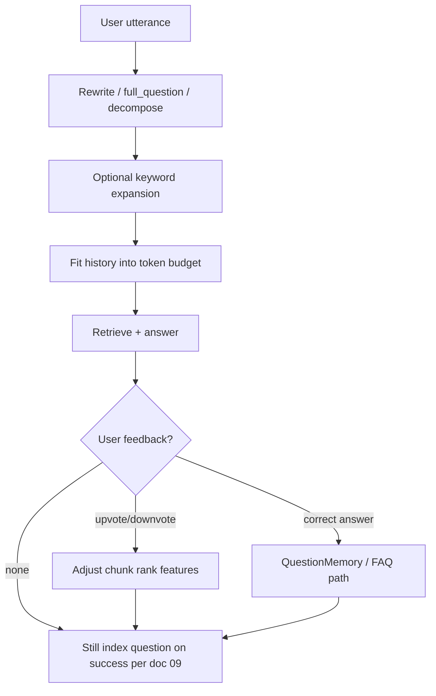

# 13 - Chat Quality Query Rewrite Memory Feedback

## Purpose

Catalog mechanisms that improve **question understanding**, **multi-turn context**, and **closed-loop quality** (feedback → better future retrieval). Complements FAQ/question memory in [07](./07-autonomous-question-discovery-and-faq-memory.md) and Q&A write-back in [09](./09-chat-qa-rag-incremental-documentation.md).

## Primary Flow

| Step | Quality effect |
| --- | --- |
| Rewrite | Aligns follow-ups and pronouns with retrieval vocabulary |
| Keywords | Boosts lexical recall for domain terms |
| History fit | Prevents dropping the constraint that mattered |
| Feedback | Moves trusted chunks up / noisy chunks down |
| Question index | Makes next similar ask cheaper (doc 09) |

## Idea Catalog

### A. Query understanding

| ID | Idea | Source | Tag | AgentCore use |
| --- | --- | --- | --- | --- |
| Q-01 | **`full_question`**: rewrite multi-turn messages into a standalone retrieval query | RAGFlow `dialog_service.async_chat` + `full_question` prompt helper | Adopt | Critical for chat; store both raw and standalone forms on `ChatQuestionObservation` |
| Q-02 | **Cross-language query expansion** | RAGFlow `cross_languages` when configured in `prompt_config` | Adapt | Optional for bilingual teams; keep project language policy |
| Q-03 | **Keyword extraction appended to query** | RAGFlow `keyword_extraction(chat_mdl, question)` | Adapt | LiteLLM structured keywords; avoid unbounded append |
| Q-04 | **RewriteQuestionPipeline** before retrieve | kotaemon `reasoning/prompt_optimization/rewrite_question.py`; used in `FullQAPipeline.stream` when `use_rewrite` | Adopt | Feature flag per profile |
| Q-05 | **DecomposeQuestionPipeline** for multi-hop | kotaemon `decompose_question.py` | Adapt | Spawn sub-retrieves; merge evidence; watch cost |
| Q-06 | **Few-shot rewrite** variants | kotaemon `fewshot_rewrite_question.py` | Adapt | Only with curated project few-shots (Common Context) |
| Q-07 | **Sync retrieval history length with message history** | kotaemon `sync_retrieval_n_message` | Adopt | Keep per-turn retrieval audits aligned with UI history |

### B. Conversation memory and fitting

| ID | Idea | Source | Tag | AgentCore use |
| --- | --- | --- | --- | --- |
| Q-08 | **Configurable history window** (`openAiHistory`) | AnythingLLM workspace history limit | Adopt | Per-project message window |
| Q-09 | **`message_fit_in`**: shrink prompt/messages to model context | RAGFlow prompts `message_fit_in` | Adopt | Shared ContextPack fitter |
| Q-10 | **ConversationHistory object** feeding local/global search | GraphRAG `query/context_builder/conversation_history.py` | Adapt | Pass prior entities into graph expand |
| Q-11 | **Memory service with system/user prompt templates** | RAGFlow `memory_service` / `memory_utils` | Adapt | Tie to AgentCore memory tiers; do not invent a second memory product |
| Q-12 | **Parsed file / attachment context** beside RAG | AnythingLLM `WorkspaceParsedFiles.getContextFiles` | Adapt | Chat uploads as first-class evidence class |

### C. Feedback → retrieval improvement

| ID | Idea | Source | Tag | AgentCore use |
| --- | --- | --- | --- | --- |
| Q-13 | **Chunk feedback adjusts pagerank-like feature** on cited chunks | RAGFlow `api/db/services/chunk_feedback_service.py` | Adapt | Opt-in (`CHUNK_FEEDBACK_ENABLED`-style); audit every change |
| Q-14 | **Relevance-weighted budget split** across cited chunks using retrieval scores | Same service `CHUNK_FEEDBACK_WEIGHTING=relevance` | Adopt | Stronger chunks get more of the feedback unit |
| Q-15 | **Uniform per-chunk delta** as legacy alternative | Same service `uniform` mode | Avoid (default) | Too strong when many weak chunks cited |
| Q-16 | **Clamp pagerank feature to bounded integer range** | `MIN_PAGERANK_WEIGHT` / `MAX_PAGERANK_WEIGHT` | Adopt | Prevent runaway boosts |
| Q-17 | **Disable feedback by default** until operators enable | Env flag default false | Adopt | Safety against gaming / poison |
| Q-18 | **Promote stable Q&A to FAQ memory** | AgentCore doc 07 + partial memory-service API | Adopt | Prior art confirms need; AgentCore already designing this |

### D. Interaction patterns that raise perceived quality

| ID | Idea | Source | Tag | AgentCore use |
| --- | --- | --- | --- | --- |
| Q-19 | **Conversation branching** (edit / resubmit / continue) | LibreChat message tree / import branch tests | Adapt | Let users explore code-first vs doc-view branches without losing the other |
| Q-20 | **Agents + MCP tool loop** for multi-step evidence gather | LibreChat agents; AnythingLLM skills/tool selection | Adapt | Prefer AgentCore MCP explore/search tools; keep LiteLLM gateway |
| Q-21 | **Intelligent tool selection to cut tokens** | AnythingLLM README/skill selection (server agent utils) | Adapt | Only expose tools needed for the question class |
| Q-22 | **Dataset / skill generators from corpora** | RAGFlow task executor `dataset_skill_generator`, `dataset_wiki_generator` | Adapt | Related to wiki + FAQ growth; not automatic public publish |
| Q-23 | **Memory agent / memory processor** alongside chat | LibreChat `packages/api` memory agent paths; `routes/memories.js` | Adapt | Route into AgentCore memory-service; do not fork a parallel store |
| Q-24 | **History summarization prompts** when window overflows | LibreChat `summaryPrompts.js` / truncate helpers | Adopt | Summarize older turns; keep recent raw |
| Q-25 | **ReWOO / multi-step reasoning plans** before final answer | kotaemon `ktem/reasoning/rewoo.py` | Adapt | Only for hard multi-hop; cost-bounded |
| Q-26 | **Conversation memory summary-for-memory** hooks | RAGFlow memory prompts (`summary4memory`-class helpers) | Adapt | Episodic → semantic consolidation (phase 02) |
| Q-27 | **Fork topologies** (direct path vs include branches vs target level) | LibreChat `fork.js` `ForkOptions` | Adapt | Stage-2 doc branch without losing Stage-1 code answer |
| Q-28 | **HITL pause / resume / steer** mid-agent run | LibreChat agents `resume.js` / `steer.js` | Adapt | Human corrects tool args before side effects |
| Q-29 | **Tool-call dedupe + cooldown** | AnythingLLM `Deduplicator` / MCP cooldown | Adopt | Stop spam search/save loops |
| Q-30 | **Few-shot examples on tool schemas** | AnythingLLM plugin `examples` / UnTooled showcase | Adapt | Better tool pick for weaker models |
| Q-31 | **Clarifying questions as tools** (not free-text) | AnythingLLM `request-user-input` plugin | Adapt | Structured Q&A when intent is ambiguous |
| Q-32 | **Agentic formalize** (standalone Q + synonym keywords, no answer leak) | RAGFlow `RAGTools.formalize` | Adopt | Safer rewrite than “answer then retrieve” |
| Q-33 | **Thinking-mode ladder** (direct → decompose → research) | RAGFlow `agentic_rag_graph` / `ExecutionStrategy` | Adapt | Cost/accuracy dial in chat profile |
| Q-34 | **Smart head/tail truncation** of long blobs | LibreChat `smartTruncateText` | Adopt | Keep IDs/conclusions when trimming |
| Q-35 | **Prefetch once for router + chat** | AnythingLLM `prefetchedContext` shared with model router | Adapt | Consistent pins/history for routing and answer |
| Q-36 | **Skill eligibility pipeline** before prompt (classify → permission → cost/risk → small tool set) | AnythingLLM skill selection pattern | Adopt | Required for AgentCore MCP tool exposure in chat |
| Q-37 | **Model routing by task risk/cost** (parse without LLM; cheap summarize; strong model for high-risk; private model for sensitive tenants) | AnythingLLM + LiteLLM gateway patterns | Adapt | Express via `ModelRoutingProfile` / LiteLLM only |
| Q-38 | **Explicit state ops** (`replace` / `append` / `set-once` / `monotonic`) instead of opaque merge | Flowise Agentflow state semantics (Apache core ideas) | Adapt | Chat agent state schema + CI contract test |
| Q-39 | **Node outcomes**: success / retryable_failure / terminal_failure / needs_human / skipped / cancelled | Flowise error-branch pattern | Adopt | Map to ChatStreamEvent + failure kinds in doc 09 |
| Q-40 | **Non-blocking HITL**: persist waiting, free workers/locks, resume on signal | Flowise HITL + LibreChat steer | Adopt | Approval for doc promote / dangerous tools |
| Q-41 | **Loop guards**: max_iterations, max_tokens, max_duration, stop_condition, no_progress_detection | Flowise loop limits; agent debate safety | Adopt | Never wait solely on model “done” |
| Q-42 | **Bounded validation retries** for typed node outputs | PydanticAI-style validation (ideas) | Adapt | e.g. max_validation_attempts=2; record each attempt in trace |

## Mapping To Doc 09 Write-Back

| Prior-art idea | Doc 09 object |
| --- | --- |
| Standalone `full_question` | Normalized field on `ChatQuestionObservation` / `RagQuestionChunk` |
| Successful answer + sources | Evidence refs on `QaDerivedDocument` |
| Feedback on citations | Optional signal into curiosity / FAQ scoring (doc 07) |
| Branch for Stage-2 doc view | `ChatSessionBranch` + contradiction opt-in |
| Write-back proof | `ChatTurnReceipt` |
| Stream/audit contract | `ChatStreamEvent` |

## Risks

| Risk | Mitigation |
| --- | --- |
| Rewrite drifts from user intent | Keep raw question; show rewrite in debug; allow disable |
| Feedback poisoning | Authn, rate limits, default off, clamps, audit |
| Keyword spam hurts precision | Cap keywords; WeightProfile |
| Branching UX complexity | Ship Stage-1/2 first; branches later |

## Related Documents

- [07 - FAQ Memory](./07-autonomous-question-discovery-and-faq-memory.md)
- [09 - Chat Q&A Incremental Docs](./09-chat-qa-rag-incremental-documentation.md)
- [10 - License And Method](./10-chat-quality-prior-art-license-and-method.md)
- [11 - Retrieval](./11-chat-quality-retrieval-ranking-and-context-packing.md)
- [12 - Grounding](./12-chat-quality-grounding-citations-refusal.md)
