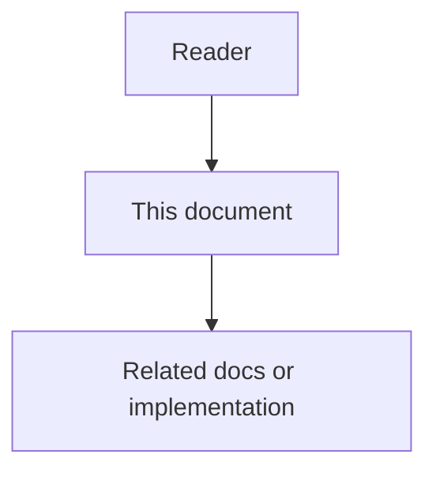

# Docs-as-Code and Synchronization - Feature Specification

## Purpose

This phase makes documentation, code, decisions, and ownership part of one synchronized knowledge graph so documentation drift is detected before merge.

## Document flow

| Step | Actor | Action | Outcome |
| --- | --- | --- | --- |
| 1 | Reader | Opens this design document | Understands scope and constraints |
| 2 | Reader | Follows the Mermaid flow | Sees primary component interactions |
| 3 | Reader | Uses Related Documents / linked symbols | Reaches deeper design or implementation |

## Mission

This phase makes documentation, code, decisions, and ownership part of one synchronized knowledge graph so documentation drift is detected before merge.

## Feature 1 - Documentation Knowledge Graph

Documents, code symbols, APIs, decisions, tasks, rules, and owners are modeled as linked graph entities. Documentation is not isolated text; it is part of the active system model.

## Feature 2 - AST Anchoring

Code symbols are anchored using parser-derived semantic identifiers and normalized hashes. This allows the system to detect meaningful code changes without relying on fragile line numbers.

## Feature 3 - YAML Frontmatter

Markdown documentation includes structured metadata such as doc ID, owner, status, linked symbols, schema version, current hash, and decision references.

## Feature 4 - Bloom Filter Lookup

An in-memory Bloom filter allows agents to quickly skip code symbols that definitely have no documentation in the current index version.

## Feature 5 - Lightweight y/n Doc Flags

Code comments or manifests can mark whether a symbol is expected to have documentation. CI reconciles these flags with the graph.

## Functional Requirements

- Index source symbols and documentation metadata.
- Link documents to code symbols and decisions.
- Detect stale or missing documentation.
- Create DriftFindings and Docs Agent Tasks.
- Block merges for critical documentation drift.
- Keep documents readable by humans and routable by machines.
