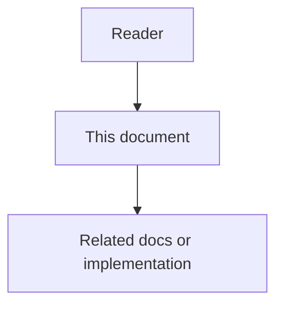

# Rule Engine and Orchestration - Feature Specification

## Purpose

This phase coordinates agents and humans through semantic policies, risk detection, escalation, dependency analysis, and task routing.

## Document flow

| Step | Actor | Action | Outcome |
| --- | --- | --- | --- |
| 1 | Reader | Opens this design document | Understands scope and constraints |
| 2 | Reader | Follows the Mermaid flow | Sees primary component interactions |
| 3 | Reader | Uses Related Documents / linked symbols | Reaches deeper design or implementation |

## Mission

This phase coordinates agents and humans through semantic policies, risk detection, escalation, dependency analysis, and task routing.

## Feature 1 - Semantic Rules and LLM-as-a-Judge

Organization policies can be written in natural language. Deterministic checks run first, and LLM judgment is used only for ambiguous semantic cases.

## Feature 2 - Escalation and Human-in-the-Loop

Risky automation pauses and creates approval tickets with evidence, policy references, proposed action, options, and rollback plan.

Accept gates support three user-selectable modes (`manual`, `auto_approve`, `system_routed`). Normative design: `09-approval-modes-and-auto-approve.md`.

## Feature 3 - Hybrid Anomaly Detection

The system combines static checks, statistical signals, graph context, and LLM review for suspicious or ambiguous cases.

## Feature 4 - Dependency and Impact Analysis

Changes are analyzed through the graph to identify affected APIs, docs, dashboards, clients, owners, policies, and teams.

## Feature 5 - Custom Rule Authoring And Domain Profiles

Users and administrators can define scoped rules without changing source code. Rules can target software engineering workflows, HR workflows, product workflows, security workflows, or other domain packs. The primary first-party rule set should remain optimized for software engineering, but the platform must allow domain-specific behavior through configuration, not hard-coded branches.

## Feature 6 - Conversation-Based Rule Suggestions

The system can analyze repeated corrections, preferences, rejected outputs, approval decisions, missing documentation requests, and feature enablement patterns. It can propose draft rules with evidence, confidence, risk, suggested scope, dry-run examples, and activation workflow.

## Functional Requirements

- Store semantic and deterministic policies.
- Evaluate changes against relevant policies.
- Create RuleEvaluation records with evidence.
- Create EscalationTickets for high-risk actions.
- Resolve Accept gates according to effective ApprovalMode (`manual`, `auto_approve`, or `system_routed`) with hard-block overrides and durable audit.
- Create ImpactMaps and downstream Tasks.
- Route work to agents or human owners.
- Store user-authored rule drafts and active rule versions.
- Store rule suggestions derived from conversation and workflow evidence.
- Support domain-scoped feature rules for engineering, HR, product, security, support, and operations profiles.
- Evaluate effective rules by organization, workspace, project, project group, role, user, agent, domain pack, environment, and task type.
- Provide deterministic conflict handling and explain why a rule applied or did not apply.
