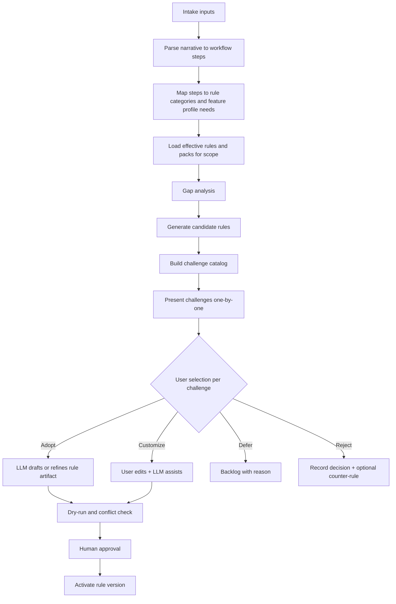

# 07 - Custom Rule Authoring And Suggestion Workflows

## 07 - Custom Rule Authoring And Suggestion Workflows
## Purpose

AgentCore must allow users, teams, and organizations to define their own operating rules for different work types. The primary use case is software engineering, but the same rule engine must support domains such as HR, product, security, support, and operations through scoped rule packs and domain profiles.

Rules should not be hard-coded into prompts, services, or UI screens. They should be versioned, testable, scoped, explainable, and auditable.

This document covers two complementary paths to rules:

| Path | Trigger | Primary user |
| --- | --- | --- |
| **Passive suggestion** | Repeated corrections and workflow signals in chat | Any user; admin reviews inbox |
| **Guided intake** | User explicitly describes business needs, constraints, and desired process | Org admin, team lead, domain owner |

Both paths produce the same artifacts: scoped draft rules, evidence, risk scores, and LLM-assisted rule text that humans approve before activation.

Related: `../08-software-engineering-architecture/26-domain-customization-and-feature-control.md` (domain packs, feature profiles, effective scope).

## Rule Authoring Goals

The rule system should allow users to express how AgentCore should behave.

Examples:

- Always write architecture documentation in English for this project.
- Do not document every single-line code change immediately; wait for the work batch to finish.
- Run code review after a batch of implementation changes.
- For HR onboarding workflows, hide code review, code graph, and CI features.
- Escalate changes that modify authentication, payroll, compliance, or production deployment behavior.
- For frontend and backend projects in the same product group, allow controlled cross-project context composition.
- For unrelated projects, never share memory, graph context, rules, tickets, reports, or conversation history.

## Rule Categories

| Category | Purpose |
| --- | --- |
| workflow rule | controls when work should run, pause, batch, or escalate. |
| documentation rule | controls documentation language, structure, timing, ownership, and evidence. |
| code review rule | controls review timing, reviewers, severity, and required checks. |
| memory rule | controls weighting, retrieval, forgetting, consolidation, and scope. |
| feature rule | controls feature enablement, hiding, read-only mode, or approval gating. |
| domain rule | applies domain-specific vocabulary, workflows, UI, tasks, and approvals. |
| security rule | blocks or escalates sensitive actions. |
| connector rule | controls which external resources or agents may be used. |
| reporting rule | controls metrics, comparisons, dashboards, and evidence collection. |

## Rule Scope

Rules must be scoped explicitly.

Supported scopes:

- organization.
- workspace.
- project.
- project group.
- team.
- role.
- user.
- agent.
- connector.
- domain pack.
- environment.
- task type.

A rule must not silently apply globally. If a user creates a rule from a conversation, AgentCore should ask for the intended scope or infer a proposed scope with clear evidence.

## Rule Lifecycle

Rules should follow a lifecycle:

1. observed need.
2. draft rule.
3. evidence attachment.
4. scope selection.
5. risk classification.
6. dry-run test.
7. human review.
8. activation.
9. monitoring.
10. revision.
11. deprecation or rollback.

Low-risk rules may be eligible for auto-draft. High-risk rules must require explicit approval before activation.

## Rule Suggestion From Conversations

The system should analyze conversations and work history to discover repeated patterns that can become rules.

Signals:

- repeated user corrections.
- repeated unanswered questions.
- repeated documentation gaps.
- repeated rejected outputs.
- repeated approval decisions.
- repeated feature disablement requests.
- repeated project-specific terminology corrections.
- repeated manual review timing preferences.
- repeated cross-project isolation concerns.
- repeated report or metric requests.

The suggestion engine should convert these signals into draft rules.

A rule suggestion should include:

- proposed rule title.
- natural-language rule text.
- structured condition.
- structured action.
- proposed scope.
- confidence score.
- risk score.
- evidence references.
- expected benefit.
- possible side effects.
- test examples.
- rollback plan.

## Conversation-To-Rule Flow

1. The conversation analyzer detects a repeated preference or correction.
2. The memory service stores the signal with source, timestamp, project scope, and confidence.
3. The rule suggestion service groups similar signals.
4. The rule engine checks whether an equivalent active rule already exists.
5. If no equivalent rule exists, the system creates a suggested rule draft.
6. The admin console shows the suggestion in a review inbox.
7. A user can edit, test, approve, reject, or narrow the rule scope.
8. Approved rules become active rule versions.
9. Future workflows evaluate the rule and record evidence.

## Guided Business And Process Intake Mode

Organizations must be able to **declare** what they need without waiting for the agent to infer it from chat history. Guided intake is an explicit product mode (admin console wizard, SDK session, or long-form chat template) where the user supplies business context and a narrative workflow; AgentCore returns structured requirements, candidate rules, and a challenge catalog.

### Intake inputs

The intake form or conversation template should capture:

| Input block | Content |
| --- | --- |
| **Organization context** | Industry, compliance regime, data sensitivity, locales, approval culture (centralized vs team-owned). |
| **Scope** | Organization, workspace, project, project group, team, role, domain pack, environment (same vocabulary as Rule Scope). |
| **Business outcomes** | What success looks like (SLAs, quality bars, audit expectations, customer-facing commitments). |
| **Constraints** | Must-nots: cross-project data sharing, cloud egress, auto-deploy, PII in memory, tools/connectors allowed. |
| **Domain vocabulary** | Terms, ticket types, document types, roles, escalation paths specific to the org. |
| **Desired process narrative** | Step-by-step description of how work should flow (who does what, when automation runs, when humans decide). |
| **Existing rules and packs** | Optional import of rule packs, domain packs, or feature profiles already in use. |
| **Exceptions** | Known edge cases, seasonal workflows, or roles that need different behavior. |

Inputs are stored as an **intake session** artifact (versioned, scoped, auditable). They are not silently promoted to active rules until the user completes challenge review and approval steps below.

### Intake outputs

After parsing the narrative and matching it against the platform capability model, the intake service produces:

1. **Requirements digest** — normalized bullet list of functional and non-functional requirements tied to rule categories.
2. **Coverage map** — which requirements are already satisfied by active rules, domain packs, or feature profiles in the chosen scope.
3. **Candidate rule set** — draft rules for gaps (each with structured condition/action, proposed scope, risk, confidence).
4. **Challenge catalog** — ordered list of tradeoffs, ambiguities, conflicts, and operational risks (see next section).
5. **Recommended rollout plan** — phased activation (shadow mode, approval_required, full enable) per candidate rule.

The LLM assists **structuring and explaining** these outputs. It does not activate rules without human confirmation on each selected item (or an explicit bulk-approve policy for low-risk packs).

## Workflow-To-Rule Discovery Pipeline

Guided intake runs a deterministic pipeline with LLM enrichment at defined steps.



### Step details

1. **Parse narrative** — Decompose the user’s process description into steps with actors (human, agent, system), triggers, artifacts (docs, tickets, memory), and decision points.
2. **Map to platform model** — Each step links to zero or more of: workflow rule, documentation rule, feature profile change, memory rule, security rule, connector rule, reporting rule, domain rule.
3. **Gap analysis** — Compare required behavior to `list_effective_rules` and effective feature profile for the scope. Mark gaps, partial coverage, and over-constraining legacy rules.
4. **Candidate rules** — One candidate per gap (or merged candidate when a single rule cleanly covers multiple steps). Candidates reuse the same schema as conversation-derived suggestions (title, NL text, condition, action, scope, scores, evidence, test examples).
5. **Challenge catalog** — For each candidate (and for global intake ambiguities), generate challenges before any activation (see below).
6. **User selection loop** — User resolves challenges individually; only **adopted** or **customized** items enter LLM-managed rule drafting.
7. **Dry-run and conflicts** — Rule engine evaluates candidates against fixture scenarios; conflict viewer shows deterministic resolution previews.
8. **Approval and activation** — Same lifecycle as other rules (human review, versioning, monitoring).

Passive conversation mining (earlier sections) can **feed** the same pipeline: grouped signals become pre-filled candidate rules inside an intake session when an admin opens “review suggested rules as a pack.”

## Challenge Catalog And Interactive Selection

A **challenge** is a discrete decision point where automatic rule generation is uncertain, risky, or mutually exclusive with another requirement. Challenges are presented **one at a time** (wizard step or focused card) so the user is not overwhelmed and each choice is auditable.

### Challenge types

| Type | Meaning | Typical user choices |
| --- | --- | --- |
| **ambiguity** | Narrative allows multiple valid rule interpretations | Pick interpretation A or B; or ask for clarification |
| **scope** | Unclear whether rule applies to project, team, or org | Narrow or widen scope with explanation |
| **tradeoff** | Automation vs control, speed vs audit depth, batch vs continuous | Select preferred pole or hybrid action |
| **conflict** | Candidate conflicts with an active rule or security policy | Override (if permitted), narrow candidate, or deprecate old rule |
| **feature_surface** | Process needs capabilities that imply feature profile changes | Enable, hide, approval_required, or shadow_mode per feature |
| **connector_or_data** | Process references tools, data classes, or egress | Allow connector, deny, or approval-gated use |
| **operational_cost** | Rule increases token use, review load, or latency | Accept, defer, or lighter-weight rule variant |
| **compliance** | Regulatory or org policy tension | Escalate to security reviewer, mandatory approval |

### Challenge record schema

Each challenge should include:

- `challenge_id` — stable within the intake session.
- `sequence` — display order (dependencies respected: scope before conflict resolution).
- `title` — short label.
- `summary` — plain-language explanation for the domain owner.
- `linked_candidate_rule_ids` — zero or more draft rules affected by this decision.
- `options` — structured choices (each with predicted outcome, risk delta, side effects).
- `default_recommendation` — system suggestion with confidence; not auto-applied.
- `evidence` — quotes from intake narrative, similar past conversations, or policy library references.
- `required_approver_role` — optional; set for compliance or security challenges.

### Selection semantics

When the user completes a challenge:

| Selection | Effect |
| --- | --- |
| **adopt** | Accept the recommended option; linked candidates proceed to LLM rule drafting unchanged unless the option modifies action/condition templates. |
| **customize** | User picks a non-default option or edits parameters; LLM regenerates structured rule from the choice. |
| **defer** | Candidate rules linked only to this challenge move to session backlog; no activation. |
| **reject** | Mark linked candidates rejected; optional “counter-requirement” stored so future suggestions do not re-propose the same rule without new evidence. |

The session cannot move to bulk activation while **blocking** challenges (compliance, unresolved security conflict) remain open.

## LLM-Managed Rule Authoring

For every challenge outcome of **adopt** or **customize**, the user should not be forced to hand-edit YAML unless they want to. **LLM-managed rule authoring** means the model produces and maintains the machine-readable rule artifact under human approval.

### Responsibilities split

| Actor | Responsibility |
| --- | --- |
| **User / admin** | Supplies business truth: process, constraints, challenge selections, final approval, rollback decisions. |
| **Intake and suggestion services** | Gap analysis, challenge ordering, deterministic conflict checks, versioning, audit log. |
| **LLM (gateway-controlled)** | Natural-language ↔ structured rule translation, variant proposals, plain-language explanations, test example generation, “what changed in v2” summaries. |
| **Rule engine** | Evaluation, dry-run, effective-rule resolution, evidence on apply. |

### Per-rule LLM workflow

1. **Draft** — Given challenge resolution + intake context, emit `rule draft` (structured condition/action, scope, risk class, NL summary for catalog).
2. **Explain** — Short explanation: what agents will do differently, what stays manual, which features toggles apply.
3. **Variants** — Optional 1–3 variants (stricter, lighter, shadow_mode-only) with tradeoff text; user picks one or merges.
4. **Test examples** — Positive/negative fixtures for dry-run UI.
5. **Revise** — User says “tighten scope to project X only” or “also defer memory until batch end”; LLM proposes a new rule version diff, not silent overwrite.
6. **Ongoing management** — From rule editor chat: “pause this rule during incident” → LLM proposes `suspended_until` or deprecation with rollback plan; human confirms.

### Prompt and safety constraints for rule LLM

- Structured output must validate against the rule schema before showing “ready for approval.”
- High-risk categories (security, authentication, payroll, production deploy, cross-project memory) must set `activation: approval_required` and cannot be downgraded by the model alone.
- The LLM must not embed org secrets or PII in rule text; reference handles (policy id, connector id) only.
- Every LLM-authored change links to `evidence`: intake session id, challenge id, model id, prompt template version.

### Management UX principles

- **Catalog view** — User sees human titles and NL summaries; structured YAML/JSON is secondary or “advanced.”
- **Chat on a rule** — Scoped assistant thread bound to `rule_id` for edits, with version history diff.
- **Pack export** — After intake, export adopted rules as a versioned rule pack for other workspaces (import re-runs challenge catalog for scope differences).

## Intake Session Model

### Session states

| State | Description |
| --- | --- |
| `draft_inputs` | User filling intake form or narrative. |
| `analyzing` | Pipeline running gap analysis and candidate generation. |
| `challenges_pending` | At least one challenge not resolved. |
| `rules_pending_approval` | All blocking challenges resolved; drafts awaiting dry-run/approval. |
| `partially_active` | Some rules activated; others deferred or rejected. |
| `completed` | Session closed; impact report available. |
| `cancelled` | No activation; artifacts retained for audit. |

### Session artifacts (persisted)

- `intake_session_id`, `scope`, `created_by`, timestamps.
- Raw and normalized intake payload.
- Requirements digest and coverage map.
- Candidate rules (draft versions).
- Challenge catalog with per-challenge resolution audit.
- LLM interaction log (references only, not full prompt dumps in customer audit unless configured).
- Activation outcomes and links to active `rule_version` ids.

## Example - Guided Intake (Operations Escalation)

**User narrative (abbreviated):** “When an agent changes production routing or customer PII handling, stop and open a ticket for the on-call lead. Day-to-day doc edits in English are fine without approval. Do not pull code context from Project B into Project A.”

**Requirements digest (excerpt):**

- Escalate production routing and PII-related agent actions.
- Documentation language English for formal docs.
- Enforce project isolation for code and memory context.

**Candidate rules (excerpt):** `security.escalate.production_routing`, `documentation.formal_design.english`, `memory.project_isolation.strict`.

**Challenge catalog (one-by-one examples):**

1. **Scope** — Should production routing escalation apply to the whole organization or only `project-group:payments`? Options: org-wide (higher blast radius) vs group-scoped.
2. **Tradeoff** — PII detection: semantic-only judge vs deterministic classifier + judge. Options with latency and false-positive notes.
3. **Conflict** — Active org rule allows `cross_project_context: read_only` for “platform” team; user asked for strict isolation. Options: exception for role, replace rule, or dual rule with deny-wins.

**User** adopts challenge 1 (group-scoped), customizes challenge 2 (hybrid), rejects exception for challenge 3 (strict isolation wins).

**LLM-managed output:** Three rule versions with NL summaries; user approves after dry-run; two activate, one replaces deprecated cross-project rule with documented rollback.

## Example - Engineering Documentation Rule

Observed conversation pattern:

- User repeatedly asks that all formal design documents be written in English.
- User rejects incomplete technical explanations.
- User asks for HLD and LLD separation.

Suggested rule:

```yaml
rule_id: documentation.formal_design.english_hld_lld_split
scope:
  project_id: agentcore
condition:
  document_type: formal_design
  includes_design_level: true
action:
  language: english
  require_hld_file: true
  require_lld_file: true
  require_index_update: true
  require_examples: true
risk: low
activation: approval_required
```

Expected behavior:

- New formal design work creates English documents.
- HLD and LLD are separated when both are needed.
- Index files are updated.
- Logical examples are included when implementation guidance depends on behavior.

## Related Documents

- Continued in `docs/04-rule-engine-orchestration/07-custom-rule-authoring-and-suggestion-workflows-continued.md`
