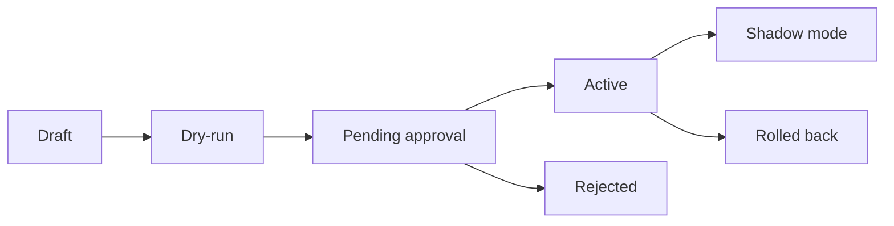

# 08 - Domain Pack, Feature Profile, And Rule Suggestion Schemas

## Purpose

Normative JSON schemas, ownership, activation workflow, and conflict precedence for DomainPack, FeatureProfile, and RuleSuggestion configuration used by AgentCore customization.

This document closes **GAP-009**. Product behavior narrative remains in `../08-software-engineering-architecture/26-domain-customization-and-feature-control.md`. Authoring UX remains in `07-custom-rule-authoring-and-suggestion-workflows.md`.

## Ownership

| Artifact | Config home | Runtime owner | Change control |
| --- | --- | --- | --- |
| DomainPack | `backend/configs/domain-packs/*.json` | project-profile / rule-engine | PR + schema gate; org admin may activate versions later |
| FeatureProfile | `backend/configs/feature-profiles/*.json` | project-profile / rule-engine | Same; scoped overrides stored as versioned rows when DB-backed |
| RuleSuggestion | produced at runtime; schema in `backend/configs/rule-packs/rule-suggestion.schema.json` | rule-engine-service | Never auto-activates by default |
| Rule pack (active policies) | `backend/configs/rule-packs/*.json` | rule-engine-service | Activation requires approval when severity ≥ medium |

First-party default pack remains `default` (software-engineering-capable baseline). Specialized packs (HR, support, …) are additive and must not replace the engineering pack as the primary wedge.

## Schema locations

| Schema | Path |
| --- | --- |
| DomainPack | `backend/configs/domain-packs/domain-pack.schema.json` |
| FeatureProfile | `backend/configs/feature-profiles/feature-profile.schema.json` |
| RuleSuggestion | `backend/configs/rule-packs/rule-suggestion.schema.json` |

Instances must validate against these schemas before merge or activation.

## Activation workflow

| Step | Actor | Action | Outcome |
| --- | --- | --- | --- |
| 1 | Author / agent | Creates draft DomainPack, FeatureProfile, or RuleSuggestion | Artifact `status=draft` |
| 2 | System | Validates JSON Schema + dry-run on fixture scope | Pass or fail with errors |
| 3 | Approver | Reviews evidence, risk, scope | `pending_approval` → `active` or `rejected` |
| 4 | Runtime | Computes effective profile with conflict rules below | Deterministic feature/rule map + explanation |

**Default:** RuleSuggestion stops at draft/pending. `auto_activate_low_risk_rules` may activate only when risk=`low`, dry-run passed, and the effective FeatureProfile explicitly enables that flag.

## Conflict precedence

More specific scope wins. Restrictive feature states beat permissive ones when scopes tie after specificity.

### Scope order (highest wins)

1. user  
2. role  
3. agent  
4. project  
5. project_group  
6. workspace  
7. organization  
8. DomainPack default  

### Feature state precedence (same scope)

When two assignments target the same feature key at the same scope:

`disabled` > `approval_required` > `admin_only` > `read_only` > `hidden` > `shadow_mode` > `enabled`

Boolean `false` maps to `disabled`; boolean `true` maps to `enabled` (legacy defaults only).

### Rule conflicts

| Situation | Resolution |
| --- | --- |
| Two active rules, opposite effect, different scope | Higher scope specificity wins |
| Same specificity, different severity | Higher severity wins |
| Same specificity and severity | Block newer activation; keep prior active; open conflict ticket |
| Suggested vs active | Suggestion never overrides active until approved |
| DomainPack vs project FeatureProfile | Project profile wins for feature keys it sets |

## Admin / operator surface (minimum)

Until the full admin UI ships, CLI/config PR review is acceptable. Required capabilities:

- list DomainPack / FeatureProfile versions  
- show effective profile for a scope (debugger)  
- RuleSuggestion inbox (approve / reject / dry-run)  
- audit log of activation and rollback  

## Verification

- `tests/backend/configs/test_domain_customization_schemas.py` validates first-party defaults and an example RuleSuggestion.
- Changing schemas requires updating defaults and that test in the same change.

## Related Documents

- `../08-software-engineering-architecture/26-domain-customization-and-feature-control.md`
- `07-custom-rule-authoring-and-suggestion-workflows.md`
- `../10-gap-analysis/01-gap-register.md`
