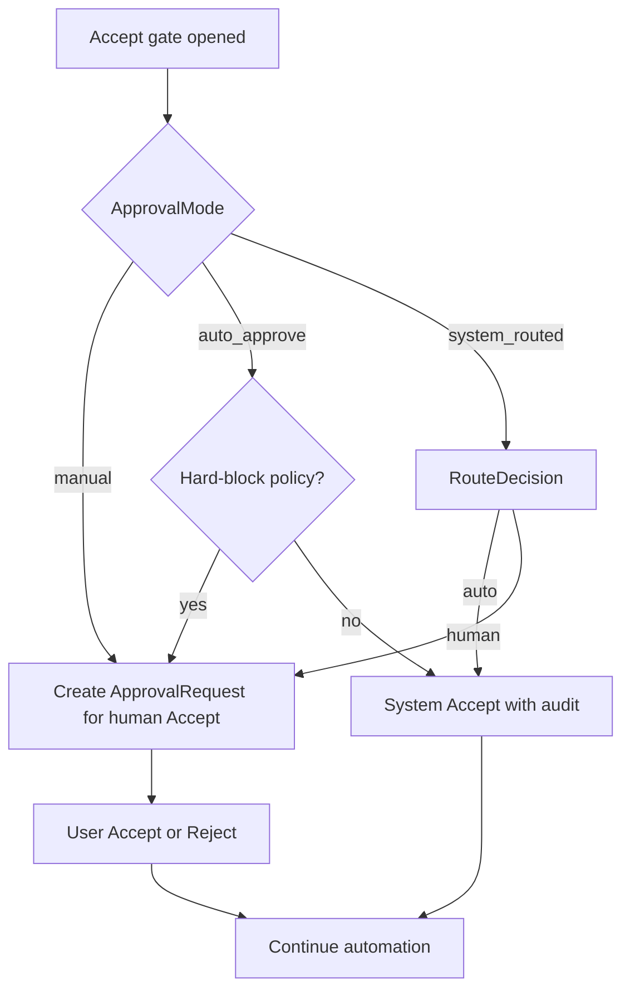

# 09 - Approval Modes And Auto-Approve

## Purpose

Define how AgentCore decides whether an Accept gate is resolved by a human, auto-approved, or routed per item. Users must be able to choose among three modes. The mode is configuration, not a prompt guess. Hard risk policies may still force human review even when the user selected auto-approve.

## Implementation status

**Shipped for v1 wedge (CLI first surface).** Mode catalog, route decision library, and `agentcore approval` commands are live. Full admin UI / IDE / chat surfaces remain follow-ups — see `10-approval-cli-first-surface.md`. This document remains the normative mode contract.

## Document flow



| Step | Actor | Action | Outcome |
| --- | --- | --- | --- |
| 1 | Rule engine / control plane | Opens an Accept gate for a proposed action | Gate subject + evidence refs exist |
| 2 | Config / IAM | Resolves effective `ApprovalMode` for tenant → workspace → project → actor | One of `manual`, `auto_approve`, `system_routed` |
| 3 | Policy hard-block | Evaluates non-deferrable classes (secrets, destructive, authz, production, compliance) | May force human path regardless of mode |
| 4 | Router (mode-specific) | Applies mode rules and optional `RouteDecision` | `ApprovalRequest` for human **or** system Accept |
| 5 | Human or system | Accept / Reject (or auto Accept) | Durable decision + audit + continue/stop |

## Problem Statement

Accept gates without modes produce either:

- approval fatigue (every micro-risk waits for a human), or
- unsafe auto-continue (automation proceeds without an explicit user policy).

Teams need an explicit, auditable choice: always ask me, auto-approve eligible items, or let the platform decide per item.

## Goals

- Offer exactly three user-selectable `ApprovalMode` values.
- Keep Accept as the human verb; Auto-Approve is a configured resolution path, not a silent skip.
- Let `system_routed` auto-approve some gates and escalate others with explainable reasons.
- Preserve fail-closed hard blocks that cannot be bypassed by mode selection alone.
- Record who chose the mode, who (or what) accepted, and why.

## Non-Goals

- Replacing ChangeSet peer review with approval modes.
- Making LLM judgment the sole authority for Accept in high-risk classes.
- Auto-approving without an `ApprovalRequest` / Decision audit trail.
- Per-tool pop-up spam; batching and WorkBatch boundaries remain separate (`../02-memory-and-context/08-batched-memory-and-deferred-knowledge-workflows.md`).

## Three Modes

| Mode id | User intent | Default behavior at Accept gate | Who Accepts |
| --- | --- | --- | --- |
| `manual` | Always review | Every eligible gate creates a human `ApprovalRequest` | Authorized user |
| `auto_approve` | Trust automation for eligible gates | System Accepts without waiting, unless hard-block forces human | System actor under user-selected mode |
| `system_routed` | Let platform choose per item | Router issues `RouteDecision`: auto or human | System or user per decision |

### Mode 1 — `manual` (always Accept by user)

- Every Accept gate that would otherwise proceed creates an `ApprovalRequest` (or `EscalationTicket` synonym until naming is unified).
- Automation pauses until an authorized human Accepts or Rejects.
- No item is auto-approved by preference; only explicit human Accept continues.

### Mode 2 — `auto_approve` (user-selected Auto Approve)

- The **user** (or project admin within IAM scope) selects this mode deliberately.
- Eligible gates are Accepted by the system immediately.
- Hard-block policies still force a human `ApprovalRequest`.
- UI must show that Auto Approve is active and allow switching back to `manual` or `system_routed`.
- Selecting this mode is itself an auditable configuration change (`ApprovalModeChanged`).

### Mode 3 — `system_routed` (system decides per item)

- For each Accept gate, the platform produces a `RouteDecision`:
  - `auto` → system Accept + audit
  - `human` → `ApprovalRequest` for user Accept
- Routing inputs **must** include risk score, policy matches, confidence, change class, environment, and evidence refs.
- Deterministic policy runs first; LLM judge may advise only when evaluation_mode allows and never overrides hard-block.
- Low confidence on a borderline case **must** prefer `human` (fail toward human).

## Effective Mode Resolution

Resolve in order (most specific wins):

1. Explicit override on the Task / AgentTicket / ChangeSet (if present and authorized).
2. Project `ApprovalModeProfile`.
3. Workspace / tenant default.
4. Platform default: `manual`.

Unauthorized actors must not raise permissiveness (e.g. a restricted agent must not set `auto_approve` for the project).

## Hard-Block Classes (mode-invariant)

These classes **must** create a human Accept gate even when mode is `auto_approve` or when `system_routed` would prefer auto, unless a separate **org-admin** break-glass policy exists and is audited:

- Secret or credential exposure / rotation.
- Destructive data or irreversible delete.
- Authentication / authorization / tenancy boundary changes.
- Production config or deploy gates marked `require_human`.
- Compliance, billing, or privacy-controlled surfaces flagged by policy.
- Explicit user instruction: “ask me before doing this.”

Hard-block is owned by rule-engine deterministic policies, not by the LLM.

## Primary Objects

### ApprovalModeProfile

Scoped configuration selecting the mode.

Required fields:

- `profile_id`
- `tenant_id` / `workspace_id` / `project_id` (as scoped)
- `mode` ∈ {`manual`, `auto_approve`, `system_routed`}
- `updated_by`, `updated_at`, `version`
- optional `routing_profile_ref` (required when mode is `system_routed`)
- optional `allowed_auto_classes` / `denied_auto_classes`
- optional `max_auto_risk` (ceiling for auto path)

### RouteDecision

Per-gate routing record when mode is `system_routed` (and optionally logged under other modes for hard-block explanation).

Required fields:

- `decision_id`, `gate_ref`, `correlation_id`
- `mode_effective`
- `route` ∈ {`auto`, `human`}
- `reason`, `policy_refs`, `risk_score`, `confidence`
- `decision_source` ∈ {`deterministic_policy`, `hybrid`, `llm_advise`, `hard_block`}
- `created_at`

### ApprovalRequest (existing)

Human Accept surface. When system Accepts under `auto_approve` or routed `auto`, the platform **must** still persist a resolved approval (or Decision twin) with:

- `resolved_by` = system actor id
- `resolution` = `accepted`
- `mode_effective`
- `route_decision_id` when applicable
- evidence and policy refs

Silent skip without a durable Accept record is forbidden.

## Decision Policy

```text
if hard_block(subject):
    route = human
elif mode == manual:
    route = human
elif mode == auto_approve:
    route = auto
elif mode == system_routed:
    route = routing_profile.evaluate(subject, evidence)
    if confidence < threshold or risk > max_auto_risk:
        route = human
emit RouteDecision (when system_routed or hard_block override)
if route == human:
    create ApprovalRequest (pending)
else:
    resolve Accept as system with audit
```

## Owning Modules

| Module | Owns |
| --- | --- |
| rule-engine-service | Mode evaluation, hard-block, RouteDecision, ApprovalRequest lifecycle |
| control-plane / orchestration | Pause/resume automation on pending Accept; attach mode to tickets |
| identity-access-service | Who may change `ApprovalModeProfile` and who may Accept |
| admin / agent UI | Mode picker, queue, Auto Approve indicator |
| audit-service | `ApprovalModeChanged`, Accept/Reject, RouteDecision evidence |

## Security And Privacy

- Mode changes require IAM permission (`approval_mode.write` or equivalent).
- Auto-Approve never widens data access; it only resolves Accept gates already authorized for the actor.
- Prompts must not carry RESTRICTED bodies; evidence refs only.
- Self-approval rules for ChangeSet peer review remain separate (`forbid_self_approval`).

## Failure Modes

| Failure | Behavior |
| --- | --- |
| Mode profile missing | Default `manual` |
| Router unavailable in `system_routed` | Fail closed → human Accept |
| Auto Accept write fails | Do not continue automation; leave gate pending or failed |
| User Rejects | Stop gated action; record reason; do not retry auto |
| Mode change mid-flight | In-flight gates keep the mode snapshotted at gate open |

## Observability

Metrics (suggested):

- `approval.gate_opened{mode}`
- `approval.route{route,mode}`
- `approval.hard_block_override`
- `approval.time_to_human_accept`
- `approval.auto_accept_count`

Audit joins by `correlation_id`: gate → RouteDecision → ApprovalRequest → automation resume.

## Acceptance Criteria

- [ ] User (with permission) can set project mode to each of the three values; change is audited.
- [ ] `manual`: no eligible gate completes without human Accept.
- [ ] `auto_approve`: eligible non-hard-block gates complete via system Accept with durable record.
- [ ] `auto_approve` + hard-block class: human queue still created.
- [ ] `system_routed`: same subject can yield `auto` or `human` based on risk/policy; reason stored.
- [ ] Low-confidence routed decision prefers human.
- [ ] Default with no profile is `manual`.
- [ ] UI exposes active mode and pending human Accept queue.

## Related Documents

- `01-feature-specification.md` — Escalation and human-in-the-loop feature
- `03-low-level-design.md` — Escalation and risk aggregation
- `04-data-contracts-and-events.md` — Approval / escalation contracts
- `../01-core-data-model/07-agent-collaboration-work-surface.md` — ChangeSet vs EscalationTicket
- `../11-logical-implementation-examples/04-rule-engine-and-human-approval-example.md` — Human approval example
- `../10-gap-analysis/01-gap-register.md` — GAP-004 Human Approval UX
