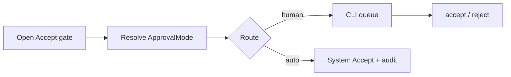

# 10 - Approval CLI First Surface

## Purpose

Close **GAP-004** by choosing the **AgentCore CLI** as the first shipped human Accept surface. Web UI / IDE / chat remain follow-ups; modes and hard-block policy stay owned by `09-approval-modes-and-auto-approve.md`.

## Decision

| Choice | Value |
| --- | --- |
| First surface | CLI (`agentcore approval …`) |
| Mode catalog | `backend/configs/approval-modes/` |
| Default mode | `manual` |
| Auto path | `auto_approve` / eligible `system_routed` still persist a durable Accept record |
| Hard-block | Always human, regardless of mode |

## Document flow



| Step | Actor | Action | Outcome |
| --- | --- | --- | --- |
| 1 | Operator / rule-engine | Opens a gate (`enqueue` or escalate evaluation) | Pending or auto-resolved item |
| 2 | Config | Resolves effective mode (env → project → catalog) | `manual` / `auto_approve` / `system_routed` |
| 3 | Policy | Applies hard-block + mode rules | `route=human` or `route=auto` |
| 4 | Human (CLI) | `approval queue` / `accept` / `reject` | Durable resolution |

## CLI

```text
agentcore approval mode show
agentcore approval mode set auto_approve
agentcore approval enqueue --subject-ref change:1 --subject-class docs.low_risk
agentcore approval queue
agentcore approval accept <id>
agentcore approval reject <id>
```

## Acceptance

- [x] First surface decision recorded (CLI).
- [x] ApprovalModeProfile schema + default catalog entry.
- [x] Route decision library with hard-block fail-closed.
- [x] CLI mode / queue / accept / reject commands.
- [x] Unit tests for route policy + CLI smoke.
- [ ] Web / IDE / Slack surfaces (explicitly out of GAP-004 v1 close).
