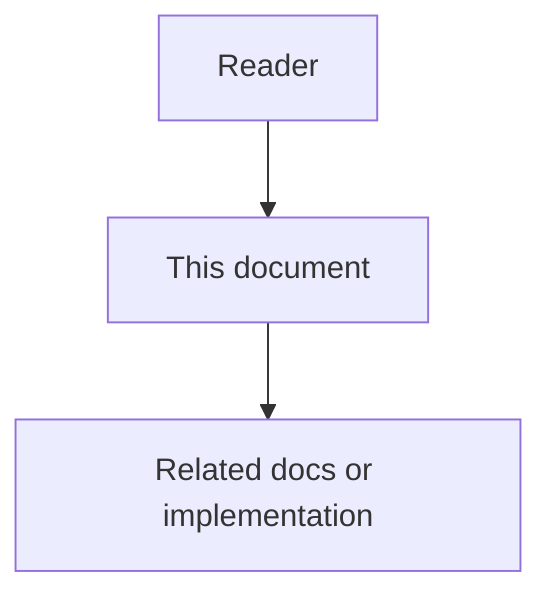

# 10 - External VCS And Tracker Mapping

## Purpose

Define how external VCS and issue trackers relate to AgentCore’s **native** agent collaboration surface. Agents write AgentCore Issues, Tasks, AgentTickets, and ChangeSets. Adapters may mirror to GitHub (or peers); they must not become the system of record for agent work.

## Document flow

| Step | Actor | Action | Outcome |
| --- | --- | --- | --- |
| 1 | Reader | Opens this design document | Understands scope and constraints |
| 2 | Reader | Follows the Mermaid flow | Sees primary component interactions |
| 3 | Reader | Uses Related Documents / linked symbols | Reaches deeper design or implementation |

## Professional Audience

Adapter engineers, security reviewers of token scopes, and operators enabling optional mirrors.

## Decision

| Concern | System of record |
| --- | --- |
| Agent-discovered conditions, executable work, durable tickets, change proposals, reviews, discussion, labels | **AgentCore** |
| Git commits, branches, protected-branch merge, CI check runs inside the host | **External VCS/CI** |
| Optional human-visible Issue/PR numbers and URLs | External projection fields on AgentCore entities |

This preserves the control-plane boundary: AgentCore does not mutate repositories; executors do, then attach evidence.

## Mapping Table

| External concept | AgentCore aggregate | Direction |
| --- | --- | --- |
| GitHub Issue | `Issue` (and optionally a planning `Task`) | bidirectional mirror optional |
| GitHub Issue comment | `DiscussionComment` on Issue | bidirectional optional |
| GitHub Pull Request | `ChangeSet` | bidirectional optional |
| GitHub PR review / inline comment | `ReviewThread` / `ReviewComment` | inbound preferred; outbound optional |
| GitHub label | `WorkLabel` (+ binding) | outbound/inbound with key map |
| GitHub milestone | `WorkMilestone` | optional |
| GitHub Actions check / required status | `policy_check_refs` / RuleEvaluation; may open EscalationTicket | inbound as evidence |
| GitLab MR | `ChangeSet` | same as PR |
| Jira Issue | usually `Task` (execution) or `Issue` (condition) per project map | adapter ACL |
| Linear Issue | `Task` or `Issue` per map | adapter ACL |
| CODEOWNERS / branch protection | policy inputs; not copied as SoR | read-only evidence |

## Anti-Corruption Rules

1. **Native status wins.** A GitHub PR closed while ChangeSet is `open` creates an adapter conflict event; it does not silently close the ChangeSet without policy.
2. **External ids are projections.** Store under `external_projections[]`; never use GitHub node id as AgentCore primary key.
3. **No authz via labels.** Mirrored labels cannot grant project access.
4. **Secrets.** Adapter tokens stay in secret storage; never in ChangeSet bodies.
5. **Capability `can_open_pr`.** Means an executor may open an external PR *as a projection* of a ChangeSet, or attach evidence that a PR exists — not that GitHub replaces ChangeSet.
6. **Air-gapped profile.** Adapters disabled; full collaboration remains available on AgentCore APIs.

## Sync Modes

| Mode | Behavior |
| --- | --- |
| `off` | Native only (default for air-gapped) |
| `outbound` | AgentCore → external create/update |
| `inbound` | External webhooks → AgentCore upsert projections + optional discussion |
| `bidirectional` | Both; conflict policy required (`native_wins` default) |

## Failure Modes

| Failure | Behavior |
| --- | --- |
| Webhook invalid signature | reject; no state change |
| External API down | queue outbound; native workflow continues |
| Mapping ambiguity (Jira epic vs Issue) | project adapter config required; fail closed on create |
| Duplicate mirror | idempotency key = `(system, external_id)` |

## Acceptance Criteria

- [ ] With adapters `off`, agents complete Issue → ChangeSet → Review → Applied evidence without GitHub.
- [ ] Enabling GitHub outbound writes `external_projections` without changing ChangeSet primary status authority.
- [ ] Inbound PR review creates ReviewComment linked to ChangeSet revision when patch fingerprint matches; otherwise marks `unmatched_evidence`.
- [ ] Documentation and scaffolds under `backend/integrations/tickets/` follow this map.

## Related Documents

- Native surface: `../01-core-data-model/07-agent-collaboration-work-surface.md`
- Contracts: `../01-core-data-model/08-changeset-review-and-discussion-contracts.md`
- Boundary: `../00-master-plan/07-agent-control-plane-product-boundary.md`
- Extensibility: `../08-software-engineering-architecture/15-extensibility-and-plugin-engineering.md`
