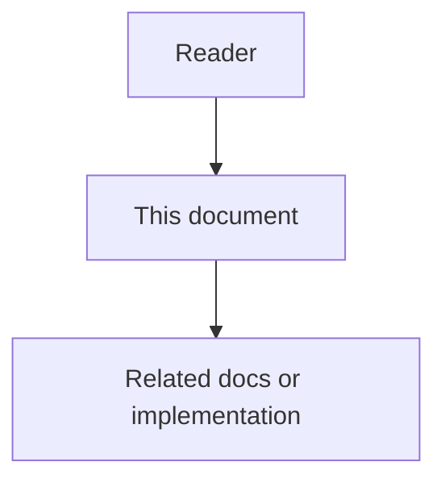

# Technical Logic and Verification - Feature Specification

## Purpose

Phase 6 turns the Phase 1 through 5 product designs into executable technical logic and a verification program. Without this phase, later graph and platform work builds on unproven assumptions.

## Document flow

| Step | Actor | Action | Outcome |
| --- | --- | --- | --- |
| 1 | Reader | Opens this design document | Understands scope and constraints |
| 2 | Reader | Follows the Mermaid flow | Sees primary component interactions |
| 3 | Reader | Uses Related Documents / linked symbols | Reaches deeper design or implementation |

## Mission

Phase 6 turns the Phase 1 through 5 product designs into executable technical logic and a verification program. Without this phase, later graph and platform work builds on unproven assumptions.

## Feature 1 - Domain Technical Logic Packs

Each earlier domain has an explicit algorithm and invariant pack: Core Data, Memory and Context, Docs Sync, Rule Engine, and Interoperability. These packs define write paths, state machines, scoring, routing, and failure handling.

## Feature 2 - End-to-End Runtime Logic

A single runtime narrative stitches domain packs into one auditable flow with correlation IDs, evidence references, and clear handoffs between services.

## Feature 3 - Technical Test Strategy

Verification covers contracts, state machines, idempotency, redaction, retrieval, docs drift, rule evaluation, broker delivery, performance signals, and reliability failure injection.

## Feature 4 - Canonical Test Ownership

Executable tests live under the root `tests/` tree. Phase and service READMEs name exact commands. Source-owned service folders do not hide the only copy of executable tests.

## Feature 5 - Deterministic Boundaries Around Models

Model-assisted judgment is allowed only after deterministic pre-checks, with stored rationale, evidence refs, and fail-closed behavior for high-risk domains.

## Functional Requirements

- Document technical logic for every Phase 1 through 5 owned surface.
- Define end-to-end runtime steps without hidden side effects.
- Define verification layers and pass/fail evidence.
- Require canonical test paths and named run commands.
- Block silent progression to Phase 7 when Phase 6 exit criteria are unmet unless an explicit waiver exists.

## Non-Functional Requirements

- Technical docs remain implementation-grade and English-only.
- Verification favors deterministic, repeatable scenarios.
- Sensitive payloads stay redacted in prompt-visible and public event paths.
- Weighting and thresholds are profile-driven, not hard-coded magic numbers.
