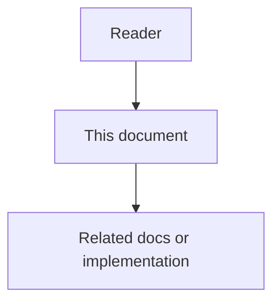

# Technical Logic and Verification - High-Level Design

## Purpose

This high-level design separates Phase 6 as the verification and technical-logic control plane for Phases 1 through 5. It does not introduce a customer-facing product domain. It introduces a delivery boundary that owns truthfulness of earlier slices.

## Document flow



| Step | Actor | Action | Outcome |
| --- | --- | --- | --- |
| 1 | Reader | Opens this design document | Understands scope and constraints |
| 2 | Reader | Follows the Mermaid flow | Sees primary component interactions |
| 3 | Reader | Uses Related Documents / linked symbols | Reaches deeper design or implementation |


## Actors

- Platform engineer implementing or changing a Phase 1 through 5 service.
- Verification engineer maintaining contract and runtime tests.
- Agent runtime and human approver as subjects of end-to-end scenarios.
- Release reviewer checking Phase 6 exit gates before Phase 7 starts.

## Components

| Component | Responsibility |
| --- | --- |
| Domain logic packs | Algorithms and invariants per earlier phase |
| Runtime stitcher docs | Cross-service flow and correlation rules |
| Verification harness | Contract, state, idempotency, redaction, and e2e tests under `tests/` |
| Evidence ledger | Expected records, events, and refs for acceptance scenarios |
| Gate checker | Confirms named commands pass before Phase 7 work |

## System Flow

```text
Owned service design (core-data … adapter)
    -> technical-logic packs under docs/06-technical-logic/
    -> service suites under tests/backend/services/<service>/
    -> technical-logic feature gate under tests/backend/gates/technical-logic-verification/
    -> pass/fail evidence
    -> allow code-graph and later feature work
```

## Boundaries

- Phase 6 may reference Phase 1 through 5 APIs, events, and stores through public contracts only.
- Phase 6 must not redefine Neo4j product behavior owned by Phase 7.
- Phase 6 must not absorb Phase 8 engineering-operating-model docs; it only sets the technical verification gate those docs later generalize.

## Integrations

- Reads designs from `docs/01-` through `docs/05-`.
- Owns `docs/06-technical-logic/`.
- Points executable proof at `tests/backend/services/<service>/` and related roots.
- Hands off to Phase 7 only after exit criteria or an owned waiver.
