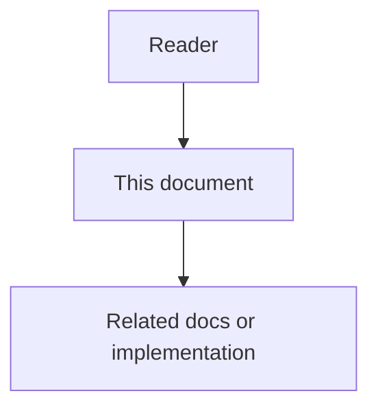

# Technical Logic and Verification - Low-Level Design

## Purpose

This low-level design defines how Phase 6 packages technical logic and verification work so engineers can implement checks without inventing hidden rules.

## Document flow



| Step | Actor | Action | Outcome |
| --- | --- | --- | --- |
| 1 | Reader | Opens this design document | Understands scope and constraints |
| 2 | Reader | Follows the Mermaid flow | Sees primary component interactions |
| 3 | Reader | Uses Related Documents / linked symbols | Reaches deeper design or implementation |


## Implementation Boundary

Phase 6 includes:

- domain technical logic documents for Phases 1 through 5,
- end-to-end runtime logic,
- technical test strategy,
- canonical test path enforcement,
- gate evidence expectations.

Phase 6 does not own a separate long-lived business microservice. Verification code lives under `tests/backend/services/<service>/` (and feature gates under `tests/backend/gates/`) with shared harness helpers under `tests/support/` as needed.

## Internal Module Layout

Recommended verification layout:

```text
tests/
  backend/
    services/<service>/
      test_<service>.py
    gates/<feature>-verification/
      test_<feature>_gate.py
      run_gate.py
    packages/
    tools/
    platform/
    legacy/
  support/                  # feature gate harness packages
docs/
  06-technical-logic/
    01-..05-*-technical-logic.md
    06-end-to-end-runtime-logic.md
    07-technical-test-strategy.md
    08-..13-phase-design.md
```

Tests are organized by **service** or **feature gate** folders (under `services/` / `gates/`), not by roadmap phase number.
## Commands (verification operations)

- `VerifyContracts` for schema and event envelope checks.
- `VerifyStateMachines` for legal and illegal transitions.
- `VerifyIdempotency` for duplicate delivery safety.
- `VerifyRedaction` for secret and sensitive payload handling.
- `VerifyRuntimeScenario` for end-to-end evidence chains.
- `CheckFeatureGate` for named pytest/command completion before code-graph work.

## Queries

- `ListRequiredChecksForService` for an owned vertical-slice service.
- `ExplainFailedCheck` for rationale, expected evidence, and owning doc refs.
- `GetCanonicalTestCommand` for a service vertical slice.

## Events / Evidence Artifacts

Verification produces evidence artifacts, not business domain events:

- contract check report,
- state-machine check report,
- idempotency check report,
- redaction check report,
- runtime scenario report,
- phase gate decision (`pass`, `fail`, `waived`).

## Persistence Rules

- Executable tests are source of truth for pass/fail.
- Docs define expected invariants and scenarios.
- Waivers must record owner, reason, expiration, and linked Issue or Decision.

## Failure Handling

- Missing canonical test path fails the Phase 6 gate.
- Undocumented high-risk path fails the Phase 6 gate.
- Model judgment without deterministic pre-check fails review.
- Phase 7 implementation starting without gate pass or waiver is a process defect.
