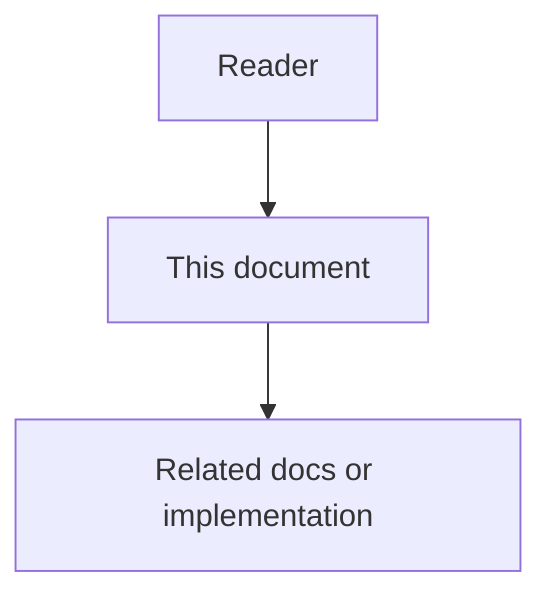

# 22 - Code Intelligence Enhancements Feature Specification

## Purpose

This document specifies **Code Intelligence Enhancements**: product behavior that
makes AgentCore’s Code-Knowledge Graph useful for coding agents and reviewers
with fewer tool calls, clearer risk, and explainable edges. Prior art is MIT
(CodeGraph, code-review-graph, graphify); AgentCore re-implements on Neo4j — see
[`21`](21-code-intelligence-prior-art-ideas-and-license.md).

## Document flow

| Step | Actor | Action | Outcome |
| --- | --- | --- | --- |
| 1 | Reader | Opens this design document | Understands scope and constraints |
| 2 | Reader | Follows the Mermaid flow | Sees primary component interactions |
| 3 | Reader | Uses Related Documents / linked symbols | Reaches deeper design or implementation |

## Professional Audience

Engineers and architects implementing `code-graph-service`, MCP gateway tools,
CI review jobs, and agent usage profiles. No beginner graph tutorials.

## Problem Statement

Agents discover structure via repeated Grep/Read. Reviewers lack ranked blast
radius and test-gap signals. Metadata exists in Neo4j but is not packaged as
surgical, budget-aware context or risk-scored change reports.

## Goals

1. One primary agent path (`explore`) returns seeds, call paths, and budgeted source.
2. Framework routes and test links enrich the graph for API and coverage questions.
3. Changed-file review yields risk scores, affected flows, and test gaps.
4. Edge confidence/provenance is visible on every agent-facing response.
5. Wave 2+ adds communities and hybrid BM25/FTS/embedding RRF (docs `27`–`31`) without abandoning Neo4j SoR.

## Non-Goals

- Replacing Neo4j with per-project SQLite.
- Vendoring upstream CLIs as runtime dependencies (default).
- Multimodal PDF/video graphs in Wave 1.
- Claiming circular graph-derived “100% impact recall.”

## Personas And Jobs

| Persona | Job |
| --- | --- |
| IDE coding agent | Answer “how does X work?” with minimal Read |
| Human reviewer / CI | Prioritize risky changed symbols and missing tests |
| Architect | See communities, hubs, bridges, surprising couplings |
| Security reviewer | Surface auth/session-named hotspots in change risk |

## Capability Groups

### Wave 1 (shipped)

| Capability | User-visible behavior | Acceptance sketch |
| --- | --- | --- |
| Explore pack | Query → sections with full or signature bodies | MCP/HTTP return `sections`, `budget_chars`, `call_path_ids` |
| Framework routes | FastAPI/Flask/Django/Express patterns → `ROUTES_TO` | Ingest creates route symbols linked to handlers |
| TESTED_BY | Convention-based production→test edges | Ingest emits `TESTED_BY`; detect_changes lists gaps |
| Detect changes | Risk report for file list | Overall score, priorities, flows, gaps |

### Wave 2 (shipped — see Production Retrieval Stack `27`–`31` for retrieval)

| Capability | User-visible behavior |
| --- | --- |
| Communities (scikit-network Leiden or Louvain) | Architecture overview clusters |
| Hub / betweenness bridge | Hotspots and chokepoints |
| Knowledge gaps / surprise / suggested questions | Architecture report |
| Hybrid BM25 + FTS + embedding RRF | `search:hybrid` + explore (`27`–`30`) |
| Shortest path | `graph/path` — how A reaches B |

### Wave 3 (shipped — session freshness + rationale + dispatch; watcher daemon deferred)

| Capability | User-visible behavior |
| --- | --- |
| Pending-sync / stale banners | Explore/detect_changes `freshness` + MCP freshness tool |
| Dynamic-dispatch provenance | Probable CALLS with `metadata.provenance=dynamic_dispatch` |
| Rationale / WHY comments | `SymbolKind.RATIONALE` + DOCUMENTED_BY from file |
| Agent skill prefers explore | MCP-first `agentcore-code-graph` skill updated |

## Permissions And Isolation

- All operations are scoped by tenant / workspace / project headers.
- Explore and detect_changes are read APIs; ingest remains write + idempotent.
- No customer source leaves the control plane except via configured LiteLLM routes for docs/embed (unchanged policy).

## Product States

| State | Meaning |
| --- | --- |
| Empty graph | Explore returns guidance to ingest; no hard failure spam |
| Partial index | Confidence and notes disclose unresolved handlers/tests |
| Fresh | Default after successful ingest |
| Stale (Wave 3) | Banner lists pending paths |

## Metrics

- Median tool calls and file reads per architecture question (agent eval).
- Explore `used_chars` / `budget_chars` ratio.
- Detect_changes: share of changed symbols with `test_count == 0`.
- Precision/recall vs git co-change (honest eval), not graph self-walk.

## Copy And Attribution

UI and docs may say features are **inspired by** public prior art. Must not claim
the product is CodeGraph, code-review-graph, or graphify, or that those projects
endorse AgentCore. License obligations: [`21`](21-code-intelligence-prior-art-ideas-and-license.md),
[`THIRD_PARTY_NOTICES.md`](THIRD_PARTY_NOTICES.md).

## Related Documents

- HLD: [`23`](23-code-intelligence-enhancements-high-level-design.md)
- LLD: [`24`](24-code-intelligence-enhancements-low-level-design.md)
- Contracts: [`25`](25-code-intelligence-enhancements-data-contracts-and-events.md)
- Risks: [`26`](26-code-intelligence-enhancements-risks-challenges-and-acceptance.md)
