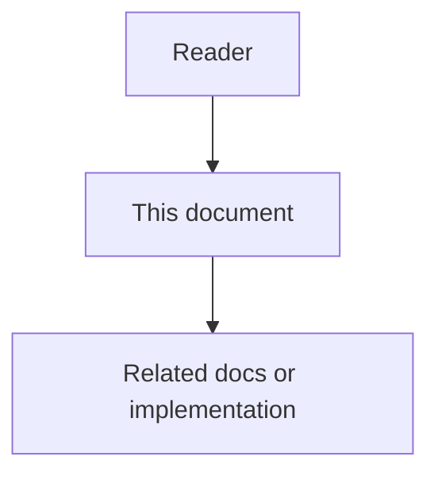

# 23 - Code Intelligence Enhancements High-Level Design

## Purpose

Defines how Code Intelligence Enhancements fit into AgentCore runtime topology.
Algorithms live in [`24`](24-code-intelligence-enhancements-low-level-design.md);
product requirements in [`22`](22-code-intelligence-enhancements-feature-specification.md).

## Document flow



| Step | Actor | Action | Outcome |
| --- | --- | --- | --- |
| 1 | Reader | Opens this design document | Understands scope and constraints |
| 2 | Reader | Follows the Mermaid flow | Sees primary component interactions |
| 3 | Reader | Uses Related Documents / linked symbols | Reaches deeper design or implementation |


## Architectural Decision

**Decision:** Implement enhancements as domain + application modules inside
`code-graph-service`, exposed via existing HTTP API and MCP gateway dispatch.
Keep `CodeSymbol` + `CODE_REL` projection; add `rel_type` values and optional
`SymbolKind.ROUTE`.

**Rationale:** Intelligence is graph-native. A separate microservice would
duplicate scope headers, stores, and embeddings. Extraction criteria later:
heavy GDS batch jobs or multi-repo daemon scale.

**Alternatives rejected:**

| Alternative | Why rejected |
| --- | --- |
| Embed upstream CodeGraph/CRG/graphify processes | License/SBOM complexity; SQLite SoR; breaks Neo4j parity |
| Agent-only prompting without graph enrichment | Non-deterministic; no durable edges |
| Postgres-only analytics tables | Duplicates Neo4j neighborhood queries |

## Runtime Topology

```text
IDE / CI / Admin
    |  MCP (usage profile) or HTTP
    v
mcp-gateway-service  ----dispatch---->  code-graph-service
                                              |
                    +-------------------------+-------------------------+
                    |                         |                         |
              Neo4jStore (structure)   Postgres/pgvector (embed)   Outbox mirror
                    |
              in-process Leiden (scikit-network) / Louvain — see docs 27–29
```

## Module Boundaries

| Package / area | Owns |
| --- | --- |
| `domain/framework_routes.py` | Route extraction (deterministic) |
| `domain/test_links.py` | Test path + stem conventions |
| `domain/flows.py` | Entry detection, BFS flows, criticality |
| `domain/risk.py` | Risk score pure function |
| `domain/explore.py` | Budget + skeletonization packer |
| `domain/hybrid_search.py` | BM25 + RRF (production retrieval) |
| `domain/communities.py` | Leiden / Louvain communities |
| `application/intelligence.py` | Explore, detect_changes, hybrid, architecture |
| `application/ingest.py` | Emits `ROUTES_TO` / `TESTED_BY` after parse |
| MCP `backends/code_graph.py` | Tool handlers |
| Usage profile JSON | Tool schemas / descriptions |

## Data Flow

### Explore

1. Normalize query; extract identifier terms.
2. Hybrid seeds (BM25 + semantic + store FTS via RRF); see docs `27`–`29`.
3. Trace CALLS BFS for call-path spine; APOC expand when available.
4. Pack symbols under char budget; skeletonize off-spine siblings.
5. Return sections with confidence policy note and `retrieval` mode.

### Detect changes

1. Resolve symbols in changed files.
2. Build flows; map membership + criticality.
3. Count callers and `TESTED_BY`.
4. Score risk; emit priorities, gaps, affected flows.

### Ingest enrichment

After CALLS/IMPORTS edges: emit routes from source text; recompute convention
`TESTED_BY` links across project symbols.

## Quality Attributes

| Attribute | Approach |
| --- | --- |
| Isolation | Scope on every store call |
| Idempotency | Existing ingest keys; enrichment edges keyed by `link_key` |
| Observability | Notes arrays; risk summary string; Neo4j capabilities probe |
| Performance | Budget caps; Wave 2 approx betweenness for large graphs |
| License | Clean-room; notices in `THIRD_PARTY_NOTICES.md` |

## Wave Boundaries

| Wave | Architecture deliverable |
| --- | --- |
| 1 | Domain modules + intelligence use cases + MCP/HTTP |
| 2 | Leiden/Louvain communities + BM25/FTS/BGE RRF (`27`–`31`) + architecture API |
| 3 | Watcher sidecar / session stale signal; provenance synthesizers |

## Related Documents

- License: [`21`](21-code-intelligence-prior-art-ideas-and-license.md)
- Contracts: [`25`](25-code-intelligence-enhancements-data-contracts-and-events.md)
- Production retrieval: [`27`](27-production-retrieval-stack-feature-specification.md)–[`31`](31-production-retrieval-stack-risks-challenges-and-acceptance.md)
- Projection ADR: [`13`](13-codesymbol-projection-adr.md)
