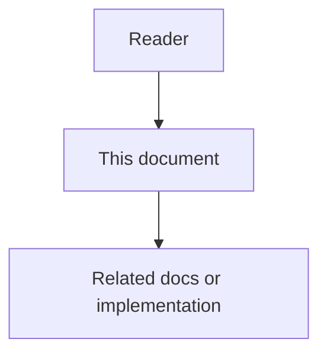

# 24 - Code Intelligence Enhancements Low-Level Design

## Purpose

Implementation-grade algorithms for Wave 1 (routes, TESTED_BY, flows, risk,
explore packing). Wave 2+ retrieval and communities: see docs `27`–`29`
(BM25/FTS/BGE/APOC/Leiden). Do not reintroduce token-overlap lexical search.
Inspired by MIT prior art; clean-room code under `code_graph_service.domain.*`.
License: [`21`](21-code-intelligence-prior-art-ideas-and-license.md).

## Document flow



| Step | Actor | Action | Outcome |
| --- | --- | --- | --- |
| 1 | Reader | Opens this design document | Understands scope and constraints |
| 2 | Reader | Follows the Mermaid flow | Sees primary component interactions |
| 3 | Reader | Uses Related Documents / linked symbols | Reaches deeper design or implementation |


## Rel Types And Kinds

| Value | Meaning |
| --- | --- |
| `ROUTES_TO` | Route node → handler symbol |
| `TESTED_BY` | Production symbol → test symbol |
| `SymbolKind.ROUTE` | Synthetic HTTP route node |

Existing: `CONTAINS`, `CALLS`, `IMPORTS`, `INHERITS_FROM`, `DOCUMENTED_BY`.
Confidence enum remains `exact|probable|ambiguous|unresolved`.

## Framework Route Extraction

```text
extract_routes(source, language, file_path):
  if python:
    match @app|router.(get|post|...|route)("path") then next def name
    if urls.py-like: match path|re_path|url("path", handler)
  if js/ts:
    match app|router.(get|post|...)("path", handlerIdent)
  return ExtractedRoute{method, path, handler_name, framework, line}
```

Ingest creates `route:{project}:{method}:{path}` and `ROUTES_TO` edges.
Unresolved handlers use `unresolved:{project}:{name}` with `unresolved` confidence.

## TESTED_BY Linking

```text
is_test_path(path):
  any path segment in {tests,test,spec,specs,__tests__}
  OR filename matches test_*, *_test.*, *.test.*, *.spec.*, *Test.py, …

suggest_test_links(symbols):
  split production vs test by is_test_path
  link when stem_variants(prod_file) ∩ stem_variants(test_file)
       OR name conventions (test_<name>)
  direction: production --TESTED_BY--> test
  confidence: probable; metadata.reason = file_stem|name_convention
```

## Execution Flows

```text
detect_entry_points(nodes, call_edges, route_handlers):
  inbound = count CALLS targets
  entry if route_handler OR name ~ main|handler|test_*|on_*|…
       OR decorator hints in signature/body
       OR (inbound==0 and conventional)

trace_flow(entry, calls_out, max_depth=8, max_nodes=40):
  BFS forward on CALLS; record path_ids, depth, file_count

criticality =
  0.30*file_spread + 0.20*external + 0.25*security
  + 0.15*test_gap + 0.10*depth_norm
```

Security keywords: auth, password, token, secret, jwt, session, login, …

## Risk Score

```text
score =
  min(sum(flow_criticalities), 0.25)   # or 0.05 * membership_count
  + min(0.05 * cross_community_callers, 0.15)   # Wave 2 communities
  + (0.30 - min(test_count/5,1)*0.25)
  + 0.20 if security name match
  + min(caller_count/20, 0.10)
  + min(churn/10,1)*0.15                 # optional
clamp to [0,1]
levels: low <0.3 ≤ medium <0.5 ≤ high <0.75 ≤ critical
```

## Explore Pack

```text
budget = f(file_count) ∈ {18k,24k,28k,32k} chars  # or override

seeds = hybrid_rrf(bm25, semantic, store_fts) ∪ identifier_term_boosts
spine = BFS CALLS from seeds (+ APOC expand when available)
candidates = seeds ∪ spine ∪ 1-hop neighbors

sibling_group = Interceptor|Handler|Service|… suffix OR method short name
if group size ≥ 3:
  keep spine (or first) full; others signature-only

emit sections grouped by file until budget; collapse/omit with notes
```

## Wave 2+ retrieval and communities (canonical)

**Authoritative algorithms** for BM25, store FTS, BGE embeddings, RRF, APOC
expand, and Leiden/Louvain live in:

- [`27`](27-production-retrieval-stack-feature-specification.md) …
  [`29`](29-production-retrieval-stack-low-level-design.md)

Do **not** reintroduce token-overlap lexical ranking or Neo4j GDS Leiden here.
Wave 1 risk/explore packers in this document remain the source for routes,
TESTED_BY, flows, and skeletonization.

### Betweenness bridges (architecture overview)

Exact for small graphs; approximate sampling when n is large.

## Failure Modes

| Failure | Behavior |
| --- | --- |
| Empty query | ValidationError |
| No symbols | Explore returns empty sections + note |
| Ambiguous route handler | Multiple `ROUTES_TO` with `ambiguous` |
| Empty / edgeless graph | One community per isolated node |

## Test Strategy

- Unit: route fixtures, test path false positives (`contest.py`), risk caps,
  skeletonization with ≥3 siblings; communities/RRF/path/dispatch/rationale.
- Service: ingest emits `ROUTES_TO`/`TESTED_BY`/rationale/dispatch; explore/
  detect_changes/architecture/hybrid/path/freshness smoke.
- Eval (later): co-change F1; agent tool-call reduction — never circular recall.

## Implementation Pointers

- `backend/services/code-graph-service/src/code_graph_service/domain/{framework_routes,test_links,flows,risk,explore}.py`
- `application/intelligence.py`, ingest enrichment hooks
- Tests: `tests/backend/services/code-graph-service/test_wave1_intelligence.py`
