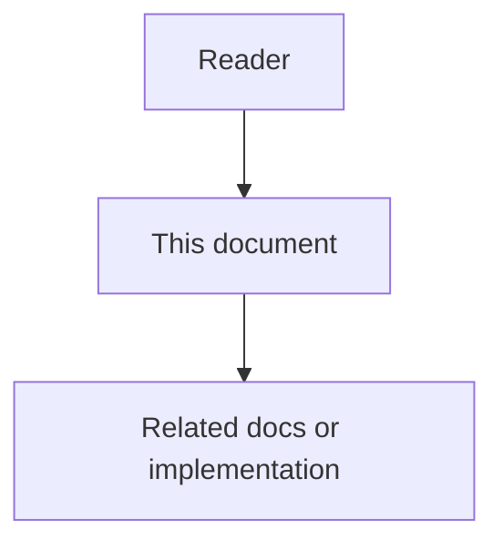

# 29 - Production Retrieval Stack Low Level Design


## Purpose

Algorithms and schemas for BM25, Lucene/Postgres FTS queries, RRF, BGE query prefix, APOC expand, and Leiden/Louvain community detection.

## Document flow



| Step | Actor | Action | Outcome |
| --- | --- | --- | --- |
| 1 | Reader | Opens this design document | Understands scope and constraints |
| 2 | Reader | Follows the Mermaid flow | Sees primary component interactions |
| 3 | Reader | Uses Related Documents / linked symbols | Reaches deeper design or implementation |


## BM25 (in-process)

Document = `searchable_text(name, qualified_name, signature, file_path, ai_documentation, body[:800])`.

Tokenization: `[A-Za-z_][A-Za-z0-9_]{1,63}` lowercased.

Scoring: Okapi BM25 with **Lucene-style positive IDF**:

```text
idf(t) = ln(1 + (N - df + 0.5) / (df + 0.5))
score  = Σ idf * (tf * (k1+1)) / (tf + k1 * (1 - b + b * dl/avgdl))
k1=1.5, b=0.75
```

For corpora with ≥32 documents, `rank_bm25.BM25Okapi` may be used when it yields
positive scores; otherwise the Lucene-style implementation is authoritative
(tiny corpora would otherwise score 0 when `df ≈ N/2`).

## Store FTS

### Neo4j

Indexes:

- `code_symbol_fulltext_v2` — name, qualified_name, signature, file_path, ai_documentation
  (canonical; created by `ensure_schema`)
- Legacy `code_symbol_fulltext` (no `file_path`) — **not created** anymore; query
  falls back only if an old database still has it

Query builder `_lucene_query`: sanitize tokens, OR-join, fuzzy `~1` for tokens
length ≥ 5. Results: `{symbol_id, score, method: neo4j.fulltext}`.

`capabilities()` is cached until `ensure_schema()`.

### Postgres

Migration `0006_symbol_fts.sql` adds `search_document tsvector` + GIN index.
`put_symbol` refreshes the document. `fulltext_search` uses
`plainto_tsquery('english', q)` and `ts_rank_cd`.

## RRF

```text
rrf(id) = Σ_channels 1 / (60 + rank_c(id))
```

Mode strings:

| Mode | Channels present |
| --- | --- |
| `bm25` | BM25 only |
| `hybrid_rrf_semantic_bm25` | BM25 + semantic |
| `hybrid_rrf_fts_semantic_bm25` | BM25 + semantic + FTS |

## Embeddings

- Default dims **1024** (`AGENTCORE_EMBEDDING_DIMS`).
- BGE query prefix when `is_query=True` and model name contains `bge`.
- `HybridEmbeddings.backend_name` reports active backend for API transparency.

## APOC / path

- `expand_neighborhood`: `CALL apoc.path.expandConfig` on `CODE_REL`, depth ≤5;
  else one-hop `list_edges` filter.
- `shortest_path_ids`: Cypher `shortestPath((a)-[:CODE_REL*..d]-(b))` with
  literal depth clamp 1..12; intelligence falls back to in-memory BFS.
- Explore seeds call APOC expand on CALLS to grow candidates.

## Communities

1. Try `sknetwork.clustering.Leiden` on weighted undirected CSR (optional extra
   `graph-analytics`).
2. Else multilevel Louvain + Leiden-style connectivity refine.
3. Auto-split communities >25% of nodes.
4. `last_community_algorithm()` → `scikit_network_leiden` |
   `louvain_leiden_refine` | `isolated_nodes`.

## Failure modes

| Failure | Behavior |
| --- | --- |
| No FTS index / plugin | Channel omitted; BM25 remains |
| BGE import/load fail | Stub embeddings; mode still RRF with weak semantic |
| APOC missing | `expansion=one_hop` / explore uses edge lists |
| scikit-network missing | Louvain fallback |
