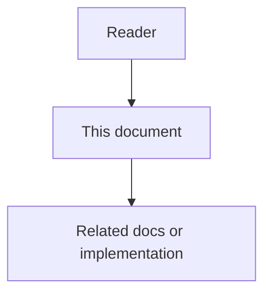

# 37 - RPM Session Parallel Sync Feature Specification

## Implementation status

**Implemented** in `llm_gateway.RpmSessionGate`, parallel `ingest_repo` /
`_ingest_pending_paths` with `LockedStore`, `GET /api/v1/llm/sessions`, and
`agentcore llm sessions`. Acceptance gates in [`40`](40-rpm-session-parallel-sync-risks-challenges-and-acceptance.md)
should be checked against the current tree when claiming production readiness.

## Purpose

Make repository sync **faster under a configured LiteLLM RPM budget** without
exceeding that budget or corrupting the graph store. Parallelism is gated by
**tracked LLM request sessions** (explicit start and end), not by “send one file
then peek RPM.” Operators and agents can observe in-flight sessions and a short
recent history through CLI and HTTP.

## Document flow

| Step | Actor | Action | Outcome |
| --- | --- | --- | --- |
| 1 | Reader | Opens this design document | Understands scope and constraints |
| 2 | Reader | Follows the Mermaid flow | Sees primary component interactions |
| 3 | Reader | Uses Related Documents / linked symbols | Reaches deeper design or implementation |

## Goals

1. **Correct RPM accounting** — every real LiteLLM `complete` / `embed` call has
   a session with start and end; capacity checks use both sliding-window starts
   and in-flight count.
2. **Useful parallelism** — bound file parse/hash workers and LLM work so wall
   time drops when RPM and CPU allow; do not serialize solely on “one file at a
   time” when many LLM slots are free.
3. **Store safety** — graph mutations remain correct under today’s single
   Postgres connection and concurrent Neo4j/application races (see risks doc).
4. **Observability** — process-local registry exposes in-flight sessions, short
   ring history, and RPM window stats via HTTP and CLI (no secrets).
5. **Honest fallbacks** — heuristic docs / local BGE / stub embeddings do not
   open RPM sessions or leave orphan in-flight entries.

## Non-Goals (v1)

- Durable session audit in a database.
- Cluster-wide / multi-process shared rate limiter (Redis or similar).
- Unbounded file parallelism.
- Changing provider-side quotas or LiteLLM proxy internals.
- Parallel human-docs Phase 2 (`docs_link_sync`) redesign (may stay serial in v1).

## Operator story

1. Operator sets `AGENTCORE_LITELLM_RPM` (and future worker caps) and runs
   `agentcore sync`.
2. Sync discovers files, schedules bounded workers for parse/hash, and queues
   documentation/embedding work that needs LiteLLM.
3. Each LiteLLM call opens a session, blocks if RPM or in-flight caps are full,
   then closes the session in `finally`.
4. Operator runs a status command (or hits HTTP) and sees who is in flight, how
   many starts remain in the current minute window, and recent completed/failed
   sessions.
5. Sync progress continues to report file/symbol throughput; session view is
   the RPM truth surface.

## Requirements

### R1 — Session identity

An **RPM session** **must** represent exactly one gated network call through
`LiteLlmGateway.complete` or `LiteLlmGateway.embed` (including gateway-level
retry attempts — see LLD). Fields **must** include:

| Field | Requirement |
| --- | --- |
| `session_id` | Unique within the process |
| `kind` | `complete` or `embed` |
| `model` | Resolved model string when known |
| `started_at` | Monotonic + wall clock suitable for API |
| `ended_at` | Null while `in_flight`; set on terminal status |
| `status` | `in_flight` \| `ok` \| `error` \| `cancelled` |
| `correlation_id` | Optional; from caller when provided |
| `file_path` / `symbol_id` | Optional attribution for sync |

Ring history size **must** be a fixed constant (normative default **100**
completed/failed sessions). Storage **must** be process-local memory.

### R2 — Lifecycle

- **Start** immediately before the network call (after capacity is granted).
- **End** in `finally` on success, error, timeout, or cancel.
- Timeout **must** align with `AGENTCORE_LITELLM_TIMEOUT_SECONDS`; a timed-out
  call **must** end the session as `error` or `cancelled` (LLD picks one and
  keeps it consistent).

### R3 — Capacity

Launching a new LiteLLM call **must** wait until both are true:

1. Sliding-window starts in the last 60s are `< AGENTCORE_LITELLM_RPM`.
2. Current in-flight sessions are below the in-flight cap (v1: same as RPM
   unless a separate env is introduced in LLD).

Local BGE / stub / heuristic paths **must not** acquire RPM capacity.

### R4 — Parallel sync pipeline

| Stage | Parallel? | Cap |
| --- | --- | --- |
| File parse + hash | Yes | `max_file_workers` (config; LLD default) |
| LiteLLM complete/embed | Yes | RPM window + in-flight sessions |
| Graph / Postgres writes | Serialized writer in v1 | 1 |

Sync **must not** rely on “check RPM then start next whole file” as the only
scheduler; LLM-bound work is the primary throttle grain. Fairness **should**
avoid one huge file starving other files’ doc work (LLD).

### R5 — Observability surfaces

- HTTP on code-graph-service under `/api/v1/llm/...` **must** expose a snapshot:
  in-flight list, recent history, RPM limit, starts in window, in-flight count.
- CLI **must** expose the same snapshot (dedicated subcommand and/or sync
  progress enrichment). Payloads **must not** include API keys or full prompts.
- Sync progress callbacks **must** be thread-safe when workers emit events.

### R6 — Failure isolation

Per-file soft-fail behavior of today’s ingest **must** remain: one file or
symbol failure does not abort the whole sync. Session errors **must** be
visible in history.

## User-visible behaviors

| Surface | Behavior (when implemented) |
| --- | --- |
| `agentcore sync` | Faster when RPM allows concurrent LLM work; store stays correct |
| Sync progress | Thread-safe file/symbol progress; ETA still meaningful |
| `GET /api/v1/llm/sessions` (name may match LLD) | In-flight + history + RPM stats |
| CLI session status | Same snapshot as HTTP |
| Heuristic-only / LLM disabled | No RPM sessions; sync still works |

## Acceptance sketch

- Unit tests prove session start/end with no leaks on success and error paths.
- Concurrent callers never exceed configured RPM starts/minute or in-flight cap.
- Store serialization (or equivalent safety) proven under parallel file workers.
- HTTP and CLI snapshots agree with registry state in the same process.
- Docs `37`–`40` match implemented names after coding; until then `lifecycle_lane: current`.

## Related Documents

- HLD: [`38`](38-rpm-session-parallel-sync-high-level-design.md)
- LLD: [`39`](39-rpm-session-parallel-sync-low-level-design.md)
- Risks / acceptance: [`40`](40-rpm-session-parallel-sync-risks-challenges-and-acceptance.md)
- Ingest workflow: [`03`](03-ingestion-and-living-documentation-workflow.md)
- LiteLLM ADR: [`09`](../13-technology-stack-and-platform-decisions/09-litellm-llm-gateway.md)
- LiteLLM env: [`12`](../13-technology-stack-and-platform-decisions/12-litellm-environment-configuration.md)
