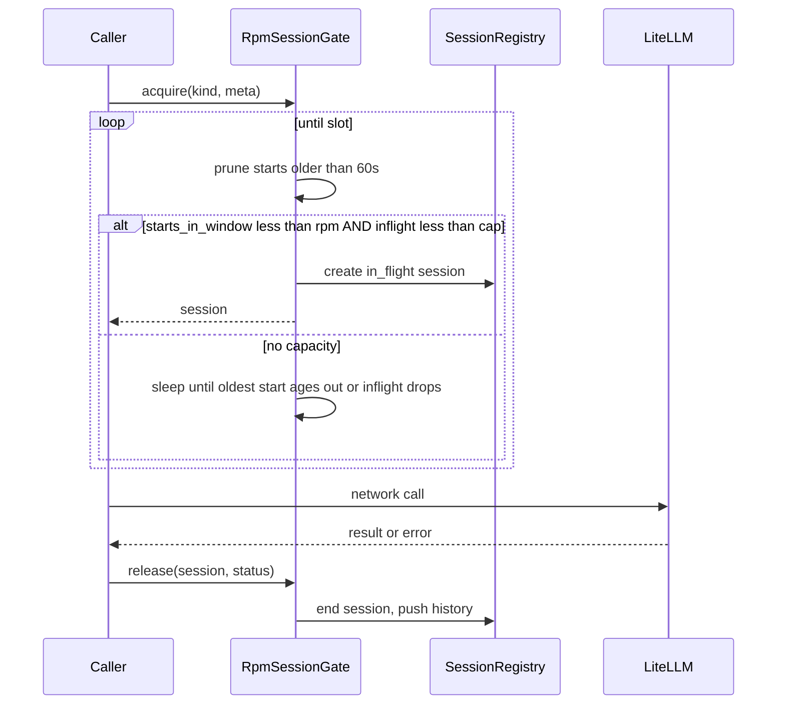

# 39 - RPM Session Parallel Sync Low Level Design

## Implementation status

**Implemented.** `RpmSessionGate` in `llm_gateway/rate_limit.py` replaces
start-only acquire; gateway acquire/release wraps network calls; ingest uses
bounded workers + `LockedStore`.

## Purpose

Specify session lifecycle, capacity checks, parallel ingest scheduling, store
serialization, failure/retry accounting, configuration, and observation APIs.

## Session data model

```text
RpmSession:
  session_id: str          # uuid4 hex or ulid
  kind: "complete" | "embed"
  model: str               # may be empty until resolved
  started_at_wall: str     # ISO-8601 UTC for API
  started_at_mono: float   # time.monotonic() for window math
  ended_at_wall: str | None
  ended_at_mono: float | None
  status: in_flight | ok | error | cancelled
  waited_sec: float        # time blocked in gate before start
  error_detail: str | None # truncated, no secrets
  correlation_id: str | None
  file_path: str | None
  symbol_id: str | None
```

**Ring history:** after terminal status, move session from in-flight map to a
deque of max length **`HISTORY_SIZE = 100`** (oldest dropped).

## Capacity algorithm (RpmSessionGate)

Replace fire-and-forget start timestamps with gated sessions.



### Agent-readable gate flow

| Step | Check / action | Result |
| --- | --- | --- |
| 1 | Lock registry | Exclusive update |
| 2 | Drop start timestamps older than 60s | Fresh window |
| 3 | If `len(starts) < rpm` and `inflight < inflight_cap` | Grant |
| 4 | Else compute sleep until next free slot | Block (no busy-spin) |
| 5 | Append start timestamp; create `in_flight` session | Return session |
| 6 | Caller runs network I/O **outside** the lock | Avoid holding lock during HTTP |
| 7 | `release` in `finally` | Terminal status; history append |

**Normative defaults:**

| Knob | Default | Meaning |
| --- | --- | --- |
| `AGENTCORE_LITELLM_RPM` | `30` | Max starts per rolling 60s |
| In-flight cap | **equal to RPM** in v1 | Prevents long calls from oversubscribing |
| Optional later | `AGENTCORE_LITELLM_MAX_INFLIGHT` | Only if ops need split caps |

**Pseudo-code:**

```text
acquire(kind, meta) -> session:
    waited = 0
    while True:
        with lock:
            now = monotonic()
            prune starts where start > now - 60
            if len(starts) < rpm and len(inflight) < inflight_cap:
                starts.append(now)
                session = new RpmSession(in_flight, kind, meta, waited)
                inflight[session.id] = session
                return session
            sleep_for = min_time_until_capacity(now)
        sleep(sleep_for)
        waited += sleep_for

release(session, status, error_detail=None):
    with lock:
        session.status = status
        session.ended_* = now
        del inflight[session.id]
        history.appendleft(session)  # maxlen 100
```

Gateway `complete` / `embed` **must**:

```text
session = gate.acquire(...)
try:
    response = litellm.*(…)
    gate.release(session, ok)
    return map(response)
except Timeout:
    gate.release(session, cancelled_or_error)
    raise
except Exception:
    gate.release(session, error, detail=…)
    raise
```

Heuristic / stub / local BGE paths **must not** call `acquire`. The shared local
BGE models load under one process-wide lock, then permit four concurrent inference
calls through one process-wide semaphore across cached models;
it must not serialize every file behind a single inference lock.

## Retry policy vs RPM

`AGENTCORE_LITELLM_NUM_RETRIES` is LiteLLM SDK retry inside one gateway call.

**v1 normative choice:** one gateway `complete`/`embed` invocation = **one**
RPM session (start before the SDK call that may internally retry; end when that
invocation returns). Document in operator notes that SDK retries still hit the
provider but do not open nested registry sessions. If later ops need
attempt-level accounting, introduce nested attempt records without changing the
outer session id.

## Parallel ingest scheduling

### File workers

```text
discovered = discover_source_files(...)
selected = prefer_unindexed_then_known(discovered, max_files)

with ThreadPoolExecutor(max_workers=max_file_workers) as pool:
    futures = [pool.submit(process_file_cpu, item) for item in selected]
    for fut in as_completed(futures):
        result = fut.result()  # parse, hash, local embeds, enqueue LLM work
        writer.submit(result.store_ops)  # or after LLM completes
```

`process_file_cpu` **may** run parse, hash, unchanged-symbol short-circuit, and
local BGE embeds. For each changed symbol needing LiteLLM docs:

```text
llm_queue.put(DocWork(file, symbol, neighbors, correlation))
```

### LLM workers / fairness

LLM execution **may** use the same file workers (each blocks in `docs.generate`)
**or** a dedicated pool sized to `min(max_file_workers, inflight_cap)`.

**Fairness (normative):** schedule DocWork with **per-file round-robin** (or
equivalent work-stealing) so one file with hundreds of symbols cannot monopolize
all in-flight slots while other files idle.

### Serialized store writer

Postgres store uses a **single** `psycopg` connection today — concurrent
`put_symbol` is unsafe.

```text
writer_thread:
    while running:
        batch = queue.get()
        with store_lock:   # or only this thread touches store
            apply upserts / edges / idempotency completes
        progress.emit(...)
```

Neo4j per-call sessions are safer, but v1 **still** serializes application-level
writes through the same writer to keep idempotency and edge ordering simple.
Connection pooling is an explicit **follow-up**, not required for v1.

### Cross-file edges

Keep today’s soft resolution: if the callee/base symbol is missing, create or
skip per existing ingest rules (external import stubs / low-confidence). Do
**not** deadlock waiting for another file’s writer. Re-sync or later files
repair edges when endpoints appear (same as serial ingest semantics).

### Idempotency

`ingest_file` keys remain **`{job_key}:{relative_path}:{index}`** (or equivalent
unique per file). Concurrent files **must not** share an idempotency key.
Idempotency begin/complete runs **inside** the serialized writer section.

## Progress tracking

`SyncProgressTracker.__call__` **must** use a lock (or queue) so concurrent
workers do not corrupt counters. Emit at least: `done`, `total`, `file`,
`status`, aggregate symbol/edge/token estimates (existing fields).

## Observability API

### HTTP

```text
GET /api/v1/llm/sessions
```

The detail endpoint accepts loopback clients only because the registry is
process-global and may contain identifiers from multiple logical scopes.

Response shape (illustrative):

```json
{
  "rpm": 30,
  "inflight_cap": 30,
  "starts_in_window": 12,
  "inflight_count": 4,
  "inflight": [ { "session_id": "...", "kind": "complete", "model": "...", "status": "in_flight", "file_path": "a.py", "symbol_id": "sym:..." } ],
  "history": [ { "session_id": "...", "status": "ok", "started_at": "...", "ended_at": "..." } ]
}
```

No API keys, raw prompts, or completion bodies.

### CLI

- The in-process graph CLI loads the code-graph service `config/.env` after repo
  dotenv files, so LiteLLM routing uses the same model configuration as the service.
  The file must be owned by the current user with mode `0600`.
- Before ingest, non-private or uncertain routes fail closed unless the operator
  consents for that run: interactive TTY yes (after showing tenant, workspace,
  project, and software path(s)), or `--allow-cloud-llm` to skip the prompt.
- During an active `agentcore sync`, `agentcore llm sessions` reads the full
  allowlisted session snapshot published to the transient sync-progress file
  (written with mode `0600` and removed when sync ends). Otherwise it reads the running service at
  `AGENTCORE_CODE_GRAPH_URL` (default
  `http://127.0.0.1:$AGENTCORE_CODE_GRAPH_PORT`). It fails explicitly when no
  live snapshot source is available instead of constructing a fresh registry.
- During sync, optional periodic line: `llm inflight=N window=M/rpm`.

## Configuration knobs

| Variable | Default | Role |
| --- | --- | --- |
| `AGENTCORE_LITELLM_RPM` | `30` | Starts per rolling minute |
| `AGENTCORE_LITELLM_TIMEOUT_SECONDS` | `180` | Session max duration; release on timeout |
| `AGENTCORE_LITELLM_NUM_RETRIES` | `3` | SDK retries inside one session |
| `AGENTCORE_SYNC_MAX_FILE_WORKERS` | auto (`min(cpu, rpm)`) | Parse/hash workers; optional int override |
| `HISTORY_SIZE` | `100` | Code constant for ring buffer |

Validate: RPM ≥ 1; file workers ≥ 1; file workers **should** be ≤ inflight_cap
to avoid huge CPU queues behind a tiny LLM gate (warn, do not hard-fail).

## Failure modes

| Failure | Session | Sync |
| --- | --- | --- |
| Provider 429 / 5xx after SDK retries | `error` | Soft-fail symbol/file; heuristic if route allows |
| Timeout | `cancelled` or `error` (pick one in impl; tests lock it) | Soft-fail |
| Parse / UTF-8 | No session | Skip/fail file as today |
| Store write error | N/A (post-LLM) | Fail file outcome; continue others |
| Process kill mid-flight | Registry lost | Next process starts empty (document) |

## Implementation map (future code — do not treat as done)

| Area | Files |
| --- | --- |
| Gate + registry | `backend/packages/llm_gateway/rate_limit.py` |
| Wire acquire/release | `backend/packages/llm_gateway/gateway.py` |
| Parallel ingest + writer | `.../application/ingest/repo_ingest.py`, `sync.py`, possibly new helper module |
| Progress lock | `backend/packages/agentcore_cli/sync_progress.py` |
| HTTP | `code_graph_service/api.py` |
| CLI | `agentcore_cli/parser.py` + new command module |
| Tests | `tests/backend/packages/llm_gateway/`, code-graph ingest unit tests |

## Test plan (normative for implementation phase)

1. Unit: acquire × N then block; release frees in-flight; history maxlen.
2. Unit: exception path always releases (no leak).
3. Concurrency: many threads; `starts_in_window ≤ rpm` and `inflight ≤ cap` always.
4. No full-minute sleeps in CI — use fake clock or rpm=1 with injected time.
5. Ingest: parallel files + serialized writer; no connection errors on Postgres path.
6. Observability: snapshot JSON schema stable; no secret fields.

## Related Documents

- Feature: [`37`](37-rpm-session-parallel-sync-feature-specification.md)
- HLD: [`38`](38-rpm-session-parallel-sync-high-level-design.md)
- Risks: [`40`](40-rpm-session-parallel-sync-risks-challenges-and-acceptance.md)
- Env: [`12`](../13-technology-stack-and-platform-decisions/12-litellm-environment-configuration.md)
