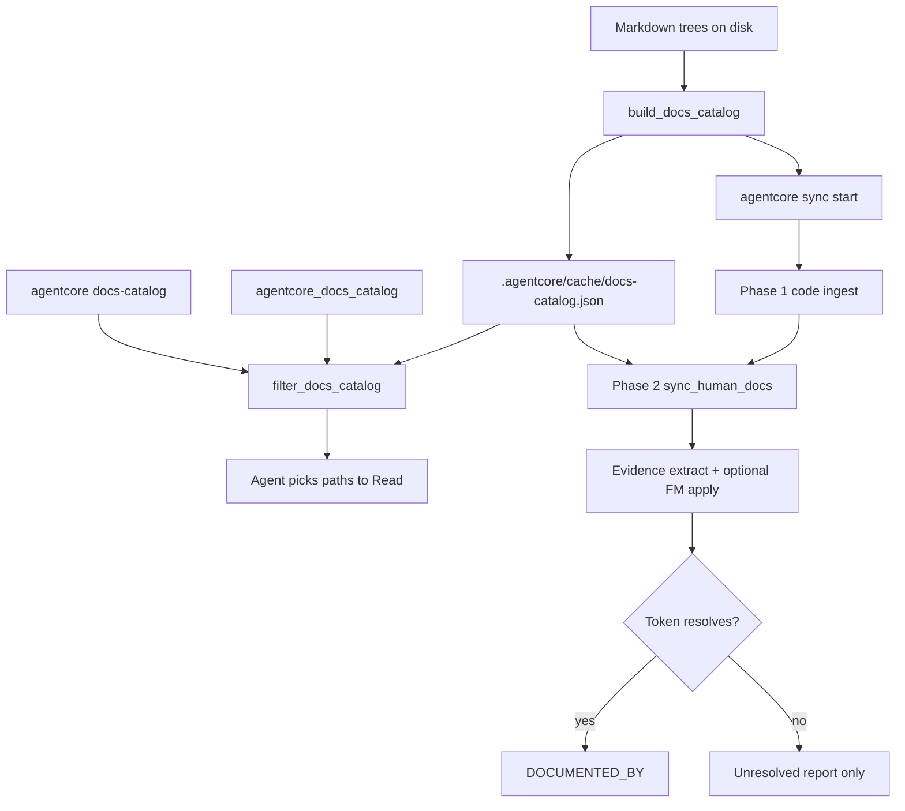

# Documentation Catalog and Lane Cache

## Purpose

Give coding agents a **small, cacheable index** of product Markdown (tags, closed-set lanes,
title, path) so they can decide which documents to Read before writing code—without dumping
full doc bodies into context and without inventing graph edges.

## Goals and Non-Goals

### Goals

- Expose **observed** vocabularies (tags/lanes/doc_type/…) from each software’s scanned Markdown.
- Index frontmatter across configurable roots (env/CLI/MCP; defaults for this checkout).
- Persist a rebuildable cache under `.agentcore/cache/docs-catalog.json`.
- Filter by tag, concern, lifecycle, audience, phase, doc_type, query, linked_symbols presence.
- Wire CLI + MCP for the same payload shape.

### Non-Goals

- Auto-writing `DOCUMENTED_BY` from **tags or catalog metadata** alone (no tag→symbol edges).
- Replacing Full-tier authoring law or `docs-standards` gates.
- Full-text embedding search over Markdown bodies (optional future).

**Allowed (Phase 2):** catalog may **order** the docs queue; evidence path citations may
merge into `linked_symbols` and create edges **only after resolve** (same rules as
`docs-suggest-links`).

## Data Model

| Field | Source |
| --- | --- |
| `vocabularies` | **Observed** values from scanned frontmatter (tags, lanes, doc_type, phase, status, …) |
| `lane_enums` | Alias of observed lane-like keys only (same software — **not** a global hardcoded enum) |
| `tags` | Aggregated unique tags with counts from this scan |
| `documents[]` | One row per Markdown file that has YAML frontmatter |
| `vocabulary_source` | Always `observed_frontmatter` |
| `stats` | Counts for documents, tags, linked_symbols presence |
| `invents_edges` | Always `false` |

**Important:** each product/software tree may use its own tags and lane strings. The catalog
never injects AgentCore procedure-09 closed sets into the vocabulary. Those closed sets remain
an authoring gate for AgentCore product docs (`docs-standards`), separate from retrieval indexing.

Document row (compact): `path`, `doc_id`, `title`, `summary` (truncated), `tags`, `doc_type`,
`phase`, `status`, lanes, `linked_symbols_count`, `has_linked_symbols`.

## Scan roots (per software)

| Priority | Source |
| --- | --- |
| 1 | MCP/CLI `roots` argument |
| 2 | Env `AGENTCORE_DOCS_CATALOG_ROOTS` (comma-separated) |
| 3 | Built-in defaults for this AgentCore checkout (`docs`, `backend/docs`, …) |

Other products should set `AGENTCORE_DOCS_CATALOG_ROOTS` (or pass `roots`) to their handbook trees.

## Cache

| Item | Default |
| --- | --- |
| Path | `.agentcore/cache/docs-catalog.json` (gitignored via `.agentcore/`) |
| Override | `AGENTCORE_DOCS_CATALOG_CACHE` absolute path |
| Roots override | `AGENTCORE_DOCS_CATALOG_ROOTS` or CLI/MCP `roots` |
| Rebuild | At the **start** of `agentcore sync` (automatic), or `agentcore docs-catalog --refresh` / MCP `refresh: true` |
| Schema | `schema_version: "1.1"` — mismatch forces rebuild |



| Step | Actor | Action | Outcome |
| --- | --- | --- | --- |
| 1 | Operator / agent | Start `agentcore sync` (catalog builds first) | Catalog + observed vocabularies ready |
| 2 | Sync Phase 2 | Order discovered docs using catalog + evidence signals | Evidence / `lifecycle_lane: current` first |
| 3 | Sync Phase 2 | Extract evidence tokens; merge into `linked_symbols` (default apply to FM) | Tokens durable; still no edge without resolve |
| 4 | Sync Phase 2 | Resolve tokens against Phase 1 graph | `DOCUMENTED_BY` only when resolved |
| 5 | Agent | Optional `docs-catalog` filter → Read Markdown | Short list of paths outside sync |

## Operator / Agent Surfaces

### CLI

```text
agentcore docs-catalog
agentcore docs-catalog --refresh
agentcore docs-catalog --roots handbook,docs --refresh
agentcore docs-catalog --tag ckg --concern standard --limit 20
agentcore docs-catalog --query hybrid --json
agentcore docs-catalog --linked-only
```

### MCP

Tool: `agentcore_docs_catalog` (`maps_to: docs_sync.catalog`).

Arguments: `refresh`, `roots`, `tag`, `concern_lane`, `lifecycle_lane`, `audience_lane`, `phase`,
`doc_type`, `query`, `has_linked_symbols`, `limit`.

## Relationship to Hybrid Coverage

| Mechanism | Role |
| --- | --- |
| Docs catalog | **Find** Markdown by metadata; **order** Phase 2 queue when cache is present |
| `docs-suggest-links` | Dry-run / review evidence `linked_symbols` (optional before sync) |
| `agentcore sync` Phase 2 | Merge evidence (default), project human docs, write `DOCUMENTED_BY` for resolved tokens |
| `generation_context.hybrid_documentation` | Prefer human docs when edges exist |

### Sync env toggles (Phase 2 evidence)

| Env | Default | Effect |
| --- | --- | --- |
| `AGENTCORE_SYNC_DOCS_EVIDENCE` | on | Extract evidence tokens during Phase 2 and merge into link tokens |
| `AGENTCORE_SYNC_DOCS_EVIDENCE_APPLY` | on | Persist new evidence tokens into YAML `linked_symbols` (same as `docs-suggest-links --apply`) |

Unset or `0` / `false` / `no` / `off` disables. Tags and catalog lanes never create edges by themselves.

## Verification

| Check | How |
| --- | --- |
| Build + filter | `tests/backend/tools/agentcore-cli/test_docs_catalog.py` |
| Phase 2 evidence + order | `tests/backend/tools/agentcore-cli/test_docs_link_sync.py` |
| MCP profile | `agentcore_docs_catalog` present in `programming-cursor-mcp` |
| Manual | `agentcore docs-catalog --refresh --json \| head` |

## Related Documents

- [`41-hybrid-documentation-coverage.md`](./41-hybrid-documentation-coverage.md)
- [`../00-master-plan/09-documentation-classification-and-lanes.md`](../00-master-plan/09-documentation-classification-and-lanes.md)
- [`../agents/TEAM-HANDOUT-agentcore-documentation-complete.md`](../agents/TEAM-HANDOUT-agentcore-documentation-complete.md)
