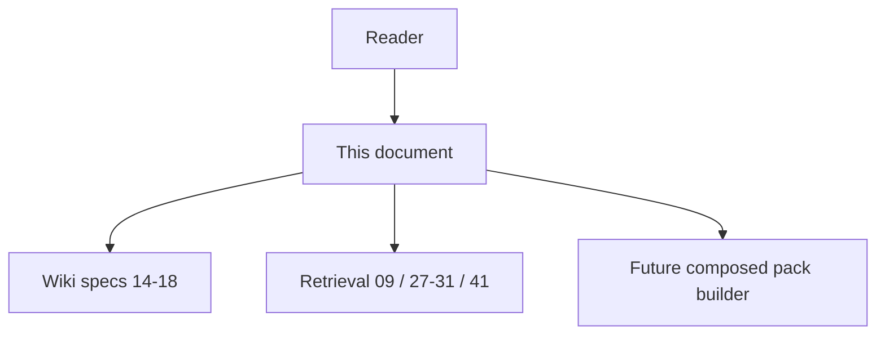
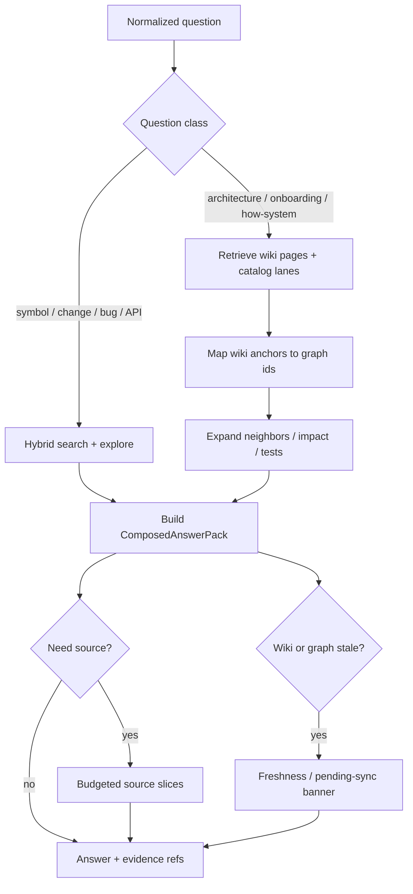

# 43 - Wiki And Graph Composed Retrieval

## Implementation status

**Designed / not shipped.** Repository Code Wiki (`14`–`18`, `20`) is still
`lifecycle_lane: future`. Wedge graph tools (explore, hybrid search, change-risk,
architecture overview) are the v1 delivery surface. This document defines how
**Wiki + graph + hybrid docs** compose once Wiki publish exists. Do not claim
product readiness or market “ask the wiki” as v1.

## Purpose

Specify how AgentCore combines:

1. **Repository Code Wiki** — coarse, architecture-aware narrative (overview,
   module pages, diagrams).
2. **Code-Knowledge Graph** — fine structural truth (symbols, calls, routes,
   impact, freshness).
3. **Hybrid documentation coverage** (`41`) — human / living / rationale / AST
   layers on symbols.
4. **Production retrieval** (`27`–`31`) — BM25 / FTS / embeddings / RRF.

so that a human or coding agent asking a question gets a **higher-understanding
answer**: concept first, evidence second, source slices only when needed.

This is the normative home for prior-art idea **I-19** (“ask the wiki” over
generated docs **plus** graph) in
[`20-repository-code-wiki-prior-art-ideas-and-license.md`](20-repository-code-wiki-prior-art-ideas-and-license.md).

## Document flow

| Step | Actor | Action | Outcome |
| --- | --- | --- | --- |
| 1 | Reader | Opens this feature spec | Understands composition intent and non-goals |
| 2 | Reader | Follows primary answer flow Mermaid + table | Sees wiki → graph → source escalation |
| 3 | Reader | Uses Related Documents | Reaches Wiki HLD/LLD or wedge retrieval docs |

## Goals and Non-Goals

### Goals

- Raise answer quality for **architecture / onboarding / “how does X work?”**
  questions without dumping the whole repository.
- Keep **surgical coding** on graph tools (explore, neighbors, impact) as the
  primary path; Wiki **seeds** understanding, it does not replace call graphs.
- Ground every Wiki claim that names a component in **graph ids or published
  `linked_symbols`**; forbid inventing symbols.
- Respect token budgets: Wiki excerpts first, then ranked graph neighbors, then
  targeted source.
- Reuse existing MCP surfaces where possible; add composed tools only when a
  single call is clearly better than agent-orchestrated multi-tool use.

### Non-Goals

- Shipping Wiki generation or composed Q&A in the v1 wedge claim.
- Replacing symbol-level living docs or hybrid coverage (`41`) with wiki-only.
- Vendoring Google Code Wiki or upstream CodeWiki CLIs.
- Continuous save-watch indexing; freshness remains explicit ingest / pending-sync
  (same law as the wedge).

## Layer Roles

| Layer | Grain | Answers best | Weak alone |
| --- | --- | --- | --- |
| Wiki pages | Repo / module | Structure, flows, where to start, cross-module story | Precise callers, blast radius, exact signatures |
| Graph + explore / hybrid search | Symbol / edge | Who calls whom, impact, routes, tests, surgical context | End-to-end narrative for newcomers |
| Hybrid doc coverage (`41`) | Symbol docs | Human/living/rationale snippets for a seed symbol | Repo-wide architecture prose |
| Architecture overview (wedge) | Communities / hubs | Structural map without generated prose | Polished onboarding narrative |
| Raw source | Spans | Final verification before edit | Token cost and noise |

**Normative preference for composed Q&A:** Wiki (if fresh) → hybrid search /
explore seeds → hybrid documentation snippets → source escalation per
[`09-context-pack-retrieval-and-agent-workflow.md`](09-context-pack-retrieval-and-agent-workflow.md).

## Primary Answer Flow

| Step | Actor | Action | Outcome |
| --- | --- | --- | --- |
| 1 | Composed retriever | Normalize question; classify intent | Architecture vs surgical routing |
| 2 | Wiki index / docs catalog | Fetch overview or module pages when architecture-class | Coarse narrative + `wiki_page_id`s |
| 3 | Graph / hybrid search | Resolve wiki anchors and/or query seeds to `CodeSymbol` ids | Grounded symbol set |
| 4 | Explore / neighbors / impact | Expand call path, tests, routes under budget | Surgical evidence |
| 5 | Hybrid doc coverage | Attach preferred snippets (human → living → rationale → AST) | Doc text without inventing edges |
| 6 | Pack builder | Fit token budget; attach freshness banners | `ComposedAnswerPack` |
| 7 | Agent / MCP consumer | Answer with evidence refs; escalate to source only if policy requires | Higher-understanding reply |

## Question Classes (routing)

| Class | Examples | First layer | Must include |
| --- | --- | --- | --- |
| Architecture | “How is auth structured?” | Wiki overview / module pages | Graph anchors for named modules |
| Onboarding | “Where should I start reading?” | Wiki overview + suggested entry symbols | Paths + hubs from graph |
| Cross-module | “How do billing and identity talk?” | Wiki interaction notes | `CALLS` / `ROUTES_TO` / path tool |
| Surgical edit | “Fix `validate_token` callers” | Graph explore / impact | Wiki optional one-liner only |
| Change risk | “What breaks if I touch this file?” | `detect_changes` / impact | Wiki only if module narrative clarifies |
| Doc drift | “Is this ADR still true?” | Docs catalog + `linked_symbols` | Graph symbol existence checks |

Mis-routing (Wiki-first on a pure rename/refactor) **must** be avoided: it
wastes tokens and can stale-steer the agent.

## ComposedAnswerPack (logical shape)

Logical fields (wire DTOs land with Wiki contracts when implemented):

| Field | Meaning |
| --- | --- |
| `question_class` | Routing label used |
| `wiki_excerpts[]` | Page id, module_key, truncated markdown, freshness |
| `graph_seeds[]` | Symbol ids / qualified names from grounding |
| `explore_or_neighbors` | Budgeted structural pack (may reuse explore payload) |
| `hybrid_documentation` | Per-seed coverage from `41` when available |
| `evidence_refs[]` | Stable ids for audit (wiki_page_id, symbol_id, doc_id) |
| `freshness` | Graph pending-sync + wiki baseline commit / stale flags |
| `source_escalations[]` | Optional path+span recommendations |
| `token_estimate` | Pack cost before LLM answer generation |

Published wiki Markdown **must** carry frontmatter linking down to graph ids
where known (see Wiki HLD boundary with living docs). Composition **must not**
duplicate full signature tables that the graph already stores.

## Ownership and Integration

| Concern | Owner |
| --- | --- |
| Wiki generate / publish | `code-graph-service` wiki subdomain (per Wiki HLD) |
| Hybrid search / explore / impact | Existing code-graph + MCP gateway tools |
| Docs catalog lane filter | `42` catalog cache |
| Symbol hybrid doc merge | `41` / `generation_context` |
| Composed pack assembly | Future application use-case in code-graph (preferred) or MCP backend facade |
| Answer LLM call | LiteLLM only; no bypass gateway |

MCP strategy:

- **Phase A (agent-orchestrated):** document a skill/guidance that calls existing
  tools in order (wiki resolve → hybrid search → explore). No new tool required.
- **Phase B (single tool):** optional `agentcore_code_graph_ask` (name TBD) that
  returns `ComposedAnswerPack` when multi-tool orchestration proves too lossy.

## Freshness and Trust

- If wiki baseline commit lags graph ingest, the pack **must** surface a stale
  banner; agents **should** prefer graph for conflict resolution.
- If graph pending-sync is non-empty, same wedge banners apply.
- Wiki prose that cannot be grounded to a symbol or path **must** be marked
  low-confidence or dropped from the pack.
- Security: same project ACL as docs and graph; no ambient host reads.

## Relationship To The Wedge

| Wedge (v1) | This composition (future) |
| --- | --- |
| explore / hybrid / change-risk / architecture overview | Still required; Wiki does not replace them |
| Explicit sync freshness | Unchanged |
| Not Repository Code Wiki | Wiki remains deferred until implementation gates pass |

Completing this design **after** a strong wedge improves architecture Q&A and
onboarding. Completing it **instead of** wedge quality does not beat lightweight
graph MCP competitors.

## Acceptance Gates (when implementing)

1. Architecture-class golden questions improve grounded answer rubric vs
   graph-only and vs wiki-only on a fixed fixture repo.
2. Surgical-class tasks do not regress token use or correct-edit rate vs
   explore-first baseline.
3. Every wiki excerpt in the pack either grounds to graph ids or is explicitly
   ungrounded + low-confidence.
4. Stale wiki or pending-sync always produces visible freshness fields.
5. No claim of continuous indexing; no Google/upstream CodeWiki runtime.

## Related Documents

- [`14-repository-code-wiki-feature-specification.md`](14-repository-code-wiki-feature-specification.md) — Wiki product requirements.
- [`15-repository-code-wiki-high-level-design.md`](15-repository-code-wiki-high-level-design.md) — Wiki ownership and boundaries.
- [`20-repository-code-wiki-prior-art-ideas-and-license.md`](20-repository-code-wiki-prior-art-ideas-and-license.md) — I-19 and license rules.
- [`09-context-pack-retrieval-and-agent-workflow.md`](09-context-pack-retrieval-and-agent-workflow.md) — context packs and source escalation.
- [`41-hybrid-documentation-coverage.md`](41-hybrid-documentation-coverage.md) — symbol doc layers.
- [`42-documentation-catalog-and-lane-cache.md`](42-documentation-catalog-and-lane-cache.md) — catalog narrowing.
- [`27-production-retrieval-stack-feature-specification.md`](27-production-retrieval-stack-feature-specification.md) — hybrid retrieval stack.
- [`../00-master-plan/01-product-scope-and-feature-catalog.md`](../00-master-plan/01-product-scope-and-feature-catalog.md) — v1 wedge excludes Wiki.
