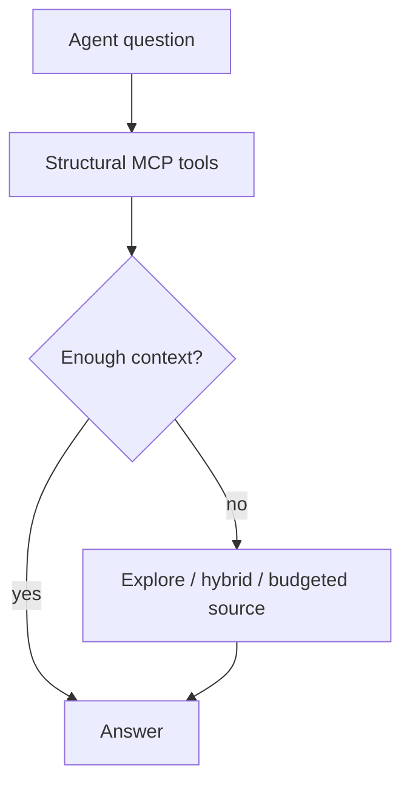

# 44 - Codebase-Memory Neo4j Hybrid Feature Specification

## Purpose

Specify AgentCore’s **best-quality** path for Codebase-Memory-style structural
agent UX: keep **Neo4j** as the durable graph store, add missing low-token
structural tools, and **escalate** to explore / hybrid RAG / budgeted source when
structure alone is insufficient.

Prior art: Vogel et al., *Codebase-Memory* ([arXiv:2603.27277](https://arxiv.org/abs/2603.27277)).
Ideas only; clean-room on Neo4j — see [`21`](21-code-intelligence-prior-art-ideas-and-license.md).

## Goals and Non-Goals

### Goals

1. Ranked **inbound callers** for a symbol (fan-in).
2. **Directed impact** (upstream / downstream / both) with depth, optional
   confidence filter, ranked blast list, and file rollup.
3. **Community of symbol** (Leiden/Louvain membership + neighbors).
4. Agent **structural-first escalate** policy so cheap tools run before wide reads.
5. **`HTTP_CALLS`** edges (client → route/handler) with confidence where extractable.
6. Incremental parser / call-resolution depth where completeness limits answers.
7. Freshness via existing sync / pending-sync (watcher only if metrics demand it).

### Non-Goals

- Replacing Neo4j with SQLite (rejected by ADR [`19`](19-competitive-code-intelligence-roadmap-adr.md)).
- Vendoring DeusData’s C binary or copying its source.
- Blind port of 66 Tree-Sitter grammars; expand via [`10`](10-language-support-policy.md).
- Claiming 83%/10× paper numbers as AgentCore product metrics without our eval.

## Quality Bar

| Question class | Preferred path | Escalate when |
| --- | --- | --- |
| Callers / impact / hubs / community | Structural MCP | Empty or sparse graph / unresolved seed |
| How does X work (semantic) | `explore` / hybrid | After structural seed fails to explain |
| Exact body / comment nuance | Budgeted source | After signatures + docs insufficient |

Target: **better than structural-only or file-only alone** on AgentCore workloads,
not paper parity marketing.

## Structural-first hybrid flow

| Step | Actor | Action | Outcome |
| --- | --- | --- | --- |
| 1 | Agent | Prefer callers / impact / community / call_path | Low-token structural pack |
| 2 | Agent | Check sparse/empty/escalate_hint | Decide whether to escalate |
| 3 | Agent | Run explore / hybrid / budgeted source when needed | Best-quality answer without wide crawl first |

## Tool Matrix vs Codebase-Memory

| Paper-style capability | AgentCore surface | Status |
| --- | --- | --- |
| Call-path / explore | `agentcore_code_graph_explore`, `…_path` | Shipped; keep compact |
| Impact analysis | `agentcore_code_graph_impact` (directed) | This pack Wave A |
| Caller ranking | `agentcore_code_graph_callers` | This pack Wave A |
| Hub / community | `architecture_overview` + `…_community` | Wave A thin community tool |
| HTTP client edges | `HTTP_CALLS` on `CODE_REL` | Wave C |
| Incremental index | `sync` / `freshness` | Wave E; watcher deferred |
| 66-language parse | Language matrix + tree-sitter | Wave D incremental |

## Acceptance Criteria

1. Unit tests cover caller ranking, directed impact, community-of-symbol, HTTP_CALLS extraction.
2. MCP profile registers `callers`, enriched `impact`, and `community` tools.
3. Guidance documents structural-first escalate order.
4. Neo4j SoR unchanged; no SQLite graph store path.
5. Docs pack `44`–`47` linked from [`00-index`](00-index.md); LLD progress table honest.

## Related Documents

- HLD [`45`](45-codebase-memory-neo4j-hybrid-high-level-design.md)
- LLD [`46`](46-codebase-memory-neo4j-hybrid-low-level-design.md)
- Risks [`47`](47-codebase-memory-neo4j-hybrid-risks-and-acceptance.md)
- ADR [`19`](19-competitive-code-intelligence-roadmap-adr.md)
- Token strategy [`05`](05-token-optimization-and-model-routing.md)
