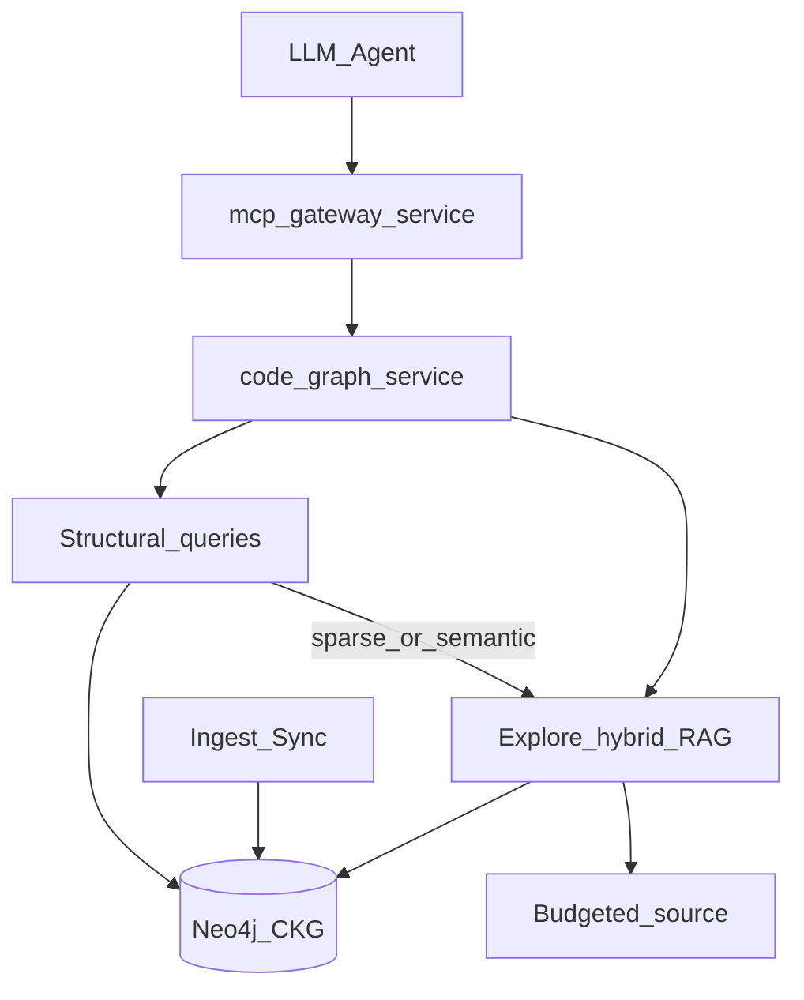

# 45 - Codebase-Memory Neo4j Hybrid High-Level Design

## Purpose

Defines how Codebase-Memory hybrid capabilities sit in AgentCore runtime topology.
Algorithms and contracts live in [`46`](46-codebase-memory-neo4j-hybrid-low-level-design.md);
product requirements in [`44`](44-codebase-memory-neo4j-hybrid-feature-specification.md).

## Document flow

| Step | Actor | Action | Outcome |
| --- | --- | --- | --- |
| 1 | Agent | Invokes structural MCP (`callers` / `impact` / `community`) | Low-token typed graph answer |
| 2 | Agent | If sparse or semantic need, escalates to `explore` / `hybrid_search` | Seeded call-path + compact bodies |
| 3 | Agent | Only then reads raw files under budget | Full nuance without default wide Grep |
| 4 | Operator / CI | Runs `sync` / ingest | Neo4j graph stays explicit-ingest fresh |

## Architectural Decision

**Decision:** Extend `code-graph-service` domain + application + Neo4j store;
expose via MCP gateway and existing HTTP where useful. Keep `CodeSymbol` +
`CODE_REL` projection; add `HTTP_CALLS` (and optionally `ASYNC_CALLS`) as
`rel_type` values.

**Rationale:** Structural and hybrid retrieval already share scope, stores, and
embeddings. A separate SQLite sidecar would split truth and violate ADR [`19`](19-competitive-code-intelligence-roadmap-adr.md).

**Alternatives rejected:**

| Alternative | Why rejected |
| --- | --- |
| Ship DeusData SQLite binary beside Neo4j | Dual SoR; SBOM; contradicts ADR 19 |
| Agent-only prompting without new tools | Non-deterministic; wastes tokens |
| 30+ MCP tools mirroring paper 1:1 | Prefer narrow tools + strong explore primary |

## Module Boundaries

| Area | Owns |
| --- | --- |
| `domain/impact.py` | Directed blast-radius pure functions |
| `domain/http_calls.py` | Client HTTP call extraction |
| `application/queries.py` | Callers / directed impact / community use cases |
| `application/intelligence.py` | Community map reuse; architecture overview |
| `neo4j/retrieval.py` | Optional Cypher fan-in ranking helpers |
| MCP `backends/code_graph/query.py` | Tool handlers + escalate hints in payloads |
| Usage profile + guidance | Tool registration and structural-first order |

## Dependencies

- Neo4j (+ APOC/GDS optional) — structural expand / degree
- Existing Leiden/Louvain in-process communities
- Production retrieval stack (`27`–`31`) for escalate path
- Explicit ingest / pending-sync (`03`, Wave 3 freshness)

## Related Documents

- Feature [`44`](44-codebase-memory-neo4j-hybrid-feature-specification.md)
- LLD [`46`](46-codebase-memory-neo4j-hybrid-low-level-design.md)
- Risks [`47`](47-codebase-memory-neo4j-hybrid-risks-and-acceptance.md)
- Code intel HLD [`23`](23-code-intelligence-enhancements-high-level-design.md)
