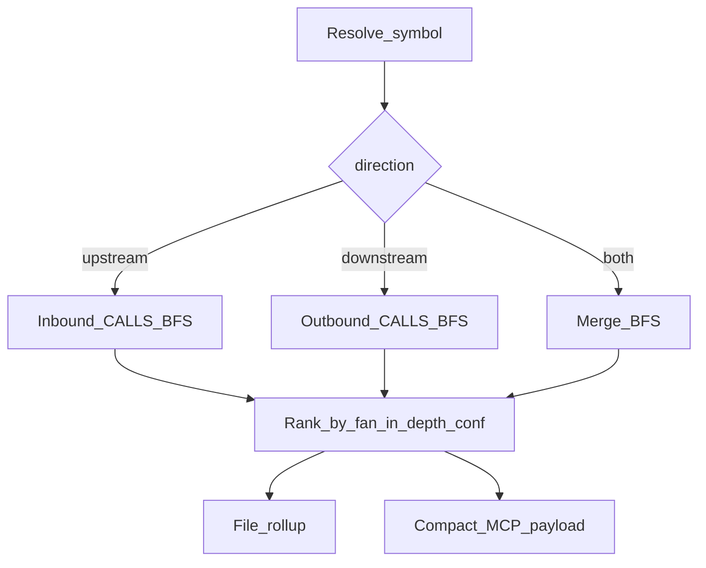

# 46 - Codebase-Memory Neo4j Hybrid Low-Level Design

## Purpose

Specify algorithms and contracts for Waves A–E. Track delivery in
**Implementation progress** below (doc-driven).

## Primary algorithm flow



| Step | Actor | Action | Outcome |
| --- | --- | --- | --- |
| 1 | Service | Resolve `symbol_id` / `qualified_name` in scope | Seed symbol or NotFound |
| 2 | Domain | BFS over allowed `rel_type`s with direction | Edge + node frontier |
| 3 | Domain | Rank by inbound degree, hop distance, confidence | Ordered blast / callers |
| 4 | Application | Attach file rollup + escalate hint | MCP/HTTP JSON |

## Wave A — Callers

**Input:** seed symbol, `top_k` (default 20), optional `min_confidence`.

**Algorithm:** Collect one-hop (or depth-bounded) inbound `CALLS` (and optionally
`HTTP_CALLS`) where `target_id == seed`. Rank by inbound fan-in of caller, then
edge confidence, then qualified_name. Return compact rows:
`{symbol_id, qualified_name, kind, file_path, call_count, confidence, hop}`.

**MCP:** `agentcore_code_graph_callers` → `code_graph.callers`.

## Wave A — Directed impact

**Input:** `direction` ∈ {`upstream`,`downstream`,`both`}, `max_depth` 1–8,
optional `rel_types`, optional `min_confidence`.

**Algorithm:** Directed BFS. Upstream follows inbound edges; downstream outbound.
Deduplicate nodes keeping minimum hop. Rank: hop asc, then fan-in desc, then
confidence. File rollup: group by `file_path` with symbol counts.

**MCP:** enrich `agentcore_code_graph_impact` with the same parameters; retain
backward-compatible undirected expand when `direction` omitted → treat as `both`
with existing expand path plus ranked blast fields.

## Wave A — Community of symbol

**Input:** seed symbol, `member_limit` (default 30).

**Algorithm:** Reuse `detect_communities` / community map from intelligence.
Return `{community_id, label, size, members[], seed}`.

**MCP:** `agentcore_code_graph_community` → `code_graph.community`.

## Wave B — Escalate policy

Payloads **must** include:

```json
{
  "escalate_hint": {
    "next_tools": ["agentcore_code_graph_explore", "agentcore_code_graph_hybrid_search"],
    "prefer_before_raw_read": true,
    "reason": "structural_sparse|semantic_question|ok"
  }
}
```

Guidance / seed text orders: `callers`/`impact`/`community` → `explore`/`hybrid` →
raw Read/Grep last.

## Wave C — HTTP_CALLS

**RelType:** `HTTP_CALLS` on `CODE_REL` with `confidence` and metadata
`{method, url_or_path, framework, line_hint}`.

**Extraction:** Deterministic regex/AST patterns for Python `httpx`/`requests` and
JS `fetch`/axios; resolve path/URL to `ROUTE` / handler when possible, else
`EXTERNAL`/`UNRESOLVED` target.

## Wave D — Parsers

Extend language matrix only with tests; improve Python/TS call resolution
confidence without regressing `stdlib_ast` Python baseline.

## Wave E — Freshness

Strengthen `freshness` / `sync` messaging in structural tools (attach
`freshness` banner). Watcher remains deferred unless acceptance metrics demand
policy change in [`03`](03-ingestion-and-living-documentation-workflow.md).

## Implementation progress

Last updated: 2026-07-23 (agent)

| ID | Spec anchor | Status | Code / tests |
|----|-------------|--------|--------------|
| A1 | Callers ranking MCP/HTTP | [x] | `domain/impact.py`; `queries.callers`; MCP `code_graph.callers`; `test_codebase_memory_hybrid.py` |
| A2 | Directed impact enrichment | [x] | `impact_analysis`; MCP impact; HTTP `…/impact` |
| A3 | Community-of-symbol MCP | [x] | `community_of_symbol`; MCP `code_graph.community` |
| A4 | Outbound call-path pack | [x] | `call_path_pack`; MCP `code_graph.call_path`; HTTP `…/call-path` |
| B1 | Escalate hints + guidance | [x] | `escalate_hint` on payloads; `seed_mcp_first.py`; `mcp-first-agentcore.mdc`; doc `05` Strategy 4b |
| C1 | HTTP_CALLS enum + extract + ingest | [x] | `RelType.HTTP_CALLS`/`ASYNC_CALLS`; `domain/http_calls.py`; `_emit_http_calls`; JS+Python unit + live |
| C2 | Neo4j neighborhood Cypher | [x] | `neo4j/retrieval.neighborhood_edges`; wired in `_structural_edges_for_seed` |
| D1 | Call-resolution / language depth | [x] | `getattr` call refs; planned `java` in matrix; doc `10` |
| E1 | Freshness on structural payloads | [x] | `freshness` attached on callers/impact/community/neighbors/call_path |
| DOC | Docs 44–47 + index/ADR/prior-art/token + phase-7/API catalog/README | [x] | `44`–`47` (active); `00-index`; ADR `19`; prior-art `21`; `05`; `phase-7-api-contract`; API catalog; domain README |

**Explicitly deferred (product law, not incomplete optional code):** filesystem watcher (ADR `19`); full Java tree-sitter (planned language only).


## Related Documents

- Feature [`44`](44-codebase-memory-neo4j-hybrid-feature-specification.md)
- HLD [`45`](45-codebase-memory-neo4j-hybrid-high-level-design.md)
- Risks [`47`](47-codebase-memory-neo4j-hybrid-risks-and-acceptance.md)
