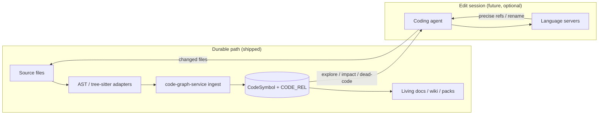

# 48 - AST and LSP Hybrid Parsing ADR

## Purpose

Records the normative split between **durable structural parsing** (AST / tree-sitter) that
powers the Code-Knowledge Graph and **optional live semantic tooling** (Language Server
Protocol) for agent edit sessions. Prevents dual sources of truth and clarifies when
IDE-grade rename / find-references are in scope.

## Status

Accepted (2026-07-23).

**Implementation honesty:**

| Layer | Product status |
|-------|----------------|
| AST / tree-sitter ingest → `CodeSymbol` + `CODE_REL` | **Shipped** (Phase 7; see language matrix) |
| Forbid LSP dual-write + `reconcile_after_edit` (ADR progress IDs 2–4) | **Shipped** (boundary + re-ingest converge) |
| Optional LSP edit-session enrichment (rename / find-refs) | **Shipped** — feature pack `49-lsp-edit-session-feature-specification.md` |

## Context

AgentCore connects repository knowledge (living docs, wiki, guidance, retrieval packs) to
code through graph edges such as `CALLS`, `IMPORTS`, `INHERITS_FROM`, `DOCUMENTED_BY`,
`ROUTES_TO`, and `TESTED_BY`. That link is a form of **structural reference**, not an IDE
rename pipeline.

Open-source prior art uses two different multi-language strategies:

| Approach | Example | Strength | Cost |
|----------|---------|----------|------|
| AST / tree-sitter | graphify, code-review-graph | One persistent cross-language map; local; incremental | Syntax-level; weaker than a type checker |
| LSP (+ optional JetBrains plugin) | Serena | Precise go-to-def, references, rename | Per-language daemons; setup variance; not a durable SoR |

AgentCore already chose AST adapters for polyglot ingest (`10-language-support-policy.md`).
The remaining question is whether knowledge↔code completeness requires embedding LSP into
the graph core, or a hybrid with clear ownership.

### Two meanings of “reference”

| Kind | Definition | Owner in AgentCore |
|------|------------|--------------------|
| Structural reference | Who calls / imports / inherits whom; docs attached to symbols | Durable graph from AST ingest |
| Semantic / IDE reference | Type-aware find-all-refs, atomic rename, diagnostics | Optional LSP session tools (future) |

Dead-code candidates (`36`) and generation validation already consume structural edges and
`live-until-proven` exclusions — they do **not** require LSP rename APIs.

## Decision

### 1. Durable SoR: AST ingest only

1. The **single source of truth** for knowledge↔code structural edges **must** remain
   `code-graph-service` ingest: Python via stdlib `ast`; other matrix languages via
   tree-sitter adapters into the shared `ParsedSymbol` / `CodeSymbol` schema.
2. Extending language coverage **must** follow `10-language-support-policy.md` (matrix +
   adapter + tests). LSP availability for a language does **not** imply matrix support.
3. Graph writers **must not** dual-write durable `CODE_REL` edges from LSP responses as a
   parallel SoR. LSP output may inform a session, not become a second Neo4j/Postgres truth.

### 2. Optional LSP: edit-session enrichment only

4. An LSP (or JetBrains-backed) capability **may** be added later as an **optional,
   session-scoped** enrichment for connected coding agents when they perform surgical
   edits (precise references, safer rename). That layer **must not** replace ingest.
5. After a successful LSP-assisted rename or structural edit, agents / sync **should**
   re-ingest affected files so the durable graph and living docs catch up (one-way
   reconciliation: edits → re-ingest → graph).
6. Product copy and MCP tools **must** distinguish “graph neighbors / structural
   references” from “IDE find-references / rename” until the LSP layer ships.

### 3. Hybrid topology (normative)

| Step | Actor | Action | Output |
|------|-------|--------|--------|
| 1 | Ingest / sync | Parse supported files with AST adapters | `ParsedSymbol` + edges |
| 2 | Store | Upsert `CodeSymbol` / `CODE_REL` | Durable graph SoR |
| 3 | Docs / retrieval | Attach living docs, packs, wiki | Knowledge↔code links |
| 4 | Agent (read) | Query graph neighbors / impact | Structural context |
| 5 | Agent (edit, future) | Optionally call LSP for rename / refs | Workspace file edits |
| 6 | Sync | Re-ingest changed paths | Graph converges to disk |

## Consequences

### Positive

- Keeps language expansion cheap and aligned with graphify / code-review-graph-style AST maps.
- Avoids per-language LSP daemon coupling in the wedge ingest path.
- Preserves a clear upgrade path for Serena-like IDE precision without rewriting SoR.
- Matches shipped confidence / dead-code honesty (structural incompleteness is already modeled).

### Negative / constraints

- Structural `CALLS` / `IMPORTS` remain weaker than type-aware LSP references (dynamic dispatch,
  string tables, plugins stay in `live-until-proven`).
- Optional LSP work needs its own feature spec, security boundary (local process only;
  no cloud exfiltration), and Usage Profile gates before shipping claims.
- Operators must not expect graph “rename” until the edit layer exists.

### Non-goals

- Replacing Neo4j / Postgres SoR with SQLite or an in-memory LSP index.
- Vendoring Serena, graphify, or code-review-graph CLIs as runtime dependencies
  (prior-art ideas only; see `19` / `21` / `THIRD_PARTY_NOTICES.md`).
- Using LSP as the primary multi-language coverage mechanism for the matrix in `10`.

## Implementation progress

Last updated: 2026-07-23 (agent)

| ID | Spec anchor | Status | Code / tests |
|----|-------------|--------|--------------|
| 1 | §Decision 1 — AST durable SoR (ingest matrix) | [x] | Already shipped; see `10` + parsers |
| 2 | §Decision 1.3 — forbid LSP dual-write on `CODE_REL` | [x] | `domain/parsing_authority.py`; `_put_edge` guard; `test_parsing_authority_adr48.py` |
| 3 | §Decision 2.5 — reconcile after edit → re-ingest | [x] | `reconcile_after_edit`; HTTP `…/graph/reconcile-after-edit` |
| 4 | §Decision 2.6 — distinguish structural vs IDE refs | [x] | `reference_kind=structural` on neighbors; `ide_semantic` on edit-session tools |
| 5 | §Decision 2.4 — optional LSP edit-session layer | [x] | Feature `49`; `domain/edit_session/`; HTTP + MCP; Fake+subprocess client |

Notes:

- Language servers are local subprocesses only (`AGENTCORE_LSP_CMD_*`); missing binaries return `available=false`.
- See `49-lsp-edit-session-feature-specification.md` for acceptance and tool names.

## Related Documents

- Language matrix and adapters: `10-language-support-policy.md`
- Ingest workflow: `03-ingestion-and-living-documentation-workflow.md`
- Projection: `13-codesymbol-projection-adr.md`
- Competitive roadmap (AST-style intelligence waves): `19-competitive-code-intelligence-roadmap-adr.md`
- Unused symbols on structural edges: `36-dead-code-candidates-and-cleanup-loop.md`
- Hybrid **documentation** layers (distinct from this parsing ADR): `41-hybrid-documentation-coverage.md`
