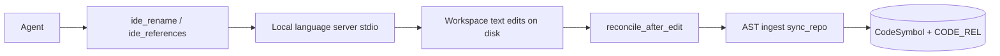

# 49 - LSP Edit-Session Feature Specification

## Purpose

Ship the ADR 48 **optional LSP edit-session** layer: precise IDE-semantic
find-references, go-to-definition, and rename for connected agents, without
making language servers a durable graph source of truth.

## Goals and Non-Goals

### Goals

- Session tools: `ide_references`, `ide_definition`, `ide_rename` (HTTP + MCP).
- Every response stamps `reference_kind=ide_semantic` (vs graph `structural`).
- Local subprocess language servers only (no cloud exfiltration).
- After successful rename (or applied workspace edit), call `reconcile_after_edit`
  so AST ingest converges the durable graph.
- Matrix languages: Python, TypeScript, JavaScript, Go, Rust when a local LS
  command is available; clear `available=false` when not.

### Non-Goals

- Dual-writing `CODE_REL` from LSP responses.
- Replacing tree-sitter / stdlib ingest.
- JetBrains plugin backend (future option; not this pack).
- Guaranteeing LS install on every host (operators configure commands).

## Primary flow

| Step | Actor | Action | Output |
|------|-------|--------|--------|
| 1 | Agent | Call IDE-semantic tool with root + path + position | Request |
| 2 | Edit session | Spawn/reuse local LS; LSP request | Hits or WorkspaceEdit |
| 3 | Edit session | Apply text edits under root only | Changed relative paths |
| 4 | Service | `reconcile_after_edit(..., run_sync=true)` | Structural re-ingest |
| 5 | Response | `reference_kind=ide_semantic` + reconcile summary | Agent-visible payload |

## Acceptance criteria

1. Unit tests prove LSP metadata cannot enter `_put_edge` / durable SoR.
2. Fake LS session covers references, definition, rename → disk → reconcile.
3. Real subprocess client speaks Content-Length JSON-RPC initialize + request.
4. Paths outside `root_path` are rejected.
5. MCP/HTTP tool descriptions state IDE-semantic vs structural neighbors.
6. When LS binary missing, tools return structured unavailable (not silent empty success pretending IDE precision).

## Implementation progress

Last updated: 2026-07-23 (agent)

| ID | Spec anchor | Status | Code / tests |
|----|-------------|--------|--------------|
| 1 | Domain edit_session + JSON-RPC | [x] | `domain/edit_session/` |
| 2 | Service/API/MCP tools | [x] | `ide_*` HTTP + MCP; neighbors labeled structural |
| 3 | Rename → reconcile | [x] | `ide_rename` → `reconcile_after_edit`; stale symbol prune on re-ingest |
| 4 | Tests + ADR 48 ID5 | [x] | `test_edit_session_feature49.py` |
| 5 | Env + package README + MCP/guidance polish | [x] | `.env.example`; `edit_session/README.md`; MCP README; seed skill |
| 6 | JSON-RPC Content-Length + WorkspaceEdit tests | [x] | `test_edit_session_jsonrpc.py` |
| 7 | Skill surfaces synced (`.cursor` / `.agents`) | [x] | `agentcore-code-graph/SKILL.md` matches seed |

## Related Documents

- ADR: `48-ast-and-lsp-hybrid-parsing-adr.md`
- Language matrix: `10-language-support-policy.md`
