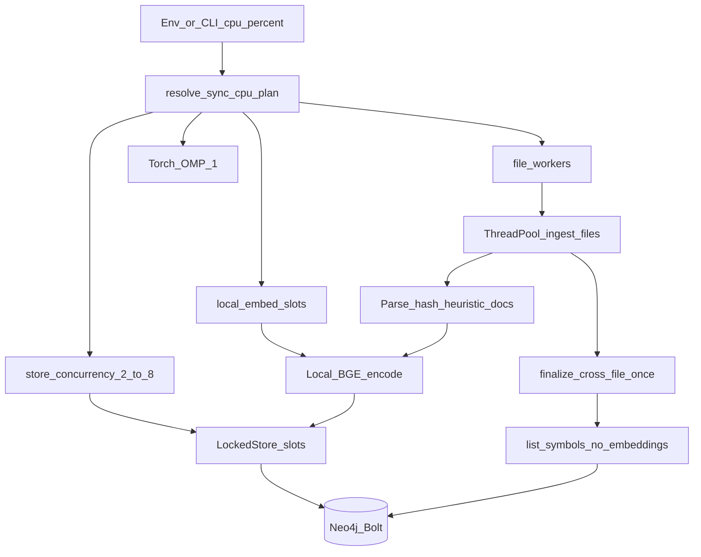

# 50 - Sync CPU Budget And Store Concurrency Low-Level Design

## Purpose

Define how `agentcore sync` turns an operator **CPU percent** into workers and
thread caps, how `LockedStore` bounds Neo4j traffic without a global write lock,
and why Neo4j `list_symbols` must not pull embedding vectors on the Bolt wire.

## Implementation status

**Implemented** in `code_graph_service.locked_store` (`SyncCpuPlan`,
`LockedStore`, `apply_sync_compute_limits`), bootstrap wiring of
`store_concurrency`, and Neo4j `LIST_SYMBOLS` projection with `embedding: []`.
Bulk parallel ingest also defers the cross-file pass and prefers heuristic docs
during the worker pool (see Related Documents pack `37`–`40`).

## Design flow

| Step | Actor | Action | Outcome |
| --- | --- | --- | --- |
| 1 | CLI / bootstrap | Resolve `AGENTCORE_SYNC_CPU_PERCENT` or workers override | `SyncCpuPlan` |
| 2 | `apply_sync_compute_limits` | Pin OMP/MKL/Torch=1; set embed semaphore | No thread-stack explosion |
| 3 | File pool | Parallel parse / heuristic docs / embed | CPU work without LiteLLM RPM wait |
| 4 | `LockedStore` | Up to `store_concurrency` concurrent store ops | Writes not single-flight |
| 5 | Postgres path | Per-thread ``psycopg`` + same slot budget | No exclusive ``lock_reads`` in production |
| 6 | Finalize | One `list_symbols` without embeddings + relink | Indexes without multi-MB vectors |

## CPU plan resolution

Precedence (see `resolve_sync_cpu_plan`):

1. Explicit positive int `AGENTCORE_SYNC_MAX_FILE_WORKERS`
2. `AGENTCORE_SYNC_CPU_PERCENT` in `1..100` (CLI `--cpu-percent` overrides env)
3. Auto: `workers = min(cpu_count, AGENTCORE_LITELLM_RPM)`; embed concurrency capped at 4

When percent mode is active:

| Field | Formula |
| --- | --- |
| `workers` | `max(1, round(cpu_count * percent / 100))` |
| `embed_concurrency` | same as `workers` |
| `torch_threads` | always `1` |
| `store_concurrency` | `max(2, min(8, workers))` |

Example: 48 CPUs at 60% → `workers=29`, `store_concurrency=8`.

## LockedStore semantics

| Backend | Reads | Mutations |
| --- | --- | --- |
| Postgres / Neo4j (`max_concurrent=N`) | Re-entrant semaphore depth `N` | Same semaphore (not a process-wide write RLock) |
| Unsafe adapter (`lock_reads=True`) | Exclusive RLock | Exclusive RLock |
| Without `max_concurrent` | Unlocked reads | Exclusive RLock fallback for mutations |

**Why not a global write lock:** with dozens of file workers, every
`put_symbol` / `put_edge` queued behind one RLock left threads on futex while
progress showed `parallel N active`, so host CPU stayed near one core.

**Why still cap at 8:** Neo4j Community on a small heap (and Postgres connection
count) cannot absorb 29 concurrent sessions; the slot budget protects overload
without serializing all workers.

Nested store calls on the same thread re-enter the semaphore via thread-local
depth (avoids BoundedSemaphore deadlock).

## list_symbols without embeddings

Neo4j `LIST_SYMBOLS` returns a map projection with `embedding: []`. Embeddings
live in the vector index (Qdrant / remote); resolution indexes only need id,
names, kind, and paths.

Pulling ~11k symbols × 1024 floats over Bolt cost ~14–16s per call and ran
multiple times before the file pool. Omitting vectors drops that to ~1.5–5s on
the same host.

`list_symbols_for_file` and single-symbol get paths may still return stored
properties as needed for prune / lookup.

## Parallel ingest notes (companion to pack 37–40)

During the worker pool (`defer_cross_file_pass=True`):

- Shared resolution indexes are built once up front.
- Per-file full-graph relink / test_links / dynamic_dispatch are deferred.
- Living docs prefer the heuristic generator so workers are not RPM-bound.
- Cross-file finalize runs once after the pool.

File-level upsert prepares docs and embeddings first, then writes, so workers
spend wall time on CPU before contending for store slots.

## Operator knobs

| Knob | Effect |
| --- | --- |
| `AGENTCORE_SYNC_CPU_PERCENT` | Preferred budget; derives workers + embeds + store cap |
| `agentcore sync --cpu-percent N` | One-run override |
| `AGENTCORE_SYNC_MAX_FILE_WORKERS` | Exact worker count (wins over percent) |
| `AGENTCORE_LITELLM_RPM` | Caps auto workers and LLM inflight |

Env field reference:
[`12-litellm-environment-configuration.md`](../13-technology-stack-and-platform-decisions/12-litellm-environment-configuration.md).

## Failure modes

| Failure | Behavior |
| --- | --- |
| Invalid percent | Fall back to auto plan |
| Neo4j overload / network aborts | Reduce effective concurrency via smaller percent or heap ops; do not remove the slot cap |
| Finalize exception | Logged/swallowed at ingest boundary so the walk still finishes; edges may be incomplete until next sync |
| Postgres | Use per-thread connections + slot budget (same as Neo4j); keep ``lock_reads`` only for non-thread-safe fakes |

## Verification

| Check | Expectation |
| --- | --- |
| Unit | `tests/backend/services/code-graph-service/test_locked_store.py` |
| Live | Progress shows `CPU budget P% → W workers`; `parallel` active advances `code k/n` |
| Host | Under heavy new files, sync process uses multiple cores (not ~1) without multi‑GB native thread stacks |
| Neo4j | No sustained bolt abort storm at default `store_concurrency` |

## Related Documents

- [`37` RPM session parallel sync feature spec](37-rpm-session-parallel-sync-feature-specification.md)
- [`38` HLD](38-rpm-session-parallel-sync-high-level-design.md)
- [`39` LLD](39-rpm-session-parallel-sync-low-level-design.md)
- [`40` risks and acceptance](40-rpm-session-parallel-sync-risks-challenges-and-acceptance.md)
- [`03` ingestion workflow](03-ingestion-and-living-documentation-workflow.md)
- LiteLLM env configuration (sync CPU knobs)
