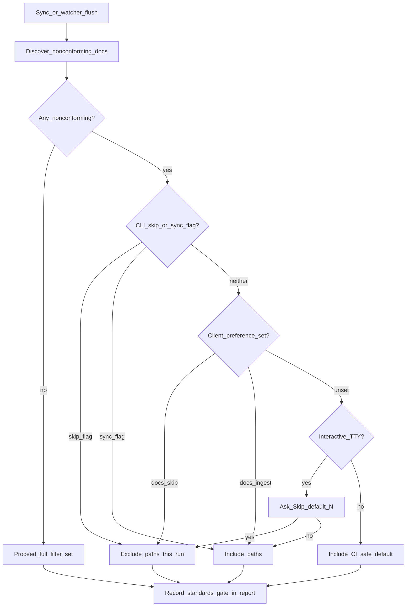

# 51 - Client Standards Gate And Watcher Policy

## Purpose

Define **where** and **how** an operator chooses **Skip** vs **Ingest** for
paths that fail Full-tier authoring / standards checks, so a **watcher** (or
any non-interactive sync) can apply that choice without a TTY prompt — and so
the operator can **change their mind later** from one obvious place: the
**AgentCore Client**.

## Implementation status

| Layer | Status |
| --- | --- |
| CLI standards gate (`ask` / `--skip-nonconforming` / `--sync-nonconforming`) | **Shipped** — docs Phase 2 auto-detect; code list reserved |
| Batched pending-sync poller (`agentcore graph watch`) | **Shipped** — marks freshness only; does **not** flush ingest by itself |
| AgentCore Client durable preference UI + storage | **Not shipped** — this document is the normative product contract |
| Watcher / auto-flush reading Client preference | **Not shipped** |

Until Client preference ships, interactive `agentcore sync` remains the only
human-facing Skip/Ingest ask. CI and scripts keep the existing flag / non-TTY
rules.

## Problem

1. Full-tier docs law says nonconforming Markdown should not quietly enter the
   graph corpus; skill `agentcore-standards-on-edit` remediates on edit so the
   tree converges.
2. Interactive sync can ask once per run (`Skip … this run? [y/N]`). A
   **watcher** has **no TTY** and must not spam prompts on every debounce flush.
3. Hard-coding “always skip” or “always ingest” in the watcher is wrong: some
   teams want a clean graph first; others want maximum coverage while they
   remediate.
4. Opinion changes: the same operator may start on **Skip**, then switch to
   **Ingest** after a remediation pass (or the reverse). The preference must be
   **durable, scoped, and editable anytime** — not buried in a one-off CLI flag.

## Goals and non-goals

### Goals

- One **AgentCore Client** settings surface owns Skip vs Ingest for
  nonconforming **docs** (and, when a machine code gate exists, **code**).
- Preference is **per project scope** (tenant / workspace / project), mutable
  without reinstall.
- Watcher-driven or scheduled flushes that actually **ingest** must read that
  preference (never invent a second silent default that disagrees with Client).
- CLI flags remain for scripts and one-off overrides.
- Clear precedence and honest “not shipped” voice until Client UI exists.

### Non-Goals

- Claiming continuous / save-triggered indexing (ADR `19` freshness freeze).
- Replacing `agentcore.sync.yaml` discovery excludes with the standards gate.
- Auto-remediating Markdown inside the watcher.
- Making `agentcore graph watch` alone a durable ingest daemon in v1 (watch
  marks pending-sync; ingest still goes through `agentcore sync` or an
  explicit flush path that applies this policy).

## Vocabulary

| Term | Meaning |
| --- | --- |
| **Nonconforming docs** | Paths Phase 2 would discover that fail `agentcore docs-standards` / Full-tier check |
| **Nonconforming code** | Reserved: machine code-standards failures when a gate exists; today CLI only accepts an explicit list |
| **Skip** | Exclude those paths from **this** ingest (temporary excludes for the run); graph stays free of bad docs |
| **Ingest** | Include them anyway (`include` mode); corpus gains coverage; remediation still expected later |
| **Ask** | Interactive TTY only — not valid for watcher / Client-backed auto-flush |
| **AgentCore Client** | Operator-facing client that wires coding agents to AgentCore (settings + connect); not the remote SSH wire script alone |

## Source of truth

| Concern | Source of truth |
| --- | --- |
| Which trees are in scope for discovery | `agentcore.sync.yaml` / `.agentcore/sync.yaml` (+ env/CLI merge) |
| Whether nonconforming paths enter this ingest | **AgentCore Client preference** for interactive / watcher / Client-triggered sync; else CLI flags; else TTY ask; else non-TTY include (CI-safe) |
| What “nonconforming” means for docs | Full-tier `docs-standards` machine check |
| Remediation | Human/agent edit + skill `agentcore-standards-on-edit` / procedure 10 — **not** the watcher |

### Preference record (contract)

Store under local project state (same family as `.agentcore/projects/<tenant>/<workspace>/<project>.json`), nested key:

```json
{
  "standards_gate": {
    "docs": "skip",
    "code": "skip",
    "updated_at": "2026-07-24T08:00:00Z",
    "updated_by": "client"
  }
}
```

| Field | Allowed values | Notes |
| --- | --- | --- |
| `docs` | `skip` \| `ingest` | Required once Client has set preference |
| `code` | `skip` \| `ingest` | Reserved; default `skip` until code gate ships |
| `updated_at` | ISO-8601 | Last Client or CLI write |
| `updated_by` | `client` \| `cli` \| `migrate` | Audit only |

Missing `standards_gate` ⇒ **unset** (fall through precedence below). Unset is
not the same as `ingest`.

## AgentCore Client UX (normative)

### Where

Settings path (product copy must stay this clear):

**AgentCore Client → Project settings → Sync → Nonconforming paths**

Two controls (separate axes):

1. **Documentation** — Skip / Ingest  
2. **Code** — Skip / Ingest (disabled or hidden until code gate ships; default Skip)

Short helper text (English product strings):

- Skip: “Keep failing Full-tier docs out of this sync until remediating.”
- Ingest: “Index them anyway; fix standards later.”

### Change anytime

- Saving the setting updates the preference record immediately.
- **No restart required** for the next sync / flush that reads the file.
- Long-running watcher processes **re-read** preference on each flush batch
  (or at least every debounce cycle) — do not cache forever at process start.
- Changing Skip → Ingest does **not** retroactively rewrite the graph; the
  operator runs sync (or the next flush) to pull previously skipped paths.
- Changing Ingest → Skip does **not** delete already-indexed bad docs; cleanup
  is a separate remediation / re-sync concern (document in UI as a one-liner).

### First-run

If preference is **unset** and the Client starts a watcher or auto-flush that
would need a decision:

1. Client **blocks** enabling auto-ingest flush until the operator picks Skip or
   Ingest once.
2. Pending-sync **banners only** may still run (watch without flush) — no gate
   required.

## Decision flow



| Step | Actor | Action | Outcome |
| --- | --- | --- | --- |
| 1 | Sync / flush | Discover Phase-2 docs; run Full-tier check | Nonconforming path list (may be empty) |
| 2 | Gate | If empty → no mode change | Full filter set unchanged |
| 3 | Gate | If `--skip-nonconforming` / `--sync-nonconforming` | Forced skip or ingest for this run |
| 4 | Gate | Else if Client `standards_gate.docs` set | Apply skip or ingest; no prompt |
| 5 | Gate | Else if TTY | Ask (default Ingest / No) | Operator choice this run only |
| 6 | Gate | Else non-TTY | Include (CI-safe; unchanged from shipped CLI) |
| 7 | Sync | Write `standards_gate` block on sync report | Auditable counts + mode |

### Precedence (highest → lowest)

1. Mutually exclusive CLI flags for **this** process invocation  
2. AgentCore Client preference (`standards_gate.docs` / `.code`)  
3. Interactive TTY ask (default Ingest / No — Enter does not skip)  
4. Non-TTY / CI: **include** (do not change sync set unless flagged)

Watcher / Client auto-flush **must not** use step 3. If preference unset, they
must refuse flush-with-ingest and surface “set Skip or Ingest in Client
settings” (step First-run).

## Watcher relationship

| Mode | Behavior |
| --- | --- |
| **Banner-only watch** (`graph watch` as shipped) | Marks pending-sync; **no** standards gate; no Skip/Ingest needed |
| **Flush watch** (future: debounce → `sync` / scoped ingest) | **Must** apply this policy before Phase 1/2 writes |
| **Manual Client Sync button** | Same gate as CLI sync; prefer Client preference over ask when set |

Product law remains: watch is **batched / debounced**, not per-keystroke
continuous indexing (ADR `19`, backlog Phase B).

## Defaults (when preference is first written by Client)

| Axis | Recommended first-run default | Why |
| --- | --- | --- |
| Docs | **Ingest** | Matches interactive CLI default (N); operators opt into Skip with `y` or `--skip-nonconforming` |
| Code | **Skip** | Fail-closed until a real code gate exists |

Operators who want maximum coverage switch to **Ingest** in Client settings;
that change applies to the next flush without another prompt.

## Failure and honesty rules

- Gate discovery/check failure must **not** block sync (shipped behavior:
  empty skip set / proceed). Prefer logging a soft warning in Client UI.
- Never market Skip as “docs deleted from disk.”
- Never market Ingest as “standards waived forever.”
- Report always records `mode`, counts, and whether preference or flag decided.

## Acceptance criteria

1. Spec documents precedence Client > ask > CI include, with CLI flags above all.  
2. Preference schema is project-scoped, mutable, re-read on flush.  
3. Watcher banner-only remains valid without preference; flush-with-ingest
   requires preference or explicit flags.  
4. Separate docs vs code axes; code reserved until machine gate exists.  
5. Sync report `standards_gate` remains the audit trail for every decision.  
6. Docs/index/CLI reference link this contract; Implementation status stays
   honest until Client UI ships.

## Implementation progress

Last updated: 2026-07-24 (agent)

| ID | Spec anchor | Status | Notes |
| --- | --- | --- | --- |
| 1 | CLI `resolve_standards_gate` | [x] | `sync_standards_gate.py`; flags + TTY ask |
| 2 | Pending-sync poll watcher | [x] | Banner/batch only; no preference read |
| 3 | Preference schema on project state | [ ] | `.agentcore/projects/…` nested `standards_gate` |
| 4 | AgentCore Client settings UI | [ ] | Project → Sync → Nonconforming paths |
| 5 | Flush path reads preference each batch | [ ] | No forever process-start cache |
| 6 | CLI loads preference when flags absent | [ ] | Between flags and TTY ask |
| 7 | Tests: precedence + unset blocks auto-flush | [ ] | Unit + Client contract tests |

## Related Documents

- Ingestion triggers: [`03-ingestion-and-living-documentation-workflow.md`](03-ingestion-and-living-documentation-workflow.md)
- Freshness / watcher marketing freeze: [`19-competitive-code-intelligence-roadmap-adr.md`](19-competitive-code-intelligence-roadmap-adr.md)
- CLI sync standards gate row: [`../08-software-engineering-architecture/42-agentcore-cli-command-reference-continued-continued-continued.md`](../08-software-engineering-architecture/42-agentcore-cli-command-reference-continued-continued-continued.md)
- Fix-on-write skills: [`../15-agent-workspace-guidance/06-mcp-first-agent-skills-and-rules.md`](../15-agent-workspace-guidance/06-mcp-first-agent-skills-and-rules.md)
- Standardization procedure: [`../00-master-plan/10-documentation-standardization-procedure.md`](../00-master-plan/10-documentation-standardization-procedure.md)
