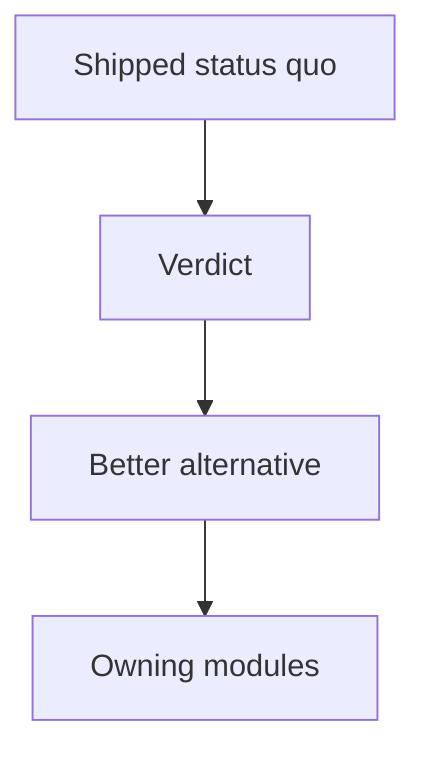

# 59 - Imperfect Graph Policy Challenges

## Implementation status

**Designed / not shipped.** Future-lane design transferred from the retired
research dump formerly at `docs/1.txt`. Do not treat as live product behavior.

## Purpose

Challenge five status-quo AgentCore behaviors and record the better future
policies. These are planning ADRs for later guidance/MCP contract changes; they
are not yet binding runtime law.

## Document flow

| Step | Actor | Action | Outcome |
| --- | --- | --- | --- |
| 1 | Architect | Reads challenge | Understands why status quo is insufficient |
| 2 | Architect | Accepts alternative | Policy target for future waves |
| 3 | Implementer | Implements owning modules | Runtime matches alternative |

## Challenge 1 — Fixed `structural → hybrid → raw Read`

**Verdict:** retain structural-first as a prior; **replace the fixed ladder**.

Fixed ladders assume every sparse structural result should trigger broad hybrid
then source reading. Literature supports: decompose required hops; classify why
sparse; test sufficiency; recover only unsupported hops; abstain when unsupported.

**Better alternative:**
`structural prior → typed result diagnosis → claim-level sufficiency → targeted recovery`

Examples: exact low-confidence call site may Read before broad hybrid;
architecture discovery may run hybrid/community in parallel; stale high-risk
target should targeted-sync first.

**Owners:** `62`, `61`, `63`, `68`.

## Challenge 2 — Confidence floors for impact eligibility

**Verdict:** useful coarse guardrail; **insufficient as principal safety mechanism**.

A universal floor hides non-equivalent cases: exact but stale call; probable among
two candidates; high-scoring learned edge without call site; runtime-observed
under one test; low-confidence but exact registration; complete-empty vs
incomplete-empty.

**Better alternative:** operation-conditioned eligibility:

`edge provenance × coverage × freshness × ambiguity × claim sufficiency × operation risk`

Keep floors only as one feature inside that decision.

**Owners:** `64`, `61`, `65`.

## Challenge 3 — Surfacing `knowledge_gaps` without auto-repair

**Verdict:** refusal to auto-create truth edges is **correct**; merely displaying
gaps is **too passive**.

Literature does not justify autonomous plausible code-edge insertion. Missing-edge
research supports diagnose → quantify recurrence → direct analyzer work.

**Better alternative:**

- Keep `knowledge_gap` as first-class unresolved fact.
- Attach root-cause hypothesis.
- Generate executable evidence-acquisition action.
- Store candidates in quarantined graph.
- Promote only via deterministic, scoped runtime, or human confirmation.

**Owners:** `69`, `71`.

## Challenge 4 — Freshness banners without forced in-loop re-sync

**Verdict:** enough for low-risk exploration; **insufficient for high-risk
impact/edit**.

A banner delegates a machine-checkable precondition to a model that may ignore it.

**Better alternative:**

| Operation class | Policy |
| --- | --- |
| Explore / explain | Banner; downgrade claims |
| Impact / edit, medium risk | Targeted re-sync unless source read and claim independent of stale structure |
| High-risk / destructive | Force targeted re-sync or abstain |
| Sync unavailable | Investigate OK; prohibit claims requiring graph completeness |

**Evidence qualification:** insufficient evidence for exact resync thresholds —
validate via stale-index fault injection (`66`).

**Owners:** `65`, `61`, `67`.

## Challenge 5 — “Never invent edges”

**Verdict:** preserve as **truth-graph invariant**; refine so the system can still
reason about hypotheses.

**Improved invariant:** never write an unverified relation into the production
truth graph or use it as impact-eligible evidence. The agent may create a
time-bounded, provenance-rich **candidate hypothesis** solely to request
validation or guide targeted retrieval.

**Owners:** `71`, `64`, `70`.

## Related Documents

- [`56-imperfect-graph-agent-decision-roadmap.md`](56-imperfect-graph-agent-decision-roadmap.md)
- [`15-call-graph-confidence-and-runtime-traces.md`](15-call-graph-confidence-and-runtime-traces.md)
- [`44-codebase-memory-neo4j-hybrid-feature-specification.md`](44-codebase-memory-neo4j-hybrid-feature-specification.md)
