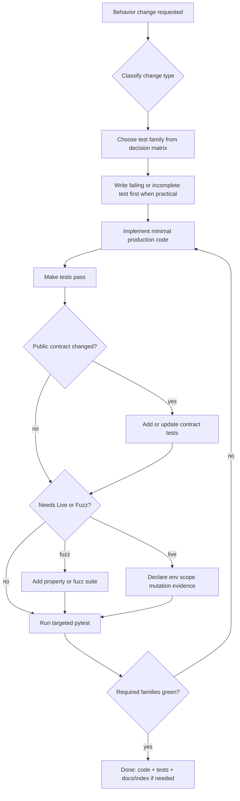

# 37 - Test Authoring Standard

## 37 - Test Authoring Standard
## Purpose

This document is the **normative test-authoring playbook** for AgentCore. It tells every human engineer and every coding agent **how to write tests** while implementing code: which family to choose, where files live, how doubles and fixtures work, how Live and Fuzz suites differ from Unit suites, and when a change is allowed to be called done.

Strategy documents already define *why* layers exist. This document owns *how to author*:

| Document | Owns |
| --- | --- |
| `11-testing-and-verification-engineering.md` | Layer goals, CI gate order, acceptance of the verification system |
| `25-live-and-unit-test-strategy.md` | Unit vs Live family rules, real-data safety, evidence |
| `33-testing-seams-and-contract-boundary-standards.md` | Seams, ports, determinism, LLM test boundaries |
| `38-fuzzing-and-property-based-testing.md` | Property-based and fuzz suites in depth |
| `../06-technical-logic/07-technical-test-strategy.md` | Domain-scenario verification for Phase 6 logic |
| **This document** | Concurrent code-and-tests law, authoring workflow, taxonomy decision matrix, doubles usage, markers, placement, agent DoD |

## Goals And Non-Goals

### Goals

- Make **concurrent code and tests** mandatory for greenfield and material changes.
- Give agents a single decision path from “new behavior” to the correct test family and path.
- Cover Unit, Contract, Integration, E2E, Live, Fuzz / property-based, Security, Performance, Regression, Snapshot, and Docs-validation authoring.
- Prefer fakes and seams over brittle mocks; keep Live tests safe and evidenced.
- Keep discovery under repository `tests/` so CI and local commands stay predictable.

### Non-Goals

- Replacing the Live safety policy in `25-…` or seam design in `33-…`.
- Mandating a coverage percentage as the only quality signal.
- Requiring Live or Fuzz on every tiny pure-function change.
- Documenting secrets, production credentials, or customer payloads in fixtures.

## Concurrent Code And Tests Law

**Normative.** Any material implementation of new or changed behavior **must** ship with tests in the same change set. Code without the required test family is **not done**.

### Applies To

| Change type | Minimum concurrent tests |
| --- | --- |
| New domain rule, value object, state transition, scorer, validator | Unit (positive + negative + edge) |
| New or changed public API / event / SDK / config schema | Contract + Unit or Integration for handler path |
| New repository / migration / outbox / inbox behavior | Integration (real or realistic store) |
| New worker / broker consumer path | Integration (duplicate, retry, DLQ as applicable) |
| New cross-service workflow | Integration or E2E for the critical path |
| New connector / install / production-like validation | Live (scoped, evidenced) when release-gated |
| Parsers, serializers, schema validators, ranking, budgets | Unit + Fuzz / property-based when inputs are adversarial or combinatorial |
| AuthZ, isolation, redaction, secret handling | Security negative tests in the same change |
| Bug fix | Regression test that fails before the fix and passes after |
| Refactor with no behavior change | Existing tests must still pass; add characterization tests if coverage was missing at the seam |

### Does Not Excuse Skipping Tests

- “Docs-only scaffolding” that includes executable behavior.
- “Temporary” handlers, CLI commands, or scripts that will ship.
- Agent-generated code.
- “Covered indirectly” by an unrelated Live suite.
- “Will add tests later” without an explicit user-approved deferral.

### Approved Deferral Only

If the user explicitly accepts a temporary gap, record it in English in code or the change description as:

```text
## tsoc-defer: tests deferred for <reason>; remove when <trigger>; real fix: <one line>
```

Unapproved deferral is a standards violation. Coding agents **must** refuse to call the task complete until required tests exist or an explicit deferral is recorded.

### Concurrent Authoring Flow



| Step | Actor action | Output |
| --- | --- | --- |
| 1 | Classify the change (domain, contract, persistence, worker, cross-service, live, security, bugfix) | Change type |
| 2 | Select families from the decision matrix below | Required test list |
| 3 | Add or extend tests under `tests/` before or with production code | Failing or incomplete tests |
| 4 | Implement the smallest correct production change | Code under owning module |
| 5 | Make required tests pass; add contract/fuzz/live when triggered | Green targeted suite |
| 6 | Update docs/indexes only when contracts or operator behavior changed | Linked docs |
| 7 | Refuse “done” if required family missing and no approved deferral | Gate |

## Test Family Taxonomy

| Family | Question answered | Dependencies allowed | Speed | Default marker |
| --- | --- | --- | --- | --- |
| Unit | Does isolated logic honor invariants? | None (fakes/stubs only) | Fast | `unit` |
| Contract | Do producer and consumer schemas agree? | Schema fixtures only | Fast–medium | `contract` |
| Integration | Do components work through real adapters in a controlled stack? | Local DB/broker/filesystem as declared | Medium | `integration` |
| E2E | Does a critical user/agent journey work end-to-end? | Full test stack | Slow | `e2e` |
| Live | Does the system work with real or production-like data/topology? | Real services; scoped and evidenced | Controlled | `live` |
| Fuzz / property-based | Do invariants hold across generated input space? | Pure or harnessed SUT | Medium | `fuzz` |
| Security | Are deny/isolation/redaction paths enforced? | As required by layer | Fast–medium | `security` |
| Performance | Do latency/throughput budgets hold? | Instrumented env | Variable | `performance` |
| Regression | Does a known failure stay fixed? | Same as original layer | As original | `regression` |
| Snapshot | Did a stable serialized surface drift unexpectedly? | Fixtures | Fast | `snapshot` |
| Docs validation | Are indexes, links, and required sections valid? | Docs tree | Fast | `docs` |

Unit and Live are **not substitutes**. Fuzz is not a substitute for Unit happy-path clarity. Live is not a substitute for Contract.

## Decision Matrix (Choose The Family)

| If you are changing… | Write first | Also write when… |
| --- | --- | --- |
| Pure function, entity, VO, state machine, policy, scorer | Unit | Combinatorial / parser / schema → Fuzz |
| HTTP/RPC handler mapping and error shape | Contract + Unit or Integration | AuthZ → Security |
| Repository SQL/Cypher, migration, outbox | Integration | Idempotency / races → focused Integration cases |
| Event consumer | Integration | Poison/retry/DLQ paths required |
| Multi-service workflow | Integration or E2E | Release readiness → Live |
| Connector, install, real provider | Live (after Unit for mappers) | Always declare mutation policy |
| Bug from production or Live failure | Regression at the correct layer | Prefer Unit if logic was wrong |
| Prompt packing / token budget / redaction helper | Unit | Adversarial strings → Fuzz + Security |
| Public OpenAPI / event envelope / SDK DTO | Contract | Breaking change → version + migration notes |

## Repository Placement

Executable tests **must** live under repository `tests/`. Do not add runnable tests under `backend/services/<service>/tests/`.

```text
tests/
  README.md
  support/                          # shared gate harnesses, fixtures packages
  backend/
    services/<service-name>/        # owning service suites
      unit/
      contract/
      integration/
      test_*.py                     # allowed until suite grows enough to split
    packages/
    gates/
    tools/
    platform/
  frontend/
  e2e/
  live/
    <suite>/
  performance/                      # optional when budgets exist
  security/                         # optional cross-cutting suites
```

Rules:

- Group by **owner** (service, package, gate), not by roadmap phase number.
- Split into `unit` / `contract` / `integration` subfolders when a service suite exceeds roughly one screen of files.
- Shared fixtures: `tests/backend/fixtures/` or `tests/support/` only when reused by multiple owners.
- Frontend: `tests/frontend/` with `test_*.ts(x)` or `*.spec.ts(x)`.
- Live: `tests/live/<suite>/` only; never mix Live I/O into Unit modules.

Canonical commands (examples):

```bash
PYTHONPATH=backend/services/core-data-service/src .venv/bin/python -m pytest tests/backend/services/core-data-service -q
PYTHONPATH=tests/support:backend/packages .venv/bin/python -m pytest tests/backend/gates/port-profile-verification -q
.venv/bin/python -m pytest -m "unit and not live" -q
.venv/bin/python -m pytest -m live --maxfail=1
```

## Authoring Workflow

### Preferred Order

1. Name the invariant or acceptance behavior in one sentence.
2. Choose family and path.
3. Write the test (red) that would fail against current or empty behavior.
4. Implement the minimum production code (green).
5. Refactor with tests green.
6. Add negative and edge cases in the same change.
7. Run the **smallest** command that would have caught the bug or missing feature.

Full red-green-refactor is preferred (`tdd` skill). When exploring an unknown seam, characterization tests first are acceptable, then tighten assertions.

### Naming

```text
test_<unit>_<behavior>_<condition>
```

Examples:

- `test_task_rejects_transition_from_closed_to_in_progress_without_reopen`
- `test_memory_retrieval_excludes_deprecated_facts_by_default`
- `test_activity_recorded_duplicate_delivery_creates_one_candidate`

Names must state the **behavior**, not the implementation method.

### Structure (AAA)

Every test should be readable as Arrange / Act / Assert (or Given / When / Then):

- Arrange: fixtures, fakes, clock, ids, scope.
- Act: one primary behavior under test.
- Assert: one primary outcome; secondary asserts only when they protect the same invariant.

Avoid multiple unrelated acts in one test.

### Assertions

- Assert on **observable behavior** and public contracts, not private helpers or table names.
- Prefer exact values and typed errors over substring-only checks when stable.
- For collections, assert membership and cardinality that matter; do not overfit order unless order is part of the contract.
- For async / eventual systems, use explicit waits with timeouts owned by the harness — never unbounded sleep loops.

### Fixtures

- Small, explicit, deterministic.
- Include negative and edge payloads, not only happy paths.
- No secrets, real API keys, or customer data.
- Prefer builders/factories over copied JSON blobs when many variants are needed.
- Live fixtures must declare data classification.

## Test Doubles: Mock, Fake, Stub, Spy

| Double | Meaning | Prefer when |
| --- | --- | --- |
| Stub | Returns canned answers | Simple dependency return values |
| Fake | Working in-memory substitute with real behavior shape | Ports (repos, brokers, clocks, id generators) |
| Mock | Verifies interactions (calls/args) | Protocol must be called with specific args |
| Spy | Records calls while delegating | Observing side effects without replacing all behavior |
| Recorded fixture | Frozen external response | HTTP/LLM adapters in Unit/Integration |

**Rules (normative):**

1. Prefer **fakes behind ports** over mocks of concrete infrastructure clients.
2. Mock only **public ports**, never private modules or ORM internals.
3. Do not re-implement production SQL in a mock and call it a test of persistence — that belongs in Integration.
4. Time, randomness, and ids **must** be injectable and fixed in Unit tests.
5. LLM and model providers **must** be behind adapters; Unit tests use fixtures or deterministic stubs. Live may call real models only under policy.
6. Avoid assertion-free tests that only check “mock was called” without outcome meaning.

Seam design details: `33-testing-seams-and-contract-boundary-standards.md`.

## Family Authoring Requirements

### Unit

Must:

- Be deterministic and offline.
- Cover positive, negative, and at least one edge/invariant break.
- Import through public packages/ports, not private internals.

Must not:

- Open network, real DB, broker, graph, vector store, or model provider.
- Depend on wall clock or real UUID entropy without injection.

### Contract

Must:

- Validate schema, required/optional fields, error shape, and version compatibility.
- Cover producer examples and consumer expectations.
- Fail loudly on breaking drift.

Place beside the owning service suite under `contract/` when split.

### Integration

Must:

- Exercise real adapters (DB, broker, filesystem) in a controlled profile.
- Cover idempotency, transaction/outbox boundaries, and failure recovery where owned.
- Clean up or use transactional isolation so suites do not leak state.

Must not:

- Import another service’s private internals; use public APIs/events/SDKs.

### E2E

Must:

- Protect critical journeys only (few tests, high value).
- Run against a documented test stack profile.
- Assert user/agent-visible outcomes, not every internal hop.

### Live

Must follow `25-live-and-unit-test-strategy.md`. Every Live run declares:

- environment, tenant/workspace/project scope
- data classification
- mutation policy (default read-only on production data)
- evidence refs (no secrets)

Authoring checklist:

1. Unit-test mappers and policies first.
2. Mark tests `@pytest.mark.live`.
3. Fail closed if required env vars / approvals missing.
4. Emit evidence artifact paths in assertions or harness output.
5. Never write Live setup code into Unit modules.

### Fuzz / Property-Based

Must:

- State **invariants** (what must always be true), not only example cases.
- Bound input size and reject unlimited generation.
- Prefer Hypothesis (Python) or equivalent for structured strategies; schema/API fuzz for parsers and HTTP surfaces.

Deep standard: `38-fuzzing-and-property-based-testing.md`.

Minimum concurrent fuzz when changing:

- parsers, serializers, frontmatter/schema validators
- query builders / Lucene or Cypher string assembly
- ranking, token budgets, weight calculators with wide numeric ranges
- redaction detectors

### Security

Must include negative paths:

- unauthorized tenant/workspace/project access denied
- secret/redaction never appears in prompts, events, or logs under test
- approval-gated actions reject without approver

### Performance

Must declare budget, dataset size, and environment before claiming pass. Smoke performance may run in CI; full soak is release-gated.

### Regression

Every production incident that maps to logic **must** add a regression test at the lowest correct layer before closing the fix.

### Snapshot

Use only for stable serialized contracts (OpenAPI fragments, golden event envelopes). Review every snapshot update as a contract change.

### Docs Validation

Treat broken indexes/links/required sections as CI failures for documentation changes.

## Related Documents

- Continued in `docs/08-software-engineering-architecture/37-test-authoring-standard-continued.md`
