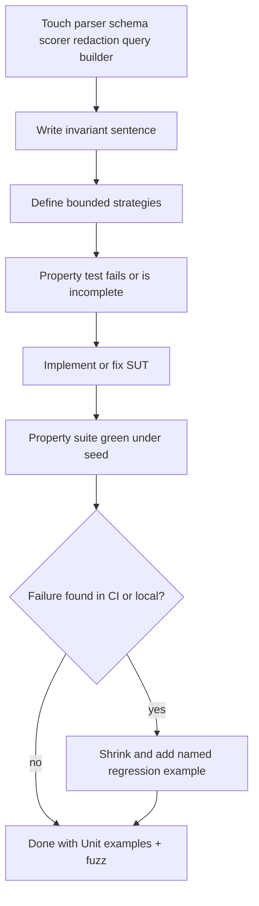

# 38 - Fuzzing And Property-Based Testing

## Purpose

This document defines how AgentCore authors **property-based tests** and **fuzz suites**. Example-based Unit tests prove selected cases. Fuzzing proves that stated **invariants** hold across a generated input space, including adversarial and boundary values Unit authors often miss.

Authoring placement, concurrent code-and-tests law, and family selection live in `37-test-authoring-standard.md`. This file owns fuzz-specific design.

## Goals And Non-Goals

### Goals

- Make invariants explicit and machine-checked.
- Require fuzz coverage for parsers, serializers, schema validators, query builders, numeric scorers, and redaction helpers when those surfaces change.
- Keep generation bounded, deterministic under seed, and CI-friendly.
- Prefer shrinking to a minimal failing example.

### Non-Goals

- Replacing Unit happy-path and named edge cases.
- Unbounded cloud-hosted fuzz farms as a default.
- Fuzzing Live production systems with destructive payloads.
- Claiming security assurance from coverage percentage alone.

## Vocabulary

| Term | Meaning |
| --- | --- |
| Property / invariant | A statement that must hold for all generated inputs in scope |
| Strategy / generator | Rules that build valid, invalid, or adversarial inputs |
| Example-based test | Fixed Arrange/Act/Assert case (Unit) |
| Property-based test | Many generated cases checking an invariant |
| Schema / API fuzz | Mutating structured payloads against validators or HTTP handlers |
| Corpus / seed corpus | Saved interesting inputs that expand coverage |
| Shrink | Automatic reduction of a failing input to a minimal reproducer |

## When Fuzz Is Mandatory

Concurrent with implementation (same change set) when touching:

| Surface | Required properties (examples) |
| --- | --- |
| Parsers (Tree-sitter wrappers, frontmatter, JSON/YAML loaders) | Never crash on bounded input; invalid input yields typed error; valid round-trip preserves semantics |
| Serializers / DTO codecs | Round-trip equality for legal values; reject illegal values |
| Schema validators | Accept all legal fixtures; reject illegal; unknown-field policy honored |
| Query / Lucene / Cypher / SQL fragment builders | Injection markers neutralized or rejected; output stays within grammar bounds |
| Ranking, weights, token budgets, decay | Monotonicity / bounds / conservation properties under profile configs |
| Redaction / secret detectors | Known secret shapes never appear in output; safe text unchanged |
| Idempotency key / identity helpers | Same logical input → same identity; distinct inputs do not collide under stated alphabet |

If the change is a pure rename with no logic change, existing fuzz suites must still pass; new fuzz is not required.

## Property Design Rules

1. **State the invariant in one sentence** in the test docstring or name.
2. **Separate generators from assertions** so strategies can be reused.
3. **Bound size**: max string length, max list length, max graph depth, max numeric magnitude.
4. **Include illegal inputs** when the SUT must reject them safely (no crash, typed error).
5. **Fix entropy**: seed Hypothesis/random; inject clock/ids via ports.
6. **No network** in default fuzz; call pure functions or in-process fakes.
7. **Persist shrinks**: once a failure is found, add a named regression example under Unit or `regression` marker.

### Good Invariants

- Round-trip: `decode(encode(x)) == x` for legal `x`.
- Idempotence: `f(f(x)) == f(x)`.
- Bounds: `0 <= score(x) <= 1` for all generated `x`.
- Safety: `redact(text)` contains no substring from the secret alphabet under test.
- Rejection: illegal payloads raise a documented error type, never `Exception` soup.

### Bad “Properties”

- “Does not throw” with no typed expectation and unlimited input size.
- Re-checking a single hard-coded example inside a generator loop.
- Asserting call counts on mocks instead of output invariants.

## Tooling

| Stack | Default tool | Notes |
| --- | --- | --- |
| Python backend | Hypothesis (`@given`, strategies) | Prefer over ad-hoc `random` loops |
| Schema / OpenAPI | Schemathesis or equivalent contract fuzz | Against test app or schema file |
| Parsers | Hypothesis text/binary + corpus seeds | Keep max_size explicit |
| Frontend TypeScript | fast-check when TS suites exist | Same invariant rules |

Dev dependency policy: add Hypothesis (or chosen tool) under project optional `dev` extras when the first fuzz suite lands; do not vendor unbounded fuzz services.

## Placement And Markers

```text
tests/backend/services/<service>/
  fuzz/
    test_<surface>_properties.py
  unit/
    test_<surface>_regression_examples.py   # shrunk failures
```

Until a service suite is large enough to split, `test_*_fuzz.py` beside unit files is acceptable.

Mark with `@pytest.mark.fuzz` (and `unit` only if fully offline and fast enough for the fast path). Long campaigns use `@pytest.mark.slow` and stay out of default PR gates.

## Authoring Flow



| Step | Action | Output |
| --- | --- | --- |
| 1 | Name invariants for the changed surface | Invariant list |
| 2 | Implement bounded strategies | Generators |
| 3 | Add `@pytest.mark.fuzz` property tests under `tests/` | Failing/green suite |
| 4 | Keep example Unit cases for human-readable edges | Unit file |
| 5 | On shrink failure, promote minimal input to regression | Named test |
| 6 | Run targeted pytest for owner + `-m fuzz` when touched | Evidence |

## CI Selection

| Pipeline | Fuzz expectation |
| --- | --- |
| PR fast path | Optional short Hypothesis deadline when fuzz files in the diff |
| PR affected owner | Fuzz for touched parser/schema/scorer owners |
| Nightly / release | Longer deadlines, corpus replay |
| Live / production | Do not run destructive API fuzz against production |

Suggested local command shape:

```bash
.venv/bin/python -m pytest tests/backend/services/<service> -m fuzz -q
```

## Security And Safety

- Fuzz payloads may look like exploits; keep them in tests only; never log them to shared production sinks.
- Do not exfiltrate corpus artifacts outside the private boundary.
- API fuzz against staging must respect Live mutation and isolation rules from `25-…`.
- Finding a crash or invariant break **requires** a regression test and a root-cause fix (`root-cause-fix`).

## Anti-Patterns

| Anti-pattern | Replace with |
| --- | --- |
| Unlimited string generation | `max_size` / deadline |
| Fuzz as only tests for a module | Unit examples + properties |
| Ignoring shrink output | Named regression case |
| Fuzzing through real LLM/network | Adapter fake + recorded fixtures |
| Mutating production via fuzz | Staging/sandbox only with policy |

## Related Documents

- `37-test-authoring-standard.md` — concurrent law, taxonomy, placement
- `11-testing-and-verification-engineering.md` — verification layers
- `25-live-and-unit-test-strategy.md` — Live safety (for any live API fuzz)
- `33-testing-seams-and-contract-boundary-standards.md` — determinism and ports
- `16-security-and-threat-modeling-engineering.md` — security test expectations

## Acceptance Criteria

Fuzzing standards are acceptable when:

- mandatory surfaces for concurrent fuzz are explicit
- invariants, bounds, seeds, and shrinking are required practice
- placement and markers are clear under `tests/`
- CI selects fuzz by ownership and risk, not as a substitute for Unit
- security and non-exfiltration constraints are stated
