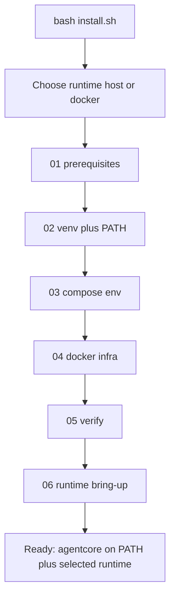

# 39 - Local Install Runbook

## Purpose

This runbook explains how to install AgentCore for **local development** with one command. The installer is modular: every stage **checks** first, then **fixes**, then **re-checks**. It is designed so a first-time operator can succeed without memorizing Docker, venv, or Compose details.

Implementation status: **shipped** for local-dev bootstrap (OS deps on Debian/Ubuntu, `.venv`, Compose Postgres + Neo4j, `agentcore doctor`). Full zero-touch production modes remain covered by [19-zero-touch-installation-and-bootstrap-automation.md](./19-zero-touch-installation-and-bootstrap-automation.md).

## Quick start

From the repository root:

```bash
bash install.sh
```

The installer **asks** whether to bring AgentCore up as:

1. **host** — Compose Postgres/Neo4j + MCP HTTP from the host `.venv` (`agentcore service start`)
2. **docker** — Compose Postgres/Neo4j + MCP HTTP in the `mcp-gateway` container (wheels from `/opt/agentcore-wheelhouse`)

Both choices **always** install OS prerequisites (when interactive), create `.venv`, and put `agentcore` on `PATH` (`~/.local/bin` + shell rc).

Non-interactive / CI:

```bash
bash install.sh --non-interactive --runtime host
bash install.sh --non-interactive --runtime docker
```

Then open a new shell if needed (so `~/.local/bin` is on `PATH`) and run:

```bash
agentcore doctor
agentcore --help
```

App Docker details: [43-app-docker-and-wheelhouse-runbook.md](./43-app-docker-and-wheelhouse-runbook.md).

## Install flow



| Step | Stage | What it checks | What it does if missing |
| --- | --- | --- | --- |
| 0 | runtime choice | `--runtime` / prompt / default `host` | Persists `runtime=` in `.agentcore/install-state.env` |
| 1 | `01_prerequisites` | Python 3.12+, curl, git, Docker daemon, Compose plugin | `apt` install on Debian/Ubuntu; enable Docker (interactive installs always run this) |
| 2 | `02_venv` | `.venv` + PATH shim | `ensure-venv.sh`; seed `.env` / `agentcore.sync.yaml`; install `~/.local/bin/agentcore` |
| 3 | `03_compose_env` | Compose `.env.local` with real secrets | Generate secrets from example templates |
| 4 | `04_docker_infra` | Postgres + Neo4j `healthy` | `docker compose --profile core up -d` + `wait-healthy.sh` |
| 5 | `05_verify` | `agentcore doctor` + PATH + infra | Fail with stage hint; optional ai-toolstack |
| 6 | `06_runtime_bringup` | Host MCP or `mcp-gateway` healthy | `agentcore service start` **or** wheelhouse + Compose `--profile app` |

Module map: [`scripts/install/README.md`](../../scripts/install/README.md).

## Flags

| Flag | Meaning |
| --- | --- |
| `--runtime MODE` | `host` or `docker` (skips interactive prompt) |
| `--non-interactive` | No prompts; default runtime `host` if `--runtime` omitted |
| `--check` | Verify only; do not install packages or change Compose |
| `--prerequisites-only` | Stop after OS deps (always installs/checks prerequisites) |
| `--skip-prerequisites` | Do not apt-install (CI/non-interactive only; ignored for interactive full installs) |
| `--skip-infra` | Skip Compose env + containers + runtime bring-up (venv/CLI/PATH only) |
| `--with-frontend` | Also ensure Node.js 18+ for `frontend/` |
| `--with-ai-toolstack` | After verify, run `ai-toolstack/scripts/install-agentcore.sh` |
| `--stage NAME` | Run one stage (see `--list-stages`) |
| `--list-stages` | Print stage ids |
| `--compose-timeout SEC` | Health wait timeout (default `180`) |

Examples:

```bash
bash install.sh
bash install.sh --runtime docker
bash install.sh --non-interactive --runtime host
bash install.sh --check --non-interactive --runtime host
bash install.sh --skip-infra --non-interactive --runtime host
bash install.sh --prerequisites-only
bash install.sh --stage 02_venv
bash install.sh --with-frontend --with-ai-toolstack
```

## Prerequisites (manual, non-Debian)

Automatic OS package install supports **Debian/Ubuntu** via `apt` only. Elsewhere, install manually before `bash install.sh --skip-prerequisites`:

- Python 3.12+ with the `venv` module
- `curl`, `git`, `ca-certificates`, `openssl`
- Docker Engine and the Docker Compose **v2** plugin
- Optional: Node.js 18+ when using `--with-frontend`

## Secrets and Compose

- Local env file: `backend/deployments/compose/.env.local` (gitignored)
- Example template: `backend/deployments/compose/neo4j.example.env`
- The installer **never prints** generated passwords
- Default ports come from the port profile / example env (Postgres `32232`, Neo4j Bolt `32287`)

Start infra alone (after env exists):

```bash
docker compose --env-file backend/deployments/compose/.env.local \
  -f backend/deployments/compose/compose.yaml --profile core up -d postgres neo4j
backend/deployments/compose/wait-healthy.sh --timeout 300 \
  agentcore-postgres-1 agentcore-neo4j-1
```

## Failure recovery

| Symptom | Likely cause | Fix |
| --- | --- | --- |
| Python 3.12 missing | Old OS / no deadsnakes | Re-run without `--skip-prerequisites`, or install Python 3.12 manually |
| `docker daemon not reachable` | Docker stopped or user not in `docker` group | `sudo systemctl start docker`; log out/in after group add |
| Compose env placeholder password | Example file copied without replace | Re-run `bash install.sh --stage 03_compose_env` |
| Neo4j wait timeout | Slow first pull / plugins | Increase `--compose-timeout 300`; check `docker logs agentcore-neo4j-1` |
| `agentcore doctor` fail | Incomplete venv | `bash install.sh --stage 02_venv` |

State markers (optional resume hints): `.agentcore/install-state.env`.

## Smoke test

Prove the installer on a real host:

```bash
# From repository root
bash tests/e2e/install/run-install-smoke.sh
SMOKE_SKIP_DOCKER=1 bash tests/e2e/install/run-install-smoke.sh
SMOKE_REQUIRE_DOCKER=1 bash tests/e2e/install/run-install-smoke.sh

# Isolated temp tree + offset ports + auto cleanup
bash tests/e2e/install/run-isolated-install-smoke.sh
SMOKE_REQUIRE_DOCKER=1 bash tests/e2e/install/run-isolated-install-smoke.sh
SMOKE_KEEP=1 bash tests/e2e/install/run-isolated-install-smoke.sh

# Pytest wrappers
.venv/bin/python -m pytest tests/backend/tools/install/test_install_smoke.py -q
.venv/bin/python -m pytest tests/backend/tools/install/test_install_smoke.py -m live -q
```

Evidence logs land under `tmp/install-smoke/`. Isolated runner uses ports `42332` / `42387` / `42574` by default and removes the temp tree unless `SMOKE_KEEP=1`. Details: [`tests/e2e/install/README.md`](../../tests/e2e/install/README.md).

## Relationship to other installers

| Entry | Owns |
| --- | --- |
| Root `install.sh` | Full AgentCore local-dev bootstrap (this runbook) |
| `scripts/ensure-venv.sh` | Python venv only (called by stage 02) |
| `ai-toolstack/scripts/install-agentcore.sh` | Cursor rules/skills/MCP wiring (optional via `--with-ai-toolstack`) |

Do not use archived `archives/hackathon/install.sh` for the active product path.

## Related Documents

- [19-zero-touch-installation-and-bootstrap-automation.md](./19-zero-touch-installation-and-bootstrap-automation.md)
- [13-local-development-and-environment-engineering.md](./13-local-development-and-environment-engineering.md)
- [36-agentcore-cli.md](./36-agentcore-cli.md)
- [backend/deployments/compose/README.md](../../backend/deployments/compose/README.md)
- [43-app-docker-and-wheelhouse-runbook.md](./43-app-docker-and-wheelhouse-runbook.md) — application container + `/opt` wheelhouse
- [scripts/install/README.md](../../scripts/install/README.md)
