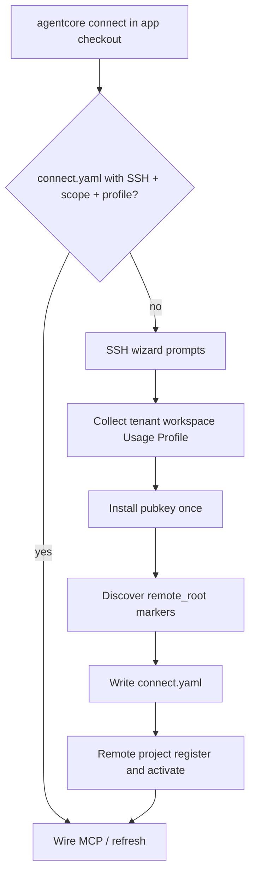

# 41 - One-Command Cross-Platform Agent Onboarding (Continued)

## Purpose

Continuation of [41-one-command-cross-platform-agent-onboarding.md](./41-one-command-cross-platform-agent-onboarding.md) after the soft size budget. Owns the **first-connect scope wizard** contract, connect HTTP APIs, troubleshooting, and implementation status.

## First connect when scope is missing

When an operator runs `agentcore connect` from an application checkout on a **TTY** and scope is not already configured, connect **must** collect the missing values interactively, then register the project and wire MCP. It does **not** invent tenant/workspace/Usage Profile silently, and it does **not** author a new Usage Profile template on the client.

### When the wizard runs

| Condition | Behavior |
| --- | --- |
| No `<checkout>/.agentcore/connect.yaml` (and no usable legacy home config) | Full SSH wizard + scope prompts |
| `connect.yaml` exists but `usage_profile` empty | Prompt for Usage Profile id (TTY) or require `--usage-profile` |
| `connect.yaml` already has `scope.*` + `usage_profile` + working SSH | Reuse; no re-prompt for tenant/workspace/profile |
| Non-interactive / no TTY and profile missing | Fail closed: pass `--usage-profile` (and scope flags as needed) |

`agentcore init` remains the **server/dogfood** path for pinning software roots on an AgentCore checkout. Remote **client** first connect does not require a prior `init` on the laptop; the wizard + `project register` establish scope on the AgentCore server.

### Prompts and defaults

```text
cd /opt/MyApp
agentcore connect
```

Typical interactive order:

1. Server host and SSH username
2. Tenant id (default `default` if the operator accepts the empty default)
3. Workspace id (default `default`)
4. Usage Profile — numbered list from the installed catalog; enter an id or list number
5. SSH password **once** (pubkey install; never stored)
6. Auto-discover AgentCore `remote_root` via `install-root` markers (not prompted)
7. Write/merge `<checkout>/.agentcore/connect.yaml`, register/activate project on the server, write IDE MCP configs

| Field | Source when missing | Notes |
| --- | --- | --- |
| `scope.tenant` | Wizard prompt | Operator-chosen id string |
| `scope.workspace` | Wizard prompt | Operator-chosen id string |
| `scope.project` | Current directory name | Override with `--project` |
| `usage_profile` | Catalog pick (`prompt_usage_profile`) | Select only — list with `agentcore profile list` |
| `server.remote_root` | `discover_remote_install_root` over SSH | Fail if no marker / common root found |
| `source.server_path` | Optional; **not** the laptop cwd for remote SSH | Must exist on the AgentCore host for ingest |

### Flow



| Step | Actor | Action | Outcome |
| --- | --- | --- | --- |
| 1 | Operator | Runs `agentcore connect` under the app repo | Starts client onboarding |
| 2 | CLI | Detects missing config / incomplete scope | Enters interactive wizard on TTY |
| 3 | Operator | Enters host, user, tenant, workspace, Usage Profile | Scope ids chosen |
| 4 | CLI | Password once → pubkey; discover `remote_root` | SSH BatchMode ready |
| 5 | CLI | Writes `connect.yaml`; `project register` / `activate` on server | Scope exists in AgentCore state |
| 6 | CLI | Merges MCP client configs | IDE can talk to AgentCore after reload |

### Non-interactive equivalent

```bash
agentcore connect --usage-profile programming-cursor-mcp \
  --tenant acme --workspace eng \
  --ssh ops@agentcore.example.internal
```

Or set `scope` + `usage_profile` in `.agentcore/connect.yaml` and re-run `agentcore connect`.

### What is not created here

- New Usage Profile **templates** (catalog ships with the CLI; choose an existing id)
- An on-server copy of the laptop app tree (set `source.server_path` to a path visible on the AgentCore host, or sync later once that path exists)
- A second identity via `agentcore init` unless you are dogfooding on the AgentCore checkout itself

## APIs (when `server.url` is set)

| Method | Path | Purpose |
| --- | --- | --- |
| `POST` | `/api/v1/projects/{project_id}/connect/bootstrap` | Register + activate + MCP descriptor |
| `POST` | `/api/v1/projects/{project_id}/connect/sources` | Register server path / git |
| `POST` | `/api/v1/projects/{project_id}/connect/ingest` | Request ingest |
| `GET` | `/api/v1/projects/{project_id}/connect/status` | Status |
| `GET` | `/health` | Liveness |

Details: [usage-profile-api.md](../../backend/services/project-profile-service/docs/usage-profile-api.md).

## Troubleshooting

| Symptom | Likely cause | Fix |
| --- | --- | --- |
| MCP hangs on connect | SSH password prompt | Install key; test `ssh -o BatchMode=yes … true` |
| `HTTP smoke failed` | `serve-http` down or bad token | Start `agentcore mcp serve-http`; check `AGENTCORE_MCP_TOKEN_SECRET` |
| Tools empty / wrong project | Wrong scope | Check `tenant` / `workspace` / project id (= cwd name unless set) |
| Connect exits: Usage Profile required | No TTY / empty profile | Pass `--usage-profile ID` or run interactively; `agentcore profile list` |
| Ingest skipped / failed | Path not on server | Set `source.server_path` to a path that exists on AgentCore host |
| `agentcore: command not found` | PATH | New shell after install; `agentcore path install` |

## Implementation status

| Capability | Status |
| --- | --- |
| `agentcore connect` + `connect.yaml` | Shipped |
| SSH stdio transport | Shipped |
| Interactive scope + Usage Profile on first connect | Shipped |
| HTTP MCP (`serve-http`, port `32500`) | Shipped |
| Bootstrap / sources / ingest / status APIs | Shipped |
| Multi-client MCP file merge | Shipped |
| Prefer HTTP with SSH fallback | Shipped |

## Related Documents

- Parent: [41-one-command-cross-platform-agent-onboarding.md](./41-one-command-cross-platform-agent-onboarding.md)
- [35-usage-profile-and-cursor-mcp-onboarding.md](./35-usage-profile-and-cursor-mcp-onboarding.md)
- [40-remote-dev-client-mcp-wiring.md](./40-remote-dev-client-mcp-wiring.md)
- [36-agentcore-cli.md](./36-agentcore-cli.md)
- [39-local-install-runbook.md](./39-local-install-runbook.md)
- [backend/services/mcp-gateway-service/README.md](../../backend/services/mcp-gateway-service/README.md)
