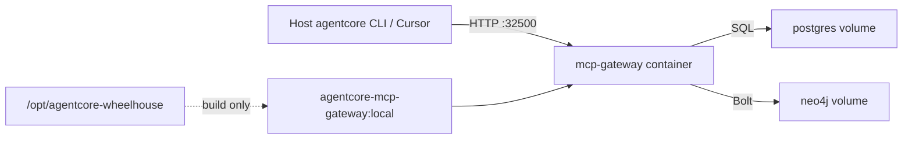

# 43 - App Docker And Wheelhouse Runbook

## Purpose

This runbook explains the **shipped** application-container path for AgentCore:

1. Export packages from the host `.venv` into a wheelhouse under `/opt/agentcore-wheelhouse`.
2. Build the `mcp-gateway` image using only that wheelhouse (`pip --no-index`).
3. Start Compose profiles `core` + `app` so Postgres, Neo4j, and MCP HTTP run as containers.
4. Verify health and MCP `initialize`.

Implementation status: **shipped** for the MCP HTTP gateway wedge. Per-service FastAPI mesh containers are **not** shipped yet. Host `.venv` + `agentcore` CLI remain the operator control plane for sync, connect, doctor, and project state.

## What works today

| Capability | Works? | How |
| --- | --- | --- |
| MCP HTTP API from the host | Yes | `http://127.0.0.1:32500/health` and `/mcp` |
| Postgres / Neo4j persistence | Yes | Compose named volumes |
| `agentcore` on **host** `PATH` after `docker compose up` | **No** | Docker does not install host PATH entries; use host `.venv` / `install.sh` |
| Same full CLI workflow **inside** the container | **Partial** | `docker exec … agentcore version` works; most operator flows still expect host checkout + `.agentcore/` state |
| Bind-mount of host project profiles into `mcp-gateway` | **No** | Image copies source at build; no runtime bind of `.agentcore/` |

## Runtime topology



| Step | Actor | Action | Result |
| --- | --- | --- | --- |
| 1 | Operator | `bash scripts/build-wheelhouse.sh` | Wheels written under `/opt/agentcore-wheelhouse` |
| 2 | Docker build | `pip install --no-index --find-links=…` | Deps baked into image |
| 3 | Compose `core` | Start `postgres`, `neo4j` | Healthy infra on non-default host ports |
| 4 | Compose `app` | Start `mcp-gateway` | MCP HTTP on host port `32500` (overrideable) |
| 5 | Client | `GET /health` / `POST /mcp` | Runtime proof |

## Wheelhouse

Default path: `/opt/agentcore-wheelhouse` (override with `AGENTCORE_WHEELHOUSE`).

```bash
# From repository root, with a working .venv
bash scripts/build-wheelhouse.sh
```

The script:

- freezes non-editable packages from `.venv`
- downloads/builds matching `.whl` files into the wheelhouse
- builds a local `agentcore==0.1.0` wheel from the checkout
- writes `requirements.txt` and `MANIFEST.txt`

Rebuild the wheelhouse after material dependency changes in `.venv`.

## Build and start

Prefer the installer (prompts for host vs docker, always installs PATH + prerequisites when interactive):

```bash
bash install.sh
# or non-interactive:
bash install.sh --non-interactive --runtime docker
```

Manual steps (equivalent to `--runtime docker`):

Prerequisites: Docker Engine, Compose v2 plugin, `backend/deployments/compose/.env.local` (from `install.sh` stage `03_compose_env` or full `install.sh`).

```bash
bash scripts/build-wheelhouse.sh

docker compose --env-file backend/deployments/compose/.env.local \
  -f backend/deployments/compose/compose.yaml \
  --profile core --profile app up -d --build postgres neo4j mcp-gateway
```

One-shot smoke (rebuilds wheelhouse unless skipped):

```bash
bash tests/e2e/docker/run-app-docker-smoke.sh
SKIP_WHEELHOUSE=1 bash tests/e2e/docker/run-app-docker-smoke.sh
```

Unit packaging checks:

```bash
.venv/bin/python -m pytest tests/backend/tools/docker/test_app_docker_packaging.py -q
```

## PATH and CLI

### Host PATH

Bringing Compose up **must not** be expected to put `agentcore` on the host `PATH`. Host PATH comes from:

- `bash install.sh` / `scripts/ensure-venv.sh` creating `.venv/bin/agentcore`
- optional symlink into `~/.local/bin` via `agentcore path` / installer behavior

Use the host CLI for `doctor`, `service`, `sync`, `connect`, `init`, and profile management.

### Inside the container

The image installs `agentcore` at `/usr/local/bin/agentcore`:

```bash
docker exec agentcore-mcp-gateway-1 agentcore version
```

Do **not** treat `docker exec … agentcore service start` as the primary operator path: that command orchestrates host Compose + a host-side MCP daemon and expects the repository checkout layout under `.agentcore/run/`.

### Port conflict

Host `agentcore service start` and Compose `mcp-gateway` both default to host port `32500`. Only one listener can own that port. The app Docker smoke stops the host MCP HTTP daemon when the port is busy. Prefer **either** host MCP **or** container MCP for local work, not both on the same port.

## Data mounts and persistence

| Data | Where it lives | Mounted into `mcp-gateway`? |
| --- | --- | --- |
| PostgreSQL databases | Docker volume `agentcore_agentcore-postgres-data` | No (network only: hostname `postgres`) |
| Neo4j store | Docker volume `agentcore_agentcore-neo4j-data` | No (network only: hostname `neo4j`) |
| SQL init migrations | Bind-mounted into `postgres` at first init | N/A |
| MCP gateway source + deps | Copied into the image at **build** time | No runtime source bind |
| Host `.agentcore/` profiles / sync state | On the host checkout | **Not** mounted today |
| Wheelhouse | `/opt/agentcore-wheelhouse` on host | Build context only (not a runtime volume) |

Implication: graph/SQL state persists across container recreate via named volumes. Operator profile files and sync pins on the host are **not** automatically shared into the gateway container. MCP clients that only need the HTTP gateway + DB-backed stores can use the container; workflows that depend on host `.agentcore/` state must keep using the host CLI (or a future bind-mount design).

Compose sets container DB hosts via env (`AGENTCORE_POSTGRES_HOST=postgres`, `AGENTCORE_NEO4J_HOST=neo4j`). The entrypoint rewrites `AGENTCORE_DATABASE_URL` / `AGENTCORE_NEO4J_URI` accordingly.

## Verification

```bash
curl -sS http://127.0.0.1:32500/health
# Expect: {"status":"ok","service":"mcp-gateway-http",...}

docker ps --filter name=agentcore-mcp-gateway --format '{{.Names}} {{.Status}}'
# Expect: ... (healthy)
```

MCP `initialize` requires a bearer token (`AGENTCORE_MCP_HTTP_TOKEN`, default in Compose for local lab: `agentcore-docker-dev-token`) plus scope headers `X-Tenant-Id`, `X-Workspace-Id`, `X-Project-Id`.

Evidence from smoke: `tmp/docker-app-smoke/`.

## Troubleshooting

| Symptom | Likely cause | Fix |
| --- | --- | --- |
| `address already in use` on `32500` | Host MCP still running | Stop host MCP (`agentcore` service runtime stop) or change `AGENTCORE_MCP_HTTP_PORT` |
| Image build cannot find wheels | Empty `/opt/agentcore-wheelhouse` | Run `bash scripts/build-wheelhouse.sh` |
| `ModuleNotFoundError` in gateway logs | Image built before required service COPY | Rebuild: `compose … up -d --build mcp-gateway` |
| `/health` OK but CLI sync fails | Expected: sync is host CLI + host state | Run `agentcore sync` on the host against the same Postgres/Neo4j ports |

## Related Documents

- [39-local-install-runbook.md](./39-local-install-runbook.md) — host bootstrap (`.venv` + Compose `core`)
- [06-local-venv-docker-and-port-policy.md](../13-technology-stack-and-platform-decisions/06-local-venv-docker-and-port-policy.md) — venv vs Docker progression
- [36-agentcore-cli.md](./36-agentcore-cli.md) — host CLI overview
- [backend/deployments/docker/README.md](../../backend/deployments/docker/README.md) — Dockerfile boundary
- [backend/deployments/compose/README.md](../../backend/deployments/compose/README.md) — Compose profiles
- [tests/e2e/docker/README.md](../../tests/e2e/docker/README.md) — app Docker smoke
