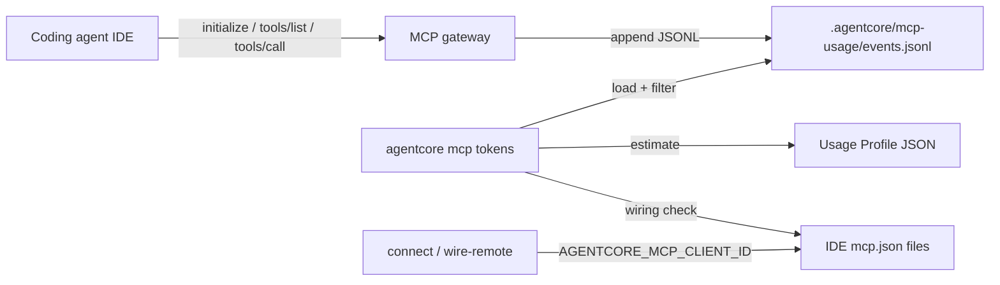

# 44 - MCP Token Accounting

## Purpose

Coding agents pay context tokens for every MCP server they load. AgentCore exposes a
large Usage Profile catalog, but Cursor (and similar IDEs) only receive the **mcp-lazy
facade** (`mcp_search_tools` / `mcp_execute_tool`) on `tools/list`. Operators still need
to know:

1. How many tokens a **connect** costs today (lazy vs accidental full-catalog dump).
2. Which **heavy tool responses** dominate later turns.
3. How usage aggregates over a **time range**, by **IDE client id** and **scope id**
   (`tenant/workspace/project`).

This document is the normative home for that behavior. The operator entrypoint is
`agentcore mcp tokens`. Catalog flags live in
[42-agentcore-cli-command-reference-part-4.md](./42-agentcore-cli-command-reference-part-4.md).

**Implementation status:** shipped in this repository (CLI estimate + gateway JSONL
usage log + unit tests). Token figures are **approximate** (UTF-8 bytes/4), not
provider-billed counts.

## Goals and Non-Goals

### Goals

- Estimate connect cost from the active Usage Profile without starting an IDE session.
- Compare lazy `tools/list` size to the full catalog size operators would pay if the
  gateway dumped every tool schema into context.
- Estimate large static / profile payloads (for example
  `agentcore_docs_authoring_standards`, `agentcore_get_effective_profile`).
- Attribute live MCP traffic with `client_id` and `scope` for filtering
  (`all` / one / many).
- Keep logging best-effort so a disk failure never breaks the MCP session.

### Non-Goals

- Replacing LiteLLM / provider billing meters.
- Streaming per-token counters into Neo4j or the admin UI (out of scope for this slice).
- Guaranteeing exact parity with a specific model tokenizer.
- Measuring non-AgentCore MCP servers (ai-toolstack `mcp-lazy` stats remain separate).

## Architecture



| Step | Actor | Action | Result |
| --- | --- | --- | --- |
| 1 | Operator / `connect` | Writes MCP config; stamps `AGENTCORE_MCP_CLIENT_ID` per client | Stdio env carries client id |
| 2 | IDE | Spawns MCP; sends `initialize`, then `tools/list` | Gateway returns lazy facade (2 tools) |
| 3 | Gateway | Appends usage event (`tokens_out` ≈ payload bytes/4) | Row in `events.jsonl` |
| 4 | IDE agent | Calls `mcp_search_tools` / `mcp_execute_tool` | Gateway logs each `tools/call` |
| 5 | Operator | Runs `agentcore mcp tokens --since … --clients … --id …` | Report: estimate + wiring + history |

## Vocabulary

| Term | Meaning |
| --- | --- |
| Connect cost | Tokens injected when the IDE loads `tools/list` for AgentCore |
| Lazy facade | The two proxy tools advertised on `tools/list` instead of the full catalog |
| Client id | IDE target id from `mcp_client_targets` (`cursor`, `vscode`, …) |
| Scope id | `tenant/workspace/project` string used in history grouping |
| Approx token | `len(utf8_json) // 4` (same heuristic as sync usage) |

## Connect estimate

`estimate_connect(profile_id)` loads `backend/configs/usage-profiles/<profile_id>.json`
and computes:

| Metric | Source |
| --- | --- |
| `lazy_tools_list_tokens` | JSON size of `lazy_tools_list(server_name)` |
| `full_catalog_tools_list_tokens` | JSON size of every profile tool name + description + `input_schema` |
| `saved_vs_full_catalog` | full − lazy (what mcp-lazy avoids on connect) |
| `heavy_tools` | Top search-hit schema sizes + known full responses |

For the default `programming-cursor-mcp` profile on this tree, a typical local run shows
on the order of **~300** lazy connect tokens versus **~3k** if the full catalog were
listed — exact numbers drift as tools are added; always re-run the CLI.

Heavy full-response estimates **must** include:

- `agentcore_docs_authoring_standards` — static Full-tier authoring law payload
  (`common_context_service.documentation_authoring_law.authoring_law_payload`).
- `agentcore_get_effective_profile` — serialized Usage Profile object size.

## Usage log contract

### Location

| Item | Default | Override |
| --- | --- | --- |
| Directory | `<AGENTCORE_ROOT>/.agentcore/mcp-usage/` | `AGENTCORE_MCP_USAGE_LOG_DIR` |
| File | `events.jsonl` | (fixed name under the directory) |
| Cap | 256 MiB | `AGENTCORE_MCP_USAGE_LOG_MAX_BYTES` (minimum 1 MiB) |

When the file exceeds the cap, the writer drops the oldest half of lines (best-effort
FIFO trim). The directory is gitignored (`.agentcore/` and `**/mcp-usage/`).

### Event shape

Each line is one JSON object. Gateway always overwrites `ts` with server UTC time.

| Field | Type | Required | Notes |
| --- | --- | --- | --- |
| `ts` | string | yes | ISO-8601 UTC with `Z` |
| `event` | string | yes | `initialize` \| `tools/list` \| `tools/call` |
| `tool` | string | yes | Method or tool name |
| `tokens_in` | int | yes | Approx request size |
| `tokens_out` | int | yes | Approx response size |
| `client_id` | string | yes | `AGENTCORE_MCP_CLIENT_ID` or `unknown` |
| `scope` | string | yes | `tenant/workspace/project` or `unknown` |
| `usage_profile` | string | yes | Active profile id |

Logging **must** be best-effort: `append_mcp_usage_event` catches all exceptions and
returns `None` on failure so MCP JSON-RPC is never broken by I/O.

### Who writes

`mcp_gateway_service.server.handle_message` logs after successful handling of
`initialize`, `tools/list`, and `tools/call` (stdio and HTTP both use this path).

## Client and scope filtering

### Client ids (`--clients`)

Same resolver as connect / wire-remote: `resolve_client_ids`.

| Value | Behavior |
| --- | --- |
| `all` / `*` | Project-scoped defaults (`cursor`, `windsurf`, `vscode`, `claude-code`, `continue`, `fragment`) for wiring; history includes **all** logged clients |
| `cursor` | One client |
| `cursor,vscode` | Explicit set; history filters to those ids only |

User-global targets (`cursor-user`, `claude-desktop`) require
`--include-user-clients` for wiring checks.

At write time, `write_fragment_to_clients` deep-copies the fragment and sets
`env.AGENTCORE_MCP_CLIENT_ID` per client so history can attribute sessions.

### Scope ids (`--id`)

| Value | Behavior |
| --- | --- |
| `all` / `*` / omitted | No scope filter on history |
| `mir/dev/agentcore` | One scope |
| `mir/dev/agentcore,acme/eng/p` | Several scopes (comma-separated) |

Scope strings are compared case-insensitively after trim.

## CLI

```bash
agentcore mcp tokens [--usage-profile PROGRAMMING] \
  [--since 24h|7d|30d|ISO] [--until ISO] \
  [--clients all|id[,id…]] [--id all|scope[,scope…]] \
  [--project-dir PATH] [--include-user-clients] \
  [--format text|json]
```

| Flag | Default | Role |
| --- | --- | --- |
| `--usage-profile` | `programming-cursor-mcp` | Profile for connect estimate |
| `--since` / `-s` | last 7d | History window start |
| `--until` / `-u` | now | History window end |
| `--clients` | `all` | IDE client filter / wiring selection |
| `--id` | `all` | Scope filter for history |
| `--project-dir` | cwd | Root for mcp.json wiring detection |
| `--include-user-clients` | off | Also check user-global configs |
| `--format` / `-f` | `text` | `text` or `json` |

### Report sections

1. **Connect cost** — lazy vs full catalog vs savings.
2. **Heavy tool payloads** — ranked estimates.
3. **Clients** — selected ids, wired paths, `wired_count × lazy_connect` hint.
4. **History** — totals plus breakdowns by `client_id`, `scope_id`, and `tool`.

Empty history is valid: the report **must** state that events appear after an IDE MCP
session hits the gateway.

## Configuration and environment

| Variable | Used by | Purpose |
| --- | --- | --- |
| `AGENTCORE_ROOT` | CLI / log paths | Repo root resolution |
| `AGENTCORE_MCP_USAGE_LOG_DIR` | Log writer / reader | Relocate usage directory |
| `AGENTCORE_MCP_USAGE_LOG_MAX_BYTES` | Log writer | Cap before FIFO trim |
| `AGENTCORE_MCP_CLIENT_ID` | Gateway | Attribution on each event |
| `AGENTCORE_USAGE_PROFILE` | Gateway | Profile id recorded on events |
| `AGENTCORE_TENANT_ID` / `WORKSPACE_ID` / `PROJECT_ID` | Gateway | Scope string on events |

## Failure modes

| Failure | Behavior | Operator action |
| --- | --- | --- |
| Missing Usage Profile | CLI exits with profile loader error | Fix `--usage-profile` / catalog file |
| Unknown `--clients` id | CLI exits listing known ids | Run `agentcore client list-mcp-clients` |
| Log directory unwritable | Gateway continues; event dropped | Fix permissions / disk |
| Log over max bytes | Oldest half of lines discarded | Archive externally if needed |
| `client_id` missing in env | Events use `unknown` | Re-run `connect` / `wire-remote` so env is stamped |
| History empty | Report shows zero calls | Connect IDE MCP once, then re-run |

## Security and data boundary

- Usage events **must not** store tool argument bodies or response text — only sizes,
  names, scope, and client id.
- Logs stay under the private AgentCore host (default `.agentcore/`); do not upload to
  cloud without explicit operator consent (`no-cloud-exfiltration` law).
- Examples in docs **must not** include bearer tokens or secrets.

## Testing

| Check | Location |
| --- | --- |
| Relative `--since`, scope parse, lazy < full estimate, aggregate filters, text format | `tests/backend/tools/agentcore-cli/test_mcp_tokens.py` |
| Lazy `tools/list` RPC and execute path (logging must not break) | `tests/backend/services/mcp-gateway-service/test_mcp_gateway.py` |

Run:

```bash
.venv/bin/python -m pytest tests/backend/tools/agentcore-cli/test_mcp_tokens.py \
  tests/backend/services/mcp-gateway-service/test_mcp_gateway.py -q
```

## Implementation map

| Path | Role |
| --- | --- |
| `backend/packages/agentcore_cli/commands/mcp_tokens.py` | CLI entry `cmd_mcp_tokens` |
| `backend/packages/agentcore_cli/mcp_token_report.py` | Estimate, time range, aggregate, text/json |
| `backend/packages/agentcore_cli/mcp_usage_log.py` | JSONL append / load / trim |
| `backend/packages/agentcore_cli/mcp_client_targets.py` | Client ids; stamp `AGENTCORE_MCP_CLIENT_ID` on write |
| `backend/packages/agentcore_cli/parser/profiles.py` | Argparse for `mcp tokens` |
| `backend/services/mcp-gateway-service/src/mcp_gateway_service/server.py` | Emit usage events |
| `backend/services/mcp-gateway-service/src/mcp_gateway_service/lazy_facade.py` | Lazy tools list used by estimate |

## Related Documents

- [35-usage-profile-and-cursor-mcp-onboarding.md](./35-usage-profile-and-cursor-mcp-onboarding.md) — Usage Profile and MCP surface
- [36-agentcore-cli.md](./36-agentcore-cli.md) — CLI install and overview
- [42-agentcore-cli-command-reference-part-4.md](./42-agentcore-cli-command-reference-part-4.md) — compact `mcp tokens` catalog row
- [40-remote-dev-client-mcp-wiring.md](./40-remote-dev-client-mcp-wiring.md) — client id table and wire-remote
- [41-one-command-cross-platform-agent-onboarding.md](./41-one-command-cross-platform-agent-onboarding.md) — connect UX
- [14-observability-and-debuggability-engineering.md](./14-observability-and-debuggability-engineering.md) — broader observability principles
