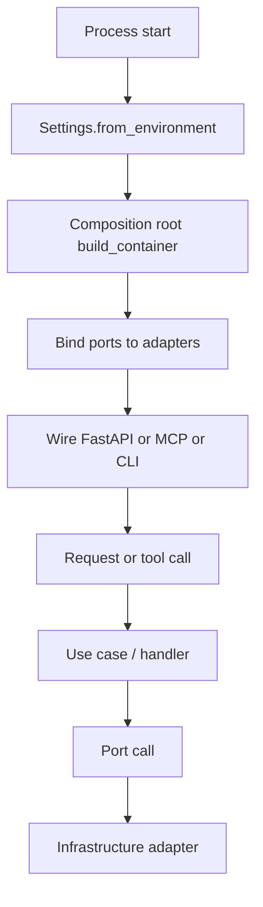

# 45 - Backend DI Composition Feature Specification

## Implementation status

**Phase A+B shipped (2026-07-23):** pathfinders (`code-graph`, MCP) plus all
listed thin services use `ServiceContainer` / `build_container` / `build_app` with
`app.state.container`. Gate includes `di-thin-services-phase-b`.

Phases C–D (port hygiene, CLI) remain **not shipped** — see `47` / `48`.

## Purpose

Specify how AgentCore Python backends must structure Dependency Injection so every
deployable process has one visible composition root, application code receives
dependencies through constructors/ports, and tests replace infrastructure without
touching business logic.

## Goals

1. One composition root per process (HTTP service, MCP gateway, CLI worker entry).
2. Constructor injection as the default; FastAPI request wiring only as a thin adapter over `app.state`.
3. No third-party DI container required for v1 of this migration.
4. No service locator, global mutable singletons, or `os.environ` reads inside domain/application layers.
5. Unit tests construct application services with fakes only.
6. Phased rollout starting with `code-graph-service` and `mcp-gateway-service`, then thin services.

## Non-goals

- Detecting DI patterns in **customer** repositories (already covered by code-graph `di_injections.py`).
- Introducing Guice / Spring / `dependency-injector` frameworks.
- Auto-wiring circular graphs or runtime bean scanning.
- Rewriting domain algorithms unrelated to wiring.
- Multi-tenant SaaS isolation work (separate GAP track).

## Actors and jobs

| Actor | Job |
| --- | --- |
| Platform engineer | Wire a new service without hiding infra construction in handlers |
| Test author | Replace Store / LLM / clock with fakes at construction time |
| Operator | Start one process and get deterministic dependency graph at boot |
| Coding agent | Follow composition-root map instead of inventing `get_instance()` helpers |

## Current as-is (honest)

| Area | Today |
| --- | --- |
| Principles | Doc `30` normative |
| code-graph | `bootstrap.build_service(Settings)` constructor-injects Store/docs/embeddings/LLM |
| mcp-gateway | `store_factory.build_stores()` builds a `StoreBundle`; backends take bundle in `__init__` |
| Thin services | Minimal `bootstrap.build_service()` → `Service(PostgresStore(url))` |
| FastAPI | Often `service = service or build_service()` at app factory — process singleton, not request DI |
| Gaps | Uneven port surfaces; some env reads leak; no gate proving “no infra in application” |

## Target behavior

### Composition root contract

Each process **must** expose:

- `Settings.from_environment(environ) -> Settings` (typed, validated)
- `build_container(settings) -> ServiceContainer` (frozen dataclass of ports/adapters)
- `build_app(container) -> FastAPI` or equivalent entry (MCP/CLI)
- `shutdown(container)` closing pools/clients

Handlers and use-cases **must** receive already-built application services (or ports), never call `build_service()` themselves except in tests’ explicit arrange step.

### Primary flow

| Step | Actor | Action | Outcome |
| --- | --- | --- | --- |
| 1 | Process | Load and validate settings | Typed `Settings` or fail fast |
| 2 | Composition root | Construct adapters and application services | Frozen `ServiceContainer` |
| 3 | Framework adapter | Attach container to `app.state` / CLI context | Handlers can resolve without globals |
| 4 | Handler | Call use case with injected deps | No env/DB construction in handler |
| 5 | Shutdown | Close pools/clients via container | Clean teardown |

## Functional requirements

| ID | Requirement |
| --- | --- |
| DI-01 | Every backend service under `backend/services/*` has a single composition-root module (keep name `bootstrap.py` or rename to `wiring.py` consistently per phase). |
| DI-02 | Application/domain packages must not import concrete `*Store` / Neo4j / LiteLLM clients except via ports in infrastructure. |
| DI-03 | `ServiceContainer` is a frozen dataclass (or equivalent) listing named dependencies; no mutable global registry. |
| DI-04 | FastAPI routes obtain services from `request.app.state.container` (or constructor-captured closure from `build_app`), not from importing a module-level singleton. |
| DI-05 | Unit tests construct use cases with in-memory fakes; live tests may use real adapters only behind markers. |
| DI-06 | MCP gateway composition root owns `StoreBundle` + graph facade; tool backends receive ports, not rebuild stores. |
| DI-07 | Circular imports between application packages and infrastructure are forbidden; dependency direction is inward. |
| DI-08 | A verification gate lists services and fails if application modules import banned infrastructure symbols. |

## Out of scope for Phase A code (when implementation starts)

- Full rewrite of all thin services in one PR (Phase B).
- Admin UI DI.
- Changing public HTTP/MCP contracts except dependency wiring internals.

## Success metrics

- All Phase A services boot only through composition root.
- Gate test green for banned imports.
- Existing code-graph and MCP unit suites remain green with fakes.
- New contributor can wire a dependency by editing one composition-root function.

## Related Documents

- `30-dependency-injection-and-composition-root.md` — standing principles
- `46-backend-di-composition-high-level-design.md` — topology
- `47-backend-di-composition-low-level-design.md` — phased migration map
- `48-backend-di-composition-risks-challenges-and-acceptance.md` — gates
