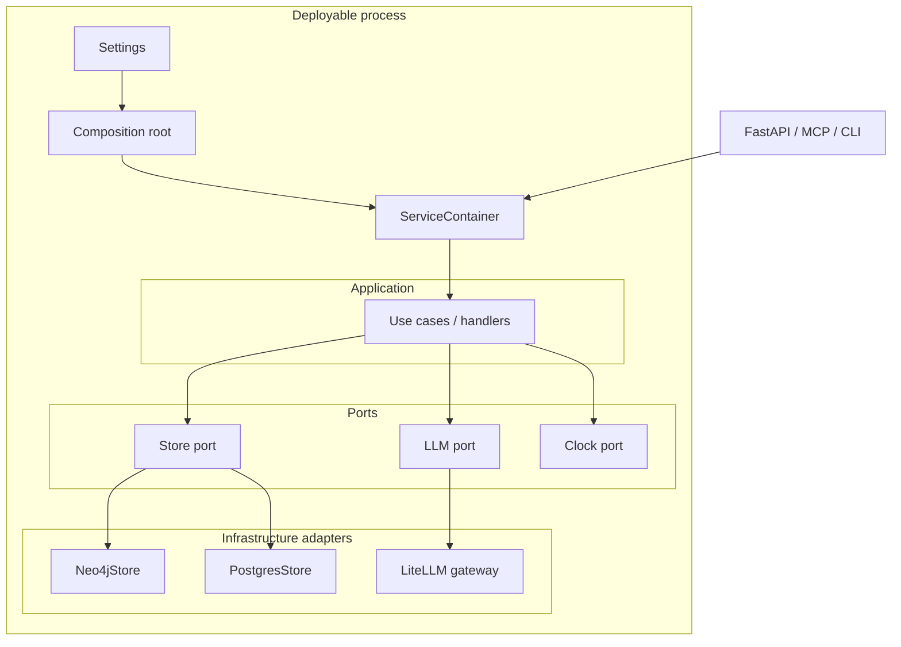

# 46 - Backend DI Composition High Level Design

## Implementation status

**Phases A–D shipped** for code-graph, MCP, thin-service composition roots, port
hygiene (`ports.py` + allowlisted `PostgresStore` imports), and CLI process-scoped
container reuse.

## Purpose

Describe the runtime topology for Dependency Injection across AgentCore Python
processes without introducing a third-party IoC container.

## Architecture overview

| Step | Actor | Action | Outcome |
| --- | --- | --- | --- |
| 1 | Bootstrap | Bind settings → adapters → use cases | `ServiceContainer` |
| 2 | HTTP/MCP/CLI | Hold container for process lifetime | Single wiring graph |
| 3 | Use case | Call ports only | Swappable adapters |
| 4 | Adapter | Talk to Neo4j/Postgres/LiteLLM | Infra isolated |

## Components

| Component | Responsibility |
| --- | --- |
| Settings | Typed env validation; no I/O beyond reading mapping |
| Composition root | Only place allowed to `new` infrastructure clients |
| ServiceContainer | Frozen bundle of application services and shared adapters |
| Ports | Protocols / ABCs owned by application or domain |
| Adapters | Implement ports; live under `infrastructure/` or `*_store.py` |
| Framework adapter | FastAPI lifespan / MCP server ctor attaches container |

## Process variants

| Process | Composition root today (as-is anchor) | Target |
| --- | --- | --- |
| code-graph HTTP | `code_graph_service.bootstrap` | `build_container` + `build_app(container)` |
| MCP gateway | `mcp_gateway_service.store_factory` + server ctor | One root producing `StoreBundle` + backends |
| Thin microservice | `*_service.bootstrap.build_service` | Same pattern; shared checklist |
| CLI (`agentcore`) | Command modules call services | Commands receive container or call root once |

## Dependency rules

- Application → ports (OK)
- Infrastructure → ports implementations (OK)
- Application → infrastructure concrete classes (**forbidden**)
- Framework adapter → composition root (**OK**, only at edge)
- Domain → framework FastAPI/MCP types (**forbidden**)

## Lifetimes

| Lifetime | Examples |
| --- | --- |
| Process | DB pools, Neo4j driver, LiteLLM gateway, embedding model |
| Request/job | Correlation id, scoped auth claims (not new DB engines) |
| Transient | Pure value objects, command DTOs |

## Failure modes (design)

| Failure | Handling |
| --- | --- |
| Missing env | Fail at Settings validation before binding adapters |
| Adapter construct error | Fail boot; do not serve half-wired app |
| Handler imports Store | Caught by import gate in Phase A/B |
| Accidental second root | Single `build_app` entry; tests assert one container identity |

## Related Documents

- `45-backend-di-composition-feature-specification.md`
- `47-backend-di-composition-low-level-design.md`
- `48-backend-di-composition-risks-challenges-and-acceptance.md`
- `30-dependency-injection-and-composition-root.md`
