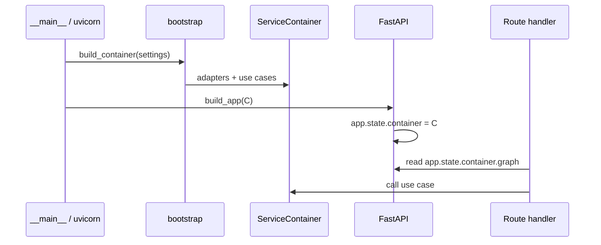

# 47 - Backend DI Composition Low Level Design

## Implementation status

**Phase A+B implemented.** Phases C–D remain design-ahead. Do not mark the whole
backend “on DI” until Phase C acceptance in `48` is checked.

## Purpose

Give engineers a concrete migration map: target types, file touch list, FastAPI
wiring recipe, and phased PRs so the backend structure moves onto explicit DI
without a big-bang rewrite.

## Target types (sketch)

```python
@dataclass(frozen=True)
class ServiceContainer:
    settings: Settings
    graph: CodeGraphService  # or MemoryService, etc.
    # optional shared ports:
    # clock: Clock
    # id_factory: IdFactory

def build_container(settings: Settings | None = None) -> ServiceContainer: ...
def build_app(container: ServiceContainer | None = None) -> FastAPI: ...
async def lifespan(app: FastAPI):
    # startup already done; shutdown closes container resources
    ...
```

Thin services use the same names even if the container has a single field.

## Primary wiring flow



| Step | Actor | Action | Outcome |
| --- | --- | --- | --- |
| 1 | Entrypoint | `container = build_container()` | Wired graph |
| 2 | Entrypoint | `app = build_app(container)` | Routes closed over / state-bound |
| 3 | Handler | Use `container.*` only | No local `build_service()` |
| 4 | Shutdown | `container` close hooks | Pools released |

## FastAPI recipe (normative for Phase A+)

**Allowed**

- `app.state.container = container` in `build_app`
- Optional `Depends(_get_container)` where `_get_container(request) -> ServiceContainer` reads `request.app.state.container`

**Forbidden**

- Module-level `SERVICE = build_service()` mutated at import time
- Handlers calling `build_service()` on each request
- Domain modules importing `fastapi.Depends`

## Banned import set (gate)

Application modules under `*/application/**` and `*/domain/**` must not import:

- `neo4j`
- concrete `PostgresStore` / `Neo4jStore` modules (except type checking in ports package if split)
- `os.environ` (use injected Settings)
- `httpx` / vendor LLM SDKs directly

Infrastructure and `bootstrap.py` / `wiring.py` may import them.

## Migration phases

### Phase A — Pathfinders (first code PR)

| Touch | Change |
| --- | --- |
| `code-graph-service/.../bootstrap.py` | Add `ServiceContainer` + `build_container`; keep `build_service` as thin wrapper returning `.graph` for compat |
| `code-graph-service/.../api.py` | `create_app(container=None)` stores container on `app.state`; remove per-call `build_service()` |
| `mcp-gateway-service/.../store_factory.py` | Treat as composition root; document `StoreBundle` as container |
| `mcp-gateway-service` backends | Construct only with injected stores/services |
| `tests/backend/gates/di-composition-verification/` | New gate: pathfinders have `build_container` / `app.state.container` |

**Verify:** existing code-graph + MCP unit tests; new gate.

### Phase B — Thin services template

Apply the same `ServiceContainer` + `build_app` pattern to:

`memory-service`, `core-data-service`, `docs-sync-service`, `rule-engine-service`,
`orchestration-service`, `audit-service`, `adapter-service`, `identity-access-service`,
`project-profile-service`, `reporting-service`, `common-context-service`.

Each PR: one service + its unit tests. Shared checklist only—no shared mega-container across processes.

### Phase C — Port hygiene

Where application code still imports concrete stores:

1. Extract Protocol in `domain/ports.py` (or existing ports module).
2. Move construction solely into bootstrap.
3. Expand import gate to that service.

### Phase D — CLI

`agentcore` long-running paths that embed services must call composition roots once per process, not per subcommand silently rebuilding pools when avoidable.

## Compatibility strategy

| Concern | Approach |
| --- | --- |
| Callers of `build_service()` | Keep function as `return build_container().graph` during Phase A |
| Tests constructing `CodeGraphService(store)` | Remain valid (constructor injection) |
| Public HTTP paths | Unchanged |
| MCP tool names | Unchanged |

## Test plan (with implementation)

| Family | What |
| --- | --- |
| Unit | Container builds with fakes; handler uses injected service |
| Gate | Banned imports; presence of `build_container` / `app.state.container` |
| Regression | Existing service unit suites |
| Live | Optional smoke boot of MCP + code-graph after Phase A |

## Implementation map (future code)

| Path | Role after migration |
| --- | --- |
| `backend/services/<svc>/src/<pkg>/bootstrap.py` | Settings + `build_container` + shutdown |
| `backend/services/<svc>/src/<pkg>/api.py` | `build_app(container)` |
| `backend/services/<svc>/src/<pkg>/domain/ports.py` | Protocols |
| `backend/services/<svc>/src/<pkg>/*_store.py` | Adapters only |
| `tests/backend/gates/di-composition-verification/` | Enforceability |

## Related Documents

- `45-backend-di-composition-feature-specification.md`
- `46-backend-di-composition-high-level-design.md`
- `48-backend-di-composition-risks-challenges-and-acceptance.md`
