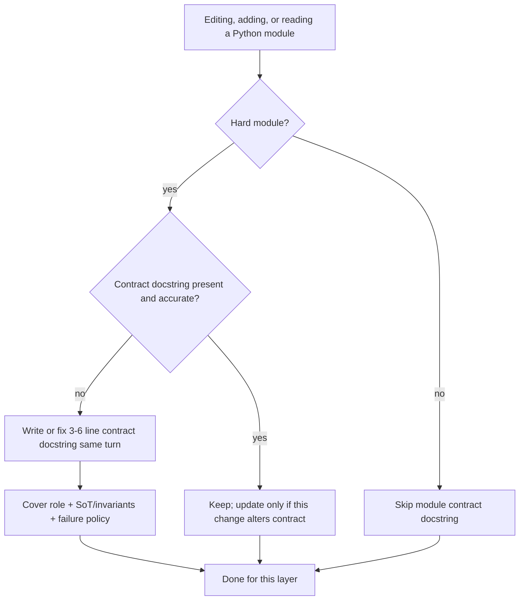

# 49 - Module Contract Docstrings Standard

## Purpose

Define when and how AgentCore modules **must** carry a short **module-level contract docstring**
so coding agents and humans learn non-obvious system contracts without reading the whole file
or inventing the wrong source of truth.

This standard is **selective**. It does **not** require a module docstring on every file.
Signal density beats volume: stale or obvious headers lower agent quality.

In-source tagged rationale (`# WHY:` / `# NOTE:` / `# HACK:`) and Full-tier Markdown under
`docs/` remain separate layers (see Related Documents). This document owns only the
**module header contract** pattern.

## Goals And Non-Goals

### Goals

- Raise agent edit quality on hard modules (queues, workers, dual-store durability, state machines,
  trust boundaries, fail-open / fail-closed policy).
- Give a fixed three-axis template so headers stay short and comparable.
- Keep English-only committed source aligned with project language law.
- Make freshness an explicit duty when contracts change.

### Non-Goals

- Replacing `# WHY:` / `# NOTE:` / `# HACK:` rationale comments (statement-level intent).
- Replacing Full-tier design / LLD Markdown under `docs/`.
- Mandating module docstrings on CRUD mappers, DTO-only modules, constants, thin re-exports,
  or other files whose behavior is obvious from names and types.
- Long architecture essays in source (those belong in `docs/`).
- Per-file encyclopedias in folder `README.md` files (those are rejected; see `50-package-folder-readme-standard.md`).

## Decision Flow



| Step | Condition | Action |
| --- | --- | --- |
| 1 | Module is not “hard” (see When Required) | Do not add a module contract docstring |
| 2 | Hard module, missing or wrong header (on edit **or** on Read) | Write/fix 3–6 lines using the three-axis template in the **same turn** |
| 3 | Hard module, header still true after the change | Leave it; do not expand for style |
| 4 | Change alters SoT, wake path, or fail policy | Update the docstring in the **same** change |

## When Required

A module **must** have a module-level contract docstring when **any** of the following is true:

| Trigger | Examples |
| --- | --- |
| Dual durability / wake path | DB is SoT; Redis LIST is a wake signal rebuilt from DB |
| Worker / queue / outbox / inbox | One-at-a-time analysis queue; lease reclaim; poison handling |
| Explicit fail-open or fail-closed | Redis timeout fails open to DB poll; authz fails closed |
| State machine or ticket lifecycle | `queued` / `analyzing` as durable states |
| Trust boundary or security policy | Tenant isolation seam; approval gate; secret redaction entry |
| Non-obvious ordering or exclusivity | Single-flight, fencing token, sticky shard |

A module **should** get one when agents repeatedly mis-edit it (wrong SoT, treating wake-layer
outages as crashes, “fixing” fail-open into fail-closed).

### When To Skip

Skip when the file is:

- Pure helpers whose contracts are the type signatures.
- Thin HTTP/MCP route wiring with no local durability policy.
- Generated code, `__init__` re-exports, fixture-only modules.
- Already covered by a neighboring hard module’s header **and** this file has no extra contract.

Do **not** paste the same essay into every related file. One SoT header at the ownership seam.

## Three-Axis Template

Module docstring (Python triple-quote at file top, after shebang/`from __future__` if any):
**3–6 lines**, English, covering all three axes:

1. **Role** — what this module owns in one sentence.
2. **Source of truth / invariants** — which store or state is authoritative; what must stay true.
3. **Allowed vs forbidden failures** — what may fail open, what must never be treated as an unexpected crash, what must fail closed.

Optional fourth line only if needed: **wake / rebuild / recovery** hint (e.g. rebuild queue from DB on startup).

Do not narrate line-by-line implementation. Do not list every function. Do not market the feature.

## Normative Example

Good (hard module — dual store + fail-open):

```python
"""
Persistent MA analysis queue — one malware sample at a time.

Durability: PostgreSQL ticket status (`queued` / `analyzing`) is the source of truth.
Redis LIST (`ma:analysis:queue`) wakes the worker; rebuilt from DB on startup.
Redis timeouts/disconnects fail-open to DB poll — never treated as unexpected crashes.
"""
```

Why this works for agents:

- Names the **unit of work** (one sample at a time).
- Pins **SoT** (Postgres ticket status) vs **wake layer** (Redis LIST).
- States **recovery** (rebuild from DB).
- States **failure policy** (fail-open; not a crash).

### Anti-Patterns

| Bad | Why |
| --- | --- |
| `"""Queue helpers."""` | No contract; agents invent SoT |
| Restating `def enqueue(...):` in the module header | Noise; use function docstring or `# WHY:` |
| Multi-page architecture in the module string | Belongs in `docs/`; will go stale |
| Persian or mixed-language committed docstring | Violates English-only source law |
| Header that contradicts the code | Worse than none — delete or fix in the same change |

## Relation To Other In-Source Layers

| Layer | Form | Owns |
| --- | --- | --- |
| **Module contract docstring** (this standard) | File-top `"""…"""` | Module SoT, invariants, failure policy |
| **Public API docstring** | Function/class docstring | Inputs, outputs, raised errors |
| **Tagged rationale** | `# WHY:` / `# NOTE:` / `# HACK:` | Local non-obvious intent → `RATIONALE` on ingest |
| **Stopgap** | `# tsoc-defer: …` | User-approved temporary debt only |
| **Human Markdown** | `docs/…` Full-tier | Architecture, APIs, runbooks, evidence `linked_symbols` |

Preference for agent context overall remains hybrid coverage: human → living → rationale → AST
(`41-hybrid-documentation-coverage.md`). Module contract docstrings are **source text** agents
read when the file is opened; they complement (they do not replace) graph layers.

## Freshness And Definition Of Done

When a change alters any of role / SoT / wake path / fail-open-or-closed policy:

1. Update the module contract docstring in the **same** change.
2. If the contract is now trivial or false, **delete** the header rather than leave a lie.
3. Do not mark the task done while a hard module’s header contradicts the new behavior.

Agents **must** read an existing module contract docstring before “simplifying” durability,
retries, or crash handling in that file.

**Fix-on-read:** When an agent **Reads** a hard module and the file-top contract docstring is
missing or inaccurate, it **must** add or fix the header in the **same turn** (skill
`agentcore-source-contracts` / always-on rule `mcp-first-agentcore` clause 13) before continuing
other work. Skip still applies for non-hard modules.

**Ingest / retrieval:** On file ingest, AgentCore indexes selective module contract docstrings onto the
FILE symbol (`ai_documentation`) and as a `MODULE_CONTRACT` rationale node linked via `DOCUMENTED_BY`,
so explore / generation-context / hybrid coverage can retrieve SoT and fail policy without a wide crawl.

## Verification

- [ ] Hard modules touched by the change have an accurate three-axis header (or an explicit skip reason that matches When To Skip).
- [ ] English only; no `ponytail:` markers; stopgaps use `tsoc-defer` only when user-approved.
- [ ] No duplicate architecture essay that should live only under `docs/`.
- [ ] Header length stays roughly 3–6 lines unless a fourth recovery line is required.

## Related Documents

| Document | Role |
| --- | --- |
| `50-package-folder-readme-standard.md` | Selective folder maps; rejects per-file README encyclopedias |
| `../agents/TEAM-HANDOUT-agentcore-documentation-complete.md` | LIST D in-source practices; points here for module contracts |
| `../07-code-knowledge-graph/41-hybrid-documentation-coverage.md` | Hybrid layer preference order |
| `../07-code-knowledge-graph/03-ingestion-and-living-documentation-workflow.md` | Ingest of symbols and rationale |
| `29-engineering-best-practices-and-implementation-standards.md` | Broader implementation guardrails |
| `09-data-and-persistence-engineering.md` | Persistence / outbox ownership context |
| `.agents/skills/tsoc-source-comments/SKILL.md` | Comment law: English / `tsoc-defer` / no `ponytail:` |
