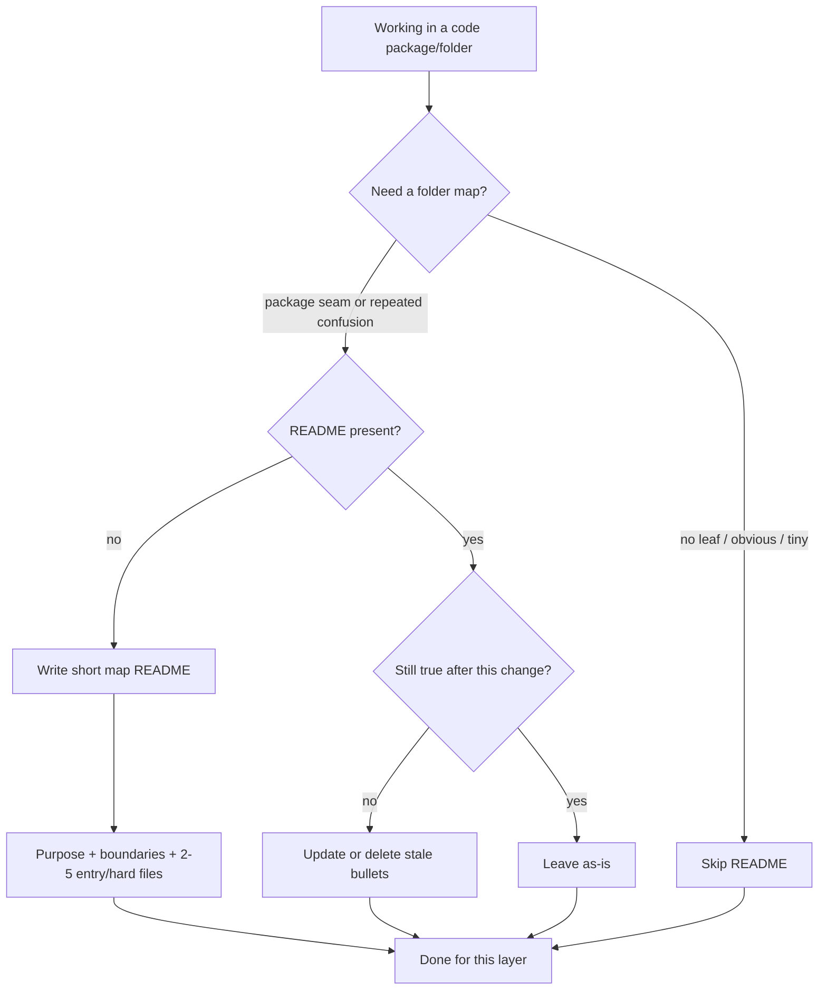

# 50 - Package Folder README Standard

## Purpose

Define when a code package or directory **may** or **must** carry a short `README.md` that
orients humans and agents to **folder ownership**, without turning every directory into a
per-file documentation catalog.

This standard is **selective** and **map-shaped**. A folder README is a navigation aid.
It is **not** the home for source-of-truth / fail-open contracts on hard modules (those stay
in module contract docstrings — see `49-module-contract-docstrings-standard.md`).
It is **not** a substitute for Full-tier design docs under `docs/`.

## Goals And Non-Goals

### Goals

- Give agents a one-screen map: what this folder owns, what it must not do, where to start.
- Keep maintenance cheap: few bullets, few named entry files, English only.
- Reduce wrong-folder edits (putting persistence in transport, waking Redis as SoT, etc.).

### Non-Goals

- Requiring `README.md` in every directory.
- A paragraph (or more) for **every** file in the folder.
- Duplicating module contract docstrings, `# WHY:` comments, or service design Markdown.
- Long architecture, API catalogs, or runbooks inside package READMEs.

## Decision Flow



| Step | Condition | Action |
| --- | --- | --- |
| 1 | Leaf folder, 1–2 obvious files, or generated tree | Skip README |
| 2 | Package / bounded seam / agents mis-place changes here | Ensure short map README |
| 3 | README lists every file with essays | Cut to purpose + boundaries + 2–5 entries |
| 4 | Hard-module SoT / fail policy lives only in README | Move contract into the module docstring (`49-…`); leave a one-line pointer in the map |

## When Required

A package/folder **must** have a `README.md` when **any** of the following is true:

| Trigger | Examples |
| --- | --- |
| Service or shared-package root | `backend/services/<svc>/src/<pkg>/`, `backend/packages/<pkg>/` |
| Layer seam that agents confuse | `application/` vs `infrastructure/`, ingest vs query |
| Non-obvious ownership split | Two queues in sibling folders; which owns rebuild-from-DB |
| Onboarding hotspot | Folder repeatedly opened for first feature work |

A folder **should** get one when newcomers or agents repeatedly ask “which file do I edit?”.

### When To Skip

- `__pycache__`, migrations snapshots, pure test fixture dirs with self-explanatory names.
- Nested folders whose parent README already maps the few files and no extra boundary exists.
- Generated or vendor trees.

Do **not** add empty README stubs “for completeness.”

## Map Template (Normative Shape)

Keep the file short (soft target: **≤ ~40 lines**). English only. Suggested H2s:

```markdown
# <Package or folder name>

## Purpose

One or two sentences: what this folder owns.

## Boundaries

- May: …
- Must not: … (dependency direction, SoT ownership, cross-folder bans)

## Start here

| Path | Role (one line) |
| --- | --- |
| `entry_or_hard_a.py` | … |
| `entry_or_hard_b.py` | … |

## See also

- Module contracts on hard files (do not restate SoT essays here).
- Design / LLD under `docs/…` when architecture is non-trivial.
```

### Start-here rules

- List **2–5** entry points or hard modules only.
- One line per path: role, not algorithm.
- Prefer linking/naming the file that holds the module contract docstring for durability / fail policy.
- Do **not** enumerate every helper, DTO, or `__init__.py`.

## Forbidden Pattern: Per-File Encyclopedia

**Rejected as the primary documentation method:**

> One README per folder that explains the meaning of every code file in that folder.

Why this is rejected for AgentCore:

| Problem | Effect |
| --- | --- |
| Agents open the target `.py` directly | README often unread; SoT still guessed wrong |
| Rename / split / merge | Catalog goes stale; stale maps mis-train agents |
| Noise for trivial files | Signal density drops; expensive tokens, little gain |
| Contracts far from edit site | Fail-open / SoT edits happen without seeing the rule |

If a file needs a real contract, put it in that file’s module docstring (`49-…`).  
If the system needs architecture, put it under `docs/` with evidence `linked_symbols`.

## Relation To Other Layers

| Layer | Form | Owns |
| --- | --- | --- |
| **Folder README** (this standard) | `README.md` in package/dir | Ownership map, boundaries, start-here |
| **Module contract docstring** (`49-…`) | File-top `"""…"""` | SoT, invariants, fail-open / fail-closed |
| **Tagged rationale** | `# WHY:` / `# NOTE:` / `# HACK:` | Local non-obvious intent |
| **Human Markdown** | `docs/…` | Design, APIs, runbooks |

Agents **must not** treat a folder README as permission to delete or “simplify” a hard module’s
contract docstring. Prefer reading both when both exist.

**Ingest / retrieval:** On repo ingest, near-code package `README.md` maps (parent dir has source files)
are projected as human DOCUMENTATION nodes (`doc_id` `package-readme:…`) with `DOCUMENTED_BY` from
FILE symbols in that folder, so ownership maps participate in hybrid coverage after sync.

## Freshness And Definition Of Done

When a change moves ownership, renames an entry file, or changes folder boundaries:

1. Update the folder README in the **same** change, or delete it if no longer needed.
2. Remove bullets that no longer match the tree — do not leave a lying catalog.
3. Do not add a new per-file paragraph “while we are here” unless that path is a true start-here / hard entry.

## Verification

- [ ] README (if present) is a map: purpose + boundaries + ≤5 start-here rows.
- [ ] No per-file encyclopedia for the whole directory.
- [ ] Hard-module SoT / failure policy is not only in the README.
- [ ] English only; no secrets; soft length ~40 lines unless a short See-also list requires more.
- [ ] Stale paths removed in the same change that renamed/moved them.

## Related Documents

| Document | Role |
| --- | --- |
| `49-module-contract-docstrings-standard.md` | Hard-module SoT / failure-policy headers |
| `05-modular-project-structure.md` | Where packages and README slots live in the tree |
| `../agents/TEAM-HANDOUT-agentcore-documentation-complete.md` | LIST D in-source / near-code practices |
| `../07-code-knowledge-graph/41-hybrid-documentation-coverage.md` | Hybrid documentation preference order |
| `.agents/skills/tsoc-source-comments/SKILL.md` | Comment law; points at module contracts |
