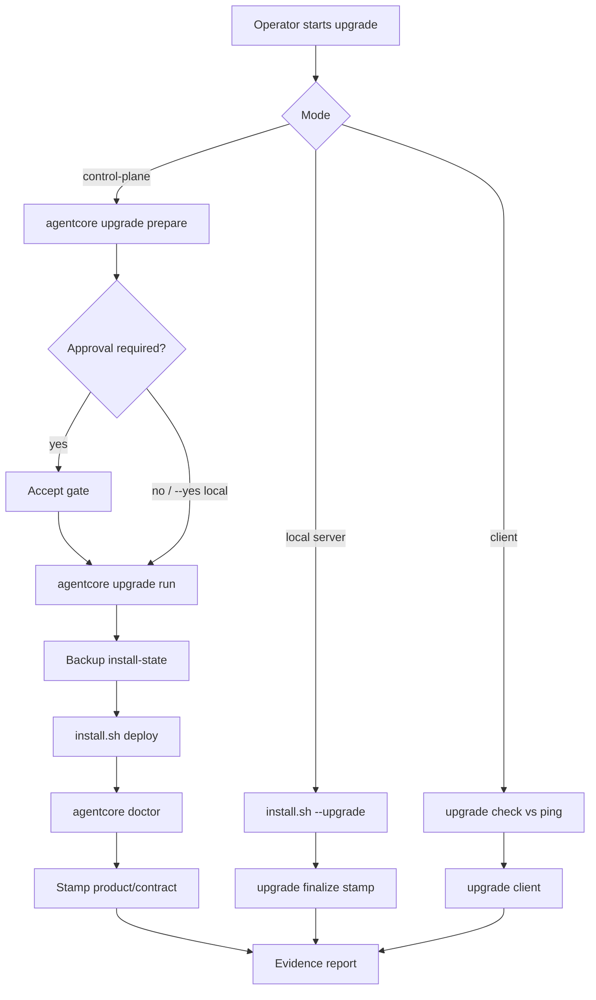

# 51 - Software Upgrade Server And Client

## Purpose

This runbook is the **normative** operator guide for upgrading an existing AgentCore installation on the **server**, refreshing **coding-agent clients**, and running **control-plane** upgrade jobs. It covers version contracts, commands, on-disk artifacts, approval boundaries, failure handling, and verification.

Implementation status: **shipped** for local-dev server upgrade, client handshake/refresh, and CLI control-plane jobs (Accept gate + backup + evidence + install-state rollback). Service-owned SQL/graph migrations remain outside this path.

## Ownership and boundaries

| Owner | Path / surface | May | Must not |
| --- | --- | --- | --- |
| Install modules | `install.sh`, `scripts/install/load.sh` | `--upgrade` backup + re-run stages + call finalize | Dockerize clients; copy Compose secrets into backups |
| Upgrade engine | `backend/packages/agentcore_cli/upgrade/` | Jobs, plan, backup meta, stamp versions, evidence | Treat product drift alone as hard failure |
| Upgrade CLI | `agentcore upgrade *` | Operator entry for plan/run/check/client | Bypass contract fail-closed checks |
| MCP gateway | `platform.ping` | Advertise product/contract versions | Invent client upgrades |
| Approval modes | `approval_modes` + `agentcore approval` | Gates for high-risk / control-plane | Auto-approve critical without profile rules |

Package map: [`backend/packages/agentcore_cli/upgrade/README.md`](../../backend/packages/agentcore_cli/upgrade/README.md).

## Upgrade surfaces

| Surface | Entry | Owns |
| --- | --- | --- |
| Server local install | `bash install.sh --upgrade` | Re-run install stages; stamp versions |
| Server control-plane | `agentcore upgrade prepare` / `run` | Job file, approval, backup, deploy, evidence |
| Client handshake | `agentcore upgrade check` | Contract/product vs `platform.ping` |
| Client refresh | `agentcore upgrade client` | `ensure-venv`, PATH, optional `connect` rewire |

Clients are never Dockerized. They only reconnect to the upgraded server over MCP (see [40](./40-remote-dev-client-mcp-wiring.md)).

## End-to-end flow



| Step | Actor | Action | Success signal |
| --- | --- | --- | --- |
| 1 | Operator | Choose local, control-plane, or client | Mode selected |
| 2 | Control plane | `upgrade prepare` writes job under `.agentcore/upgrade-jobs/` | Job `status` planned / approved / awaiting_approval |
| 3 | Human or auto | Accept gate when `requires_approval` | Gate `approved` or local `--yes` |
| 4 | Server | Backup + deploy (`install.sh`) + doctor | Job `succeeded` |
| 5 | Client | `upgrade check` then `upgrade client` | Compatibility `ok` |
| 6 | Either | Evidence JSON under `.agentcore/upgrade-evidence/` | Report path printed |

## Versions and compatibility

| Field | Role | Failure policy |
| --- | --- | --- |
| `contract_version` | MCP/tool contract between server and client | **Fail-closed** on mismatch (exit non-zero) |
| `min_client_contract` | Lowest client contract the server accepts | Compared with client contract major |
| `product_version` | Package/release label (`agentcore_cli.__version__`) | **Advisory** when contracts match |

Advertisement:

- `agentcore doctor` includes `product_version`, `contract_version`, `install_versions`, `server_advertisement`.
- `platform.ping` / `agentcore_ping` structured content includes `product_version`, `contract_version`, `min_client_contract`.
- Stamp after success: `.agentcore/install-state.env` keys `product_version`, `contract_version`, `runtime`.

## On-disk artifacts

| Path | Written by | Contents |
| --- | --- | --- |
| `.agentcore/install-state.env` | install stages + `upgrade finalize` / successful `run` | Stage markers, `runtime`, stamped versions |
| `.agentcore/upgrade-backups/install-<ts>/` | `install.sh --upgrade` | Copy of install-state (+ sync yaml if present) |
| `.agentcore/upgrade-backups/<job_id>/` | `upgrade run` | install-state copy, optional sync yaml, `backup-meta.json` (no secrets) |
| `.agentcore/upgrade-jobs/<job_id>.json` | `prepare` / `run` / `rollback` | Plan, steps, status, approval_id, paths |
| `.agentcore/upgrade-evidence/<job_id>.json` | finalize / run / rollback | Evidence report for audit |

## Server upgrade (local)

```bash
bash install.sh --upgrade
bash install.sh --upgrade --runtime host
bash install.sh --upgrade --runtime docker
```

Behavior:

1. Require existing `.agentcore/install-state.env` (else fail: run a full install first).
2. Backup state to `.agentcore/upgrade-backups/install-<utc>/` (never copies Compose `.env.local` secrets).
3. Force non-interactive when runtime was already stamped; re-run install stages.
4. Call `agentcore upgrade finalize --runtime …` to stamp versions and write evidence.

Equivalent job-based path:

```bash
agentcore upgrade plan --mode local
agentcore upgrade run --mode local --yes --risk-level medium
agentcore upgrade status <job_id>
```

## Control-plane upgrade

Aligned with [21 - Automation Control Plane](./21-automation-control-plane-and-self-service-operations.md) and [09 - Automated Deployment Runbooks](../09-platform-governance-operations/09-automated-deployment-and-connectivity-runbooks.md).

```bash
agentcore upgrade prepare --mode control-plane --risk-level high \
  --tenant mir --workspace ops --project agentcore
agentcore approval queue --status pending
agentcore approval accept <approval_id>
agentcore upgrade run <job_id>
agentcore upgrade rollback <job_id>
```

Rules:

- `mode=control-plane` or `risk-level` in `{high, critical}` → `requires_approval` and Accept gate with `subject_class=platform.upgrade`.
- Local non-critical may use `--yes` to proceed without a gate.
- `--skip-deploy` skips `install.sh` (tests / finalize-only).
- Rollback restores **install-state** from the job backup only (not databases).

## Client upgrade

On the coding-agent host (laptop or Remote SSH workspace):

```bash
## Save structuredContent from agentcore_ping / platform.ping, then:
agentcore upgrade check --from-ping /tmp/server-ping.json
agentcore upgrade client --project-dir /path/to/app-repo
```

`upgrade client` refreshes the AgentCore checkout venv when present (`scripts/ensure-venv.sh`), reinstalls the PATH shim, and re-runs `connect.yaml` wiring when that file exists under `--project-dir`.

## CLI catalog (`agentcore upgrade`)

How to read each row: **Why** / **Required** / **Optional** / **Example** / **What changes**.

### `upgrade versions`

| Field | Content |
| --- | --- |
| Why | Show local product/contract and what this checkout advertises as server |
| Required | None |
| Optional | None |
| Example | `agentcore upgrade versions` |
| What changes | Nothing (stdout JSON) |

### `upgrade check`

| Field | Content |
| --- | --- |
| Why | Fail-closed contract handshake before client work |
| Required | One of `--from-ping`, `--assume-local-server`, or `--server-contract` |
| Optional | `--server-product`, `--min-client-contract` |
| Example | `agentcore upgrade check --from-ping /tmp/ping.json` |
| What changes | Nothing; exit `0` compatible/advisory, `2` incompatible |

### `upgrade plan`

| Field | Content |
| --- | --- |
| Why | Dry-run plan from install-state (no job file) |
| Required | Existing install-state recommended |
| Optional | `--target`, `--mode`, `--risk-level` |
| Example | `agentcore upgrade plan --mode control-plane --risk-level high` |
| What changes | Nothing (stdout JSON) |

### `upgrade prepare`

| Field | Content |
| --- | --- |
| Why | Create durable job + optional Accept gate |
| Required | install-state for non-client modes |
| Optional | `--mode`, `--risk-level`, `--target`, `--actor`, scope flags, `--no-approval` |
| Example | `agentcore upgrade prepare --mode local --risk-level low --no-approval` |
| What changes | `.agentcore/upgrade-jobs/<id>.json`; may enqueue approval queue item |

### `upgrade run`

| Field | Content |
| --- | --- |
| Why | Execute approved job (prepare+run if `job_id` omitted) |
| Required | Approval satisfied, or `--yes` for local non-critical |
| Optional | `job_id`, `--skip-deploy`, `--mode`, `--risk-level`, scope flags |
| Example | `agentcore upgrade run --mode local --yes --skip-deploy` |
| What changes | backup dir, may run `install.sh`, stamp install-state, evidence, job status |

### `upgrade status` / `upgrade rollback`

| Field | Content |
| --- | --- |
| Why | Inspect job; restore install-state from job backup |
| Required | `job_id` |
| Example | `agentcore upgrade status <id>` / `agentcore upgrade rollback <id>` |
| What changes | status: none; rollback: rewrites `install-state.env` + evidence |

### `upgrade finalize`

| Field | Content |
| --- | --- |
| Why | Stamp versions/evidence after external `install.sh --upgrade` |
| Required | None |
| Optional | `--job-id`, `--runtime` |
| Example | `agentcore upgrade finalize --runtime host` |
| What changes | install-state stamp + evidence JSON |

### `upgrade client`

| Field | Content |
| --- | --- |
| Why | Refresh client CLI and optional MCP rewire |
| Required | Compatible contract (local or `--from-ping`) |
| Optional | `--project-dir`, `--from-ping`, `--skip-venv`, `--skip-connect` |
| Example | `agentcore upgrade client --project-dir . --skip-venv` |
| What changes | may refresh `.venv`, PATH shim, MCP client configs via connect |

## Failure and rollback

| Failure | Response |
| --- | --- |
| Contract incompatible | Stop; align `contract_version` on server or client |
| Awaiting approval | `agentcore approval accept <id>` or reject |
| Deploy / doctor fail | Job `failed` + evidence; fix root cause; re-run |
| Need config rollback | `agentcore upgrade rollback <job_id>` |
| Irreversible data migration | Forward-fix; file rollback does **not** undo DB |

## Limits

- Rollback restores **install-state** (and related non-secret files), not databases.
- `install.sh --upgrade` re-runs modular install stages; service-specific SQL/graph migrations stay owned by each service migration path.
- Coding-agent clients are never Dockerized.

## Verification

```bash
agentcore upgrade versions
agentcore upgrade check --assume-local-server
agentcore doctor
bash install.sh --help   # must list --upgrade
.venv/bin/python -m pytest tests/backend/packages/test_upgrade.py -q
```

## Related Documents

- [39 - Local Install Runbook](./39-local-install-runbook.md)
- [36 - AgentCore CLI](./36-agentcore-cli.md)
- [42 - AgentCore CLI Command Reference](./42-agentcore-cli-command-reference.md)
- [21 - Automation Control Plane And Self-Service Operations](./21-automation-control-plane-and-self-service-operations.md)
- [09 - Automated Deployment And Connectivity Runbooks](../09-platform-governance-operations/09-automated-deployment-and-connectivity-runbooks.md)
- [40 - Remote Dev Client MCP Wiring](./40-remote-dev-client-mcp-wiring.md)
