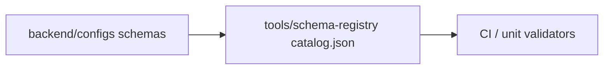

# 12 - Schema Registry Architecture

## Status

Accepted (2026-07-23). Closes **GAP-008**.

## Purpose

Choose a concrete home for AgentCore contract schemas so producers and consumers
share one discoverable catalog without inventing a new networked service for v1.

## Document flow

| Step | Actor | Action | Outcome |
| --- | --- | --- | --- |
| 1 | Author | Adds/updates `*.schema.json` under `backend/configs/` | Schema source of truth |
| 2 | Author | Registers entry in `backend/tools/schema-registry/catalog.json` | Discoverable ownership |
| 3 | CI / tests | Validate examples against schemas | Drift fails the build |

## Decision

1. **v1 schema registry = repository directory catalog**, not a microservice and
   not a database-backed registry.
2. **Authoritative schema files** live under `backend/configs/` (and other
   documented config trees that already hold JSON Schema).
3. **Discovery index** lives at `backend/tools/schema-registry/catalog.json`
   (owners, status, compatibility policy, path).
4. Compatibility checks and example validation run in **pytest / phase gates**
   (same pattern as domain-pack / feature-profile tests).
5. A future DB-backed or networked registry is allowed only via a new ADR when
   multi-writer runtime registration is required.

## Alternatives considered

| Option | Why not for v1 |
| --- | --- |
| Dedicated schema-registry service | No multi-tenant runtime writers yet; ops cost without payoff |
| Database-backed registry | Config is already Git-versioned; DB adds sync debt |
| `packages/contracts` only | Contracts package is SDK-facing; config schemas already live under `backend/configs/` |

## Catalog entry fields

| Field | Meaning |
| --- | --- |
| `schema_id` | Stable id |
| `title` | Human title |
| `path` | Repo-relative path to JSON Schema |
| `owner` | Team or role |
| `status` | `active` / `deprecated` / `draft` |
| `compatibility` | `backward` / `none` / `additive` |
| `doc_ref` | Optional normative doc |

## Non-goals

- Hot reload of schemas from Postgres.
- Cross-org public schema marketplace.
- Replacing OpenAPI generation for HTTP surfaces (registry complements it).

## Acceptance

- Architecture note published (this file).
- Catalog indexes first-party config schemas.
- Unit test asserts catalog paths exist and schemas parse as objects.
- GAP-008 marked CLOSED with `closed_in` pointing here.

## Related Documents

- `05-api-versioning-and-contract-governance.md`
- `../08-software-engineering-architecture/08-interface-and-contract-engineering.md`
- Gap register `GAP-008`
